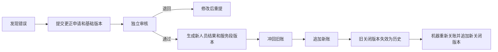

<!--
  SRVF 活动业务全流程修正方案
  v1.1：已吸收《系统性对抗性复核报告 v1.0》的全部阻断项与重要修订。
-->

*SRVF 活动管理系统*

# 活动业务全流程修正方案

> 正式修订版 v1.1｜从活动建立、发布、报名、现场执行到结算归档

- **方案状态：**业务合同 GO，可在仓库开工门通过后按依赖顺序开发
- **代码参照：**所提供的 `0.66.0` 仓库快照，目录标识 `47c4987514fef3772efb95a78adcd73dbd81c89c`
- **决策来源：**24个总原则＋355项明细＋12项二次确认＋坐标最新决定＋系统性对抗性复核
- **修订日期：**2026年8月3日
- **适用范围：**后端、管理后台、手机端、测试、上线与运维
- **配套开发文档：**[SRVF_活动业务全流程改造_详细开发文档_v1.1.md](./SRVF_活动业务全流程改造_详细开发文档_v1.1.md)
- **逐项追踪矩阵：**[SRVF_活动业务规则_355项追踪矩阵_v1.1.md](./SRVF_活动业务规则_355项追踪矩阵_v1.1.md)
- **本次修订说明：**[SRVF_活动业务文档_v1.1_修订说明.md](./SRVF_活动业务文档_v1.1_修订说明.md)

> **一句话目标**　把系统从“能发布、能报名、能填考勤”改成“无论30人还是10000人，都能按场次逐人结清，证据不会半路变化，历史数字不会漂，少一人也不能假关闭”。

> **坐标最终决定**　活动地址、活动坐标和打卡坐标继续作为普通业务数据保存。本轮不建设坐标专用加密仓、隔离存储、临时授权查看、专门保存期限、删除流程或专用告知文本；这些内容不作为上线门槛。现有页面不直接返回打卡原始坐标、运行记录遮挡经纬度的简单保护继续保留。

## 一页结论

现有系统的发起资格、组织范围、岗位名额、发布变更快照、负责人历史、两次考勤审核、定位距离计算、操作留痕和通知待办箱都有可保留的骨架。真正需要重做的是活动现场证据、逐人结算和最终关账之间的连接。

v1.1 已经收口上一轮复核发现的12个一级问题：

1. 活动还可合法签退时，不能把旧证据提交终审。
2. 已发布活动的关键场次、岗位、名额、报名表和签到规则不能绕过变更审核。
3. 不足30分钟真实离场可以由现场人员按特殊方式闭合，0时长、0分，不再把人永久卡在场内。
4. 同一人同一场次永远只有一个永久参与身份，取消后重报只是新版本。
5. 已经产生真实现场证据的活动不能再按“从未发生”普通取消，只能提前终止并结算。
6. 活动总名额按去重人数；场次和岗位名额按参与人次。
7. 防重号必须同时核对完整请求，不能串人、串场次或串动作。
8. 所有会改变队员时长和贡献的操作继续使用仓库唯一的队员排队锁，不另造第二套锁。
9. 正式账、冲回和替换都有数据库唯一编号，重试一百次也只能记一次。
10. 万人结算先整批准备，最终在短事务中统一生效，页面只能看见0%或100%，看不见半批。
11. 更正会一起产生新的人员结果、服务段、账和关闭版本，统计不会互相打架。
12. 离线包有设备、有效期、连续序号和摘要校验；撤权、异常时间或篡改记录进入人工复核，不自动生效。

**最终结论：**业务规则已经闭合，不需要再次填写大清单。研发只能在仓库预检、维护者授权和详细开发文档规定的依赖顺序下开工。

## 1. 核对基线、覆盖范围与文件关系

本方案覆盖活动建立、发布审核、报名、资格、候补、现场执行、逐人结算、两次审核、正式记账、更正、机器关账、评价、统计、通知、万人任务和上线演练。

| 业务范围 | 原明细数 | v1.1主要承接位置 |
| --- | ---: | --- |
| 活动发起资格与组织 | 15 | 第3、4、11节 |
| 活动资料与现场保障 | 31 | 第4、5节 |
| 岗位、班次与名额 | 29 | 第5节 |
| 发布审核与发布后变更 | 25 | 第3、4、10节 |
| 负责人、协作人和审核人 | 22 | 第4、11节 |
| 队员查看与查找 | 20 | 第6、10节 |
| 报名、审核、候补与取消 | 44 | 第6节 |
| 签到签退与现场执行 | 46 | 第7节 |
| 正式考勤、时长与贡献值 | 56 | 第8节 |
| 完结、评价与统计 | 31 | 第9、10节 |
| 通知、数据、权限与上线保障 | 36 | 第10至16节 |

355项逐条编号、最终规则、开发对象和自动测试编号不再塞进正文造成阅读噪音，统一放入配套追踪矩阵。矩阵是本方案的一部分，不能只交正文而漏交矩阵。

## 2. 已冻结的30条最终业务规则

1. 只有账号正常的正式队员可以成为真实业务发起人；跨组织发起必须有明确授权。管理员可以代建，但代建人和真实发起人分别留痕。
2. 所有时间统一按北京时间解释。不同日期、时段、地点必须使用独立场次表达，活动可以跨天和多日。
3. 系统按普通500人、大型2000人、极限10000人设计。业务人员不再手工拆成100人或200人的小单。
4. 所有初次发布都由另一名合格审核人审核，提交人永远不能审核自己。本轮不做风险分级和多级发布会签。
5. 发布后，时间、地点、名额、场次、岗位、资格、报名表、可见范围、签到规则和贡献规则等关键变化必须提交完整变更方案并由另一人审核。
6. 只有错别字、不会改变参与条件或现场执行的纯展示小改可以直接修改并留痕。允许直接修改的字段必须是代码中的固定白名单，不能由前端自由判断。
7. 普通活动发布后，对全系统账号正常的正式队员可见；邀请活动只对受邀人员和工作人员可见。看得见不代表符合报名资格。
8. 报名方式独立于可见范围，必须明确选择：公开申请、仅邀请确认、只允许后台代报名或暂停报名。
9. 一场活动可以包含多个场次、岗位和班次。同一人可以参加多个互不重叠场次，同一场次只能有一个最终岗位。
10. 活动总名额按去重人员数计算；场次和岗位名额按参与人次计算。第一次取得任一有效场次时占活动人员名额，最后一个有效场次释放时才释放。
11. 发布人必须选择名额分配方式：先到先得、资格排序或抽签。不同方式分别形成可重放的分配批次和候补顺序，不能一律由审核顺序决定。
12. 自定义报名表是正式功能，支持题型、必填、选项、范围、文件、确认勾选和版本。手机端、后台代报名和导入必须使用同一个校验器。
13. 资格规则支持等级、组织、证书、年龄、训练、性别和保险，可设置强制拦截或仅提醒。打开页面、提交报名和审核通过前至少检查三次。
14. 受邀人员仍需满足账号、正式队员、保险、硬性资格和名额规则；邀请只替代公开申请，不自动绕过安全和容量条件。
15. 同一活动、同一队员、同一场次只有一个永久参与身份。取消、重报、撤回和递补只增加版本，不得创建第二个结算身份。
16. 所有线下参与场次都必须签到和签退。普通队员自助签到、签退必须扫描对应场次的二维码，不能只点定位按钮。
17. 每个场次分别生成签到码和签退码，静态、可打印、整场有效；二维码可以单独作废和重发，旧版本立即失效。
18. 二维码查看、打印、作废和重发是独立权限。只读协作人不能看到可使用的二维码。
19. 定位由发布人按场次选择“不限制”或具体半径。要求定位时二维码、时间、定位同时合格；不限制时仍必须扫码和满足时间、身份、报名条件。
20. 定位配置采用“系统默认→活动类型模板→活动默认→场次→必要时岗位”的覆盖顺序。发布审核时保存最终解析值和来源，后续模板变化不能悄悄改变已发布活动。
21. 普通签退在签到未满30分钟时必须拒绝。真实提前离场由有权限的现场人员登记“提前离场闭合”，保存真实离场时间和原因，关闭该服务段，时长和贡献值均为0，之后允许再次签到。
22. 支持工作人员扫队员码、单人代签、批量代签、名单导入和工作人员离线补传。在线操作使用服务端时间；只有经过预览的导入和受控离线补传可以带历史发生时间。
23. 错扫不能删除原记录。必须追加“作废”或“替代”事件，保存原因和操作者，随后才能录入正确事实。
24. 每个通过的“队员×场次”都必须有最终人员结果。请假、缺席、取消、未入选、候补到期和不足30分钟提前离场不进入有效服务明细，时长和贡献值为0。
25. 内部临时参加者必须补建永久参与身份并记录批准人、原因和时间；外部嘉宾只进访客名单，不进内部时长、贡献和队员考勤统计。
26. 活动仍可产生合法打卡、人员集合仍会变化或证据尚未封场时，只能整理结算草稿，不能提交审核。
27. 保留提交人、一审人、终审人的严格分离。审核人只能通过或退回，不能在审核页面直接改时长和分数；负责人修改后生成新的不可变提交版本。
28. 终审通过后，以正式批次写入不可更新、不可删除的时长账和贡献账。北京时间同一天最终计入贡献上限为3分，按真实服务发生顺序分配，相同时间按稳定编号排序。
29. 更正不能覆盖旧结果。必须针对明确的基础版本申请，批准后追加新的人员结果版本、服务段版本、冲回旧账、新账和新的关闭版本。
30. 活动自然结束、结算关闭、归档冻结是三个阶段。关闭必须完成逐人、逐证据、逐账和逐异常机器检查；7天是默认归档等待期，不是禁止合法更正的截止日。

## 3. 修正后的完整业务流程

| 阶段 | 谁操作 | 页面做什么 | 系统硬检查 | 成功后的结果 |
| --- | --- | --- | --- | --- |
| 建立草稿 | 正式队员或获授权代建人 | 填资料、场次、岗位、报名、定位、通知和协作规则 | 发起资格、组织范围、时间和名额 | 保存草稿，可复制为新草稿 |
| 提交发布 | 真实发起人 | 查看完整预览和变更影响 | 服务端重新生成完整快照 | 形成待审核版本，关键内容冻结 |
| 发布审核 | 独立审核人 | 通过或退回并写理由 | 禁止自审、快照未变化 | 发布并建立主负责人，或退回修改 |
| 报名分配 | 队员、报名协作人 | 填表、选场次岗位、接受邀请 | 资格、表单、名额和永久身份 | 形成通过、候补、未入选等明确结果 |
| 现场执行 | 参与者、现场人员 | 扫码、工作人员扫码、代签、导入或离线采集 | 当前权限、二维码、时间、可选定位、防重 | 形成追加式现场事实 |
| 证据封场 | 系统、主负责人 | 查看尚未闭合人员和异常 | 所有有效打卡窗口结束，开放服务段已闭合 | 固定证据版本和应结算人口版本 |
| 逐人结算 | 主负责人、考勤协作人 | 给每个队员×场次最终结果，确认服务段和初算 | 无悬空人员、无重复身份、内容摘要一致 | 生成不可变提交版本 |
| 两次审核 | 一审人、终审人 | 仅通过或退回 | 人员隔离、版本和封场版本未变化 | 终审后整批正式记账 |
| 机器关账 | 主负责人发起 | 查看缺口清单并点击关闭 | 12道关账检查全部通过 | 追加关闭版本，开放评价 |
| 归档与更正 | 归档人员、申请人、独立审核人 | 归档冻结或申请更正 | 更正只针对明确基础版本 | 历史不覆盖，新版本重新关账 |

## 4. 建立活动页面和发布审核怎么改

建立活动改成十个区块，手机端与后台使用同一字段合同。发布后，直接编辑和变更提案必须由服务端按活动阶段区分，不能只靠页面隐藏按钮。

| 页面区块 | 主要内容 | 关键检查 |
| --- | --- | --- |
| 基本资料 | 标题、逐级分类、承办组织、摘要、富文本正文、封面、图集 | 富文本清洗；附件归属和状态核验；完整回显 |
| 时间与场次 | 活动总时间、场次名称、开始、结束、时区、排序 | 结束晚于开始；正式服务场次至少30分钟；场次不重叠规则明确 |
| 地点与导航 | 地址、集合点、执行点、撤离点、导航坐标 | 经纬度成对；公共地址正常展示；定位启用时必须有有效中心点 |
| 岗位与班次 | 场次岗位、角色、时段、资格、名额、负责人、装备和说明 | 岗位时段在场次内；同场次岗位名不重复；名额不超上层 |
| 报名规则 | 开放、截止、取消截止、报名方式、分配方式、多志愿、保险 | 截止可明确清空；空值绝不变成1970年 |
| 报名表与资格 | 题目、题型、必填、选项、文件、确认、资格规则 | 生成版本；所有入口统一校验；强制和提醒分开 |
| 现场规则 | 二维码、签到签退窗口、定位半径、精度提醒、代签、现场人员 | 最终解析配置进入发布快照；已发布后不能直接改 |
| 联系与保障 | 公开联系人、内部联系人、交通、餐饮、住宿、天气、备用日期 | 联系信息按查看范围返回；本轮不建设风险等级模块 |
| 协作与通知 | 草稿、报名、考勤、现场、岗位、只读协作；通知目标 | 每项能力独立；全部通过统一授权服务判定 |
| 提交审核 | 完整预览、影响人数、变更说明 | 服务端重建快照；提交人不能审核自己 |

### 4.1 生命周期与可修改范围

| 活动阶段 | 可以直接修改 | 必须走变更审核 | 禁止普通修改 |
| --- | --- | --- | --- |
| 草稿 | 全部草稿内容 | 无 | 无 |
| 待发布审核 | 无关键修改；先撤回再改 | 无 | 直接修改已提交快照 |
| 已发布、未开始 | 固定展示小改白名单 | 时间、地点、场次、岗位、名额、表单、资格、可见性、签到和计分规则 | 绕过提案调用子资源写接口 |
| 进行中 | 极少量现场说明和联系人小改 | 未来场次改期、取消或必要规则变化 | 修改已开始场次的身份、历史现场事实和贡献规则 |
| 自然结束／提前终止 | 只读展示性补充 | 更正流程承接事实变化 | 普通业务修改、增加新场次或新报名规则 |
| 已关闭／归档 | 无 | 更正申请 | 覆盖历史、删除正式事实和账本 |

纯展示小改白名单只包含不会影响参与资格、现场执行和结算的字段，例如错别字、封面替换、说明性图片和非关键正文修辞。白名单由后端常量维护并有自动测试，前端不能自行把字段判断成“小改”。

### 4.2 取消、单场取消和提前终止

- 第一场正式开始前，且不存在有效现场事实时，主负责人可以普通取消。原因必填；已有报名或距开始不足24小时必须二次强确认并通知相关人员。
- 任一有效签到、代签、服务段或其他现场事实存在后，普通取消必须拒绝，改走提前终止并逐人结算。
- 已发布的未来场次允许单独取消或改期，但必须走变更提案。只影响该场次的名额、二维码、报名选择、通知和结算人口。
- 提前终止后，保留30分钟真实签退窗口；窗口结束后现场人员必须逐人收口仍未闭合的服务段。
- 取消、单场取消、提前终止均需要稳定防重号，重复请求不得重复释放名额或重复通知。

### 4.3 角色和权限

| 活动内角色 | 可以做什么 | 明确不能做什么 |
| --- | --- | --- |
| 业务发起人 | 建立和维护草稿、提交发布审核 | 自审；发布后当然拥有所有现场和结算权 |
| 草稿协作人 | 草稿阶段编辑 | 提交、发布、取消、代签、审核 |
| 发布审核人 | 通过或退回初次发布和关键变更 | 审核自己的申请；因审核自动成为负责人 |
| 主负责人 | 管理活动、人员、现场、结算、取消／终止和关账 | 绕过独立审核；覆盖正式历史 |
| 报名协作人 | 审核、分配、候补、邀请、临时参加 | 考勤、二维码、代签、取消整场 |
| 考勤协作人 | 整理逐人结果和提交结算版本 | 终审自己的提交；直接修改正式账 |
| 现场签到人员 | 扫码、代签、特殊离场闭合、离线采集 | 审核结算；超出活动或场次范围操作 |
| 岗位负责人 | 管理本人岗位或场次人员 | 跨岗位操作；取消整场 |
| 只读协作人 | 查看非敏感完整管理进度 | 查看可使用二维码；修改、审核、代签、取消、移交 |
| 一审／终审人 | 通过或退回结算版本 | 直接改时长和分数；突破人员隔离 |

这些活动内角色只描述业务关系，不能形成第二套权限系统。所有接口最终必须经过现有统一授权服务；业务关系只是授权服务计算范围时的一种依据。

## 5. 活动、场次、岗位、名额和分配

### 5.1 四个概念不能混在一起

- **活动**是总壳，负责标题、分类、承办组织、总名额、可见范围和总体规则。
- **场次**是实际执行单元，负责某一天、某段时间、某个地点、签到签退窗口和场次名额。
- **岗位**说明某个场次里做什么，负责计分角色、岗位名额、岗位资格、岗位负责人和装备说明。
- **永久参与身份**代表“某名队员参加某个场次”，取消重报也不会换一条身份，只增加历史版本。

### 5.2 名额单位正式冻结

| 名额层级 | 计算单位 | 什么时候占用 | 什么时候释放 |
| --- | --- | --- | --- |
| 活动总名额 | 去重队员人数 | 某人第一次取得任一有效场次选择 | 该人的最后一个有效场次选择失效 |
| 场次名额 | 场次参与人次 | 该人取得该场次有效选择 | 该场次选择失效 |
| 岗位名额 | 场次岗位参与人次 | 该人取得该场次岗位 | 该场次岗位失效或经确认换岗 |
| 预留名额组 | 符合名额组条件的人次 | 分配批次确认 | 取消、到期释放或转入公共池 |

例子：100名队员每人参加3个场次，活动总名额占100，三个场次合计参与人次为300。页面必须同时展示“去重报名人数”和“场次参与人次”，不能只给一个模糊的“报名数”。

### 5.3 三种分配方式

**先到先得：**符合资格并完成报名时立即占位。排位按服务端受理顺序，不因审核员先处理谁而变化。

**资格排序：**截止后生成一次分配批次，冻结候选名单、表单版本、资格规则版本、评分明细、同分排序和结果。审核员不能临时改变评分规则。

**抽签：**截止后冻结候选名单，保存抽签批次、规则版本、随机种子承诺、结果和候补顺序，使结果可以复查和重放。

候补顺序取决于所选分配方式：先到先得沿原排位，资格排序沿评分结果，抽签沿抽签结果。不能把三种方式全部偷偷变成先进先出。

### 5.4 多志愿和预留名额

- 队员可以按顺序填写多个场次岗位志愿。
- 系统按名额方式处理志愿，不能在未获得队员确认时把人强行换到其他岗位。
- 专业人员或合作单位可以配置预留名额组，包括适用资格、数量、释放时间和释放后的公共池规则。
- 预留名额、公共名额和候补递补必须在同一活动锁和名额事务中处理，不能分别“先查还有没有”再各自写入。
- 名额自动对账任务必须能比较容量桶和实际有效参与身份，发现不一致时告警，不允许静默漂移。

## 6. 报名、邀请、资格、候补和取消

### 6.1 报名方式与可见范围分开

| 报名方式 | 谁可以发起动作 | 是否需要受邀 | 是否需要审核 |
| --- | --- | --- | --- |
| 公开申请 | 看得到活动且符合基本准入的正式队员 | 否 | 按活动规则 |
| 仅邀请确认 | 受邀队员 | 是 | 邀请不绕过硬资格；可按规则免普通人工审核 |
| 只允许后台代报名 | 有报名管理权的工作人员 | 否 | 操作者本人不能兼任该报名的独立审核人时，仍走审核 |
| 暂停报名 | 无人可新报名 | 不适用 | 现有报名不自动取消 |

普通活动完结后保留只读详情。邀请活动完结后，仍只对参与者、受邀者和工作人员可见。

### 6.2 正式报名表

题型至少包括：单行文字、多行文字、数字、日期、单选、多选、文件和确认勾选。每题必须有固定编号、标题、必填、范围、选项、最多选择数、说明、查看范围和是否允许导出。

- 报名提交时逐题检查，缺必填、类型错误、超范围、选项不存在都明确拒绝。
- 后台代报名、手机自助和名单导入使用同一个服务端校验器，后台不能绕过。
- 发布后修改报名表走变更审核并生成新版本。旧答案继续对应旧版本。
- 文件题先创建一次性上传会话，提交报名时核验上传人、文件状态和会话归属，再绑定到报名版本；未提交会话按既有手动清理流程处理，不新增第3个定时任务。

### 6.3 资格检查三次

1. 打开报名页时告诉本人符合哪些条件、缺什么。
2. 提交报名时重查，强制条件不满足就不能提交。
3. 审核通过或接受邀请前再次重查，防止报名后证书、保险、账号或队员资格变化。

活动级规则可以被场次岗位规则进一步收紧。资格排序使用冻结后的规则版本，不允许截止后换规则再排序。

### 6.4 邀请、临时参加和访客

**邀请：**邀请有待确认、已接受、已拒绝、已撤回、已过期五类结果。受邀人可以接受或拒绝，工作人员可以在接受前撤回。接受时仍检查硬资格、名额和必要报名表。

**内部临时参加：**必须是系统内队员。现场补建永久参与身份，记录批准人、原因和批准时间，并与名额占用、重复身份检查和结算人口更新在同一事务完成。

**外部访客：**记录姓名、单位、邀请人、备注和是否到场，只用于现场名单，不进入内部服务时长、贡献值、队员考勤和入队进度。

### 6.5 取消、迟到处理和候补终态

- 报名取消截止前，队员可自助取消并释放相应名额。
- 截止后，队员提交取消申请，由主负责人或报名协作人审批；批准后释放名额并按该分配方式递补，拒绝时原因必填。
- 已经产生现场事实的参与身份不能再按普通报名取消处理，必须进入最终人员结果。
- 活动开始后仍待审核的报名自动进入“审核到期”；候补在递补截止后进入“候补到期”；资格排序或抽签未入选者进入“未入选”。这些都是明确终态，不允许永远悬在待处理。
- 同一人取消后重新报名同一场次，只重新开启原永久身份并增加版本，不创建第二个人员结算项。

### 6.6 复制活动与长期草稿

- 支持把旧活动复制成一个全新草稿。只复制可复用配置，不复制报名、邀请、打卡、结算、账本、关闭、更正和通知历史。
- 长期无人处理草稿在负责人工作台中提示，并支持后台人工归档。它不是自动删除，不新增清理定时任务。
- 协作候选人、队员、场次和岗位选择均使用搜索和标准 `page/pageSize` 分页，不再截断为前200人。

## 7. 签到签退与现场执行

### 7.1 两张静态二维码

每个场次分别生成签到码和签退码。二维码内容只包含必要的活动、场次、动作、版本和服务端签名，不放姓名、电话或原始坐标。

- 签到码不能用于签退，签退码不能用于签到。
- 错活动、错场次、错动作、时间窗外、已作废版本均不写正式事实。
- 二维码作废和打卡并发时，打卡必须在同一事务内重新读取当前版本，不能在锁外检查后继续写。
- 密钥配置和轮换复用仓库已有配置与密钥治理方式，不新增独立秘密管理系统。泄露时可以作废当前版本并重发。
- 静态码在不限制定位时存在被转发代扫风险，这是本期明确接受的剩余风险。本轮不增加动态码、人脸、NFC、蓝牙或设备证明。

### 7.2 定位与精度

可选“不限制定位”，或50、100、200、500、1000、2000、5000、10000米，也可在50至10000米内自定义。

定位精度采用**提醒而非硬拦**：

- 精度值为空或大于100米时，页面提示“定位精度较低”，但仍按实际计算距离决定是否在半径内。
- 精度异常会进入现场复核提示，不自动增加半径，也不直接拒绝一条本来在范围内的记录。
- 发布人不能把精度阈值改成另一套业务规则；100米是本期统一提醒阈值。

### 7.3 打卡时间窗

- 场次有独立签到开放、签到截止、签退开放和签退截止。
- 报名选择存在岗位独立时段时，有效打卡窗口取场次窗口和岗位窗口的交集。
- 提前到场准备时间是否计入，由场次设置“准备时段”，必须进入发布审核快照，不能由审核人事后自由猜。
- 活动或场次提前终止后，从真实终止时刻起保留30分钟签退窗口。
- 只有签到时要求当前报名和资格有效。已经有开放服务段的人，即使之后账号或报名状态变化，也必须允许正常闭合，或者由现场人员明确收口，不能永久显示在场。

### 7.4 30分钟与提前离场

普通签退在29分59秒必须拒绝，30分整允许。这个限制适用于本人扫码、工作人员扫码、普通代签、批量代签、导入和正常离线签退。

真实提前离场时：

1. 有现场权限的人选择“提前离场闭合”。
2. 填真实离场时间和原因。
3. 系统追加一条特殊闭合事实，不伪造普通签退。
4. 该段标记已闭合、0服务时长、0贡献值。
5. 该人不再显示“当前在场”，之后允许重新签到形成新段。

### 7.5 打卡事实只追加，不覆盖

一切现场事实采用追加方式：签到、签退、提前离场闭合、作废、替代、代签、导入和离线补传都形成独立事件。错误事件不能直接更新或删除。

每次请求包含防重号和完整请求摘要。只有“防重号相同且摘要完全相同”时返回原结果；防重号相同但换人、换场、换动作、换来源、换设备、换时间或换位置时，必须返回防重冲突，绝不能把另一人的记录返回出来。

### 7.6 工作人员在线、导入和离线

| 入口 | 时间来源 | 权限检查 | 额外要求 |
| --- | --- | --- | --- |
| 工作人员扫队员码 | 服务端当前时间 | 每条写入时重查当前现场权限 | 会员码必须是可信凭证或经搜索人工确认 |
| 单人代签 | 服务端当前时间 | 同事务重查 | 原因必填 |
| 批量代签 | 服务端当前时间 | 每个任务项重查；撤权后剩余项停止 | 逐项结果和防重号 |
| 名单导入 | 预览确认的历史时间 | 执行时重查 | 绑定文件摘要、解析版本和预览任务号 |
| 离线补传 | 有效离线包内的受控时间 | 上传时仍有权限才自动生效 | 设备绑定、有效期、连续序号和摘要链 |

离线包被撤权、过期、换设备、跳号、重复号、未来时间、时间严重异常或摘要链断裂时，不直接形成正式服务事实，而是进入人工复核暂存区。复核通过后再追加正式事实。

### 7.7 现场权限撤销

现场权限撤销与批量任务、代签或离线补传并发时，所有写入都必须以事务内当前权限为准。批量任务运行一半撤权，已经成功的项目保留，尚未执行的项目停止并显示“权限已撤销”，不能继续偷偷写完。

## 8. 逐人结算、审核、时长和贡献值

### 8.1 结算人口按“队员×场次”冻结

每个有效参与身份对应一条逐人结算项。系统同时展示：

- 去重参与人数；
- 场次参与人次；
- 各场次、岗位人数；
- 尚未处理的队员×场次数量。

结算人口版本在报名通过、取消、递补、临时参加、场次取消和人员身份更正时单调增加。打卡证据版本在每次有效现场事实、作废或替代时单调增加。

### 8.2 什么时候才允许提交结算

进行中可以整理草稿，但只有同时满足以下条件才能提交：

1. 活动已自然结束或正式提前终止。
2. 所有场次和岗位的有效签退窗口已经关闭。
3. 所有开放服务段已经正常签退或按特殊事实收口。
4. 当前证据版本和人员版本已经冻结。
5. 当前没有待审核的关键变更会改变本次结算。

提交时生成不可变的结算版本、证据版本、人员版本和内容摘要。一审、终审都重新比较这些版本；任何变化都必须退回并重新提交，旧版本不能继续生效。

### 8.3 人员结果和服务明细分开

| 最终人员结果 | 是否有有效服务段 | 时长与贡献 |
| --- | --- | --- |
| 正常出勤 | 是 | 按真实段计算 |
| 迟到 | 是 | 按真实段计算，并保留迟到标签 |
| 早退 | 是 | 按真实段计算，并保留早退标签 |
| 迟到且早退 | 是 | 两个标签可以同时存在 |
| 请假 | 否 | 0时长、0分 |
| 缺席 | 否 | 0时长、0分 |
| 报名取消 | 否 | 0时长、0分 |
| 未入选／候补到期／审核到期 | 否 | 0时长、0分 |
| 不足30分钟提前离场 | 特殊闭合，不是有效服务 | 0时长、0分 |
| 免考或不计服务 | 否 | 0时长、0分 |

迟到和早退不再压成互相排斥的一个状态，而是主结果加独立标签。

### 8.4 迟到、早退和贡献规则

- 系统模板默认迟到宽限15分钟、早退阈值15分钟，发布人可以按场次在0至60分钟范围内调整，最终值进入发布审核快照。
- 迟到和早退不自动删除真实服务时长。贡献影响由对应活动类型和角色的贡献规则决定。
- 应计贡献的活动若找不到有效贡献规则，结算可以整理，但必须禁止终审，明确提示“缺少贡献规则”。不能默认为0后悄悄通过。
- 系统计算值与负责人认定值分开保存。负责人在提交前修改认定值时原因必填；一审和终审只通过或退回，不能直接改值。

### 8.5 北京时间每日3分

同一队员同一北京时间自然日的“最终计入分”总和不能超过3分。

- 页面同时显示规则初算分、负责人认定分、最终计入分和因上限未计入分。
- 贡献按真实服务发生顺序依次分配；相同时间按稳定的活动、场次、服务段编号排序。
- 跨北京时间零点的服务按真实时间拆到两个自然日。
- 同一队员在不同活动出现无法解释的时间重叠时，终审必须拒绝并要求处理。
- 更正后重新计算受影响日期，并以新账版本显示分配变化，旧分配永久保留。

### 8.6 两次审核和正式批次记账

- 提交人不能一审或终审，一审人不能终审，最高管理员也不能绕过。
- 一审和终审只允许“通过”或“退回”，不能在审核页面修改人员结果、时长或分数。
- 负责人修改后形成新的提交版本，原版本保留。
- 500人可以直接完成；2000和10000人通过后台任务分批准备。
- 准备中的正式账对所有页面、统计、评价和入队进度不可见。
- 最终提交使用短事务，统一把批次改为生效、结算改为终审通过、队员日期版本递增，并写入审计和通知待办。
- 任何版本变化或锁预算不满足时，整批不得生效，必须重算受影响人员或作废重做。

### 8.7 正式账的防重复

每个账本批次、每笔分录和每次操作都有唯一编号和完整请求摘要：

- 同一结算项、版本、日期和分录类型只能有一组正式分录。
- 一笔旧账最多被一个指定冲回操作冲回。
- 冲回和替换自身也防重。
- 负责人认定分必须等于最终计入分加因上限未计入分。
- 正式分录不能更新或删除，统计只读取已生效批次。
- 重试、断点续跑和重复点击一百次，结果必须与执行一次相同。

## 9. 机器关账、归档和更正

### 9.1 三条状态轴

| 状态轴 | 主要状态 | 回答的问题 |
| --- | --- | --- |
| 活动执行 | 草稿、待审核、已发布、进行中、自然结束、提前终止、开始前取消 | 活动现实中执行到了哪一步 |
| 人员结算 | 未开始、整理中、待一审、待终审、正式生效、更正中、重新关闭 | 每个人、每段时长和每笔分数是否结清 |
| 资料归档 | 未归档、归档等待、已归档 | 普通业务入口是否还能改，后续是否只能走更正 |

结算状态、关账状态和归档状态不能用一个“完成”按钮糊在一起。页面可以合并展示，但数据上必须有清楚的主事实和版本。

### 9.2 机器关账的12道硬检查

1. 活动已经自然结束或正式提前终止；普通取消活动进入取消收口，不伪造服务结算。
2. 所有有效打卡窗口已经关闭，当前证据版本已封场。
3. 没有开放服务段、只有签到无去向人员或待人工复核的离线事实。
4. 当前没有待审核的关键活动变更。
5. 当前没有待处理、待审批或已批准但未生效的更正申请。
6. 所有报名和邀请都有明确终态，待审核、候补和未确认邀请已经收口。
7. 每个有效队员×场次永久身份都有且只有一个当前人员结果版本。
8. 实际出勤结果有完整服务段；请假、缺席、取消、未入选等结果时长和贡献均为0。
9. 当前结算版本已经终审通过，且所有正式账属于已生效批次。
10. 每日贡献满足3分上限，人员、时长、贡献、评价资格和入队进度的统计来源一致。
11. 没有重复人员身份、重复正式账、未完成批量任务或名额对账异常。
12. 在活动锁内重查以上条件后，追加新的关闭版本，保存检查摘要、人数摘要、证据版本、人口版本、结算版本和账本批次号。

30人报名通过、0打卡、0人员结果时，可以显示“活动时间已经结束”，但必须拒绝关闭，并清楚提示30个队员×场次尚未处理。

### 9.3 关闭凭证使用版本链

一场活动可以有多个历史关闭版本：首次关账是第1版，更正完成后重新关账追加第2版，以此类推。旧关闭版本永远保留，同一时刻只有最新一版是当前生效版本。

页面默认显示当前关闭版本，并能查看“为什么从第1版变为第2版”。统计和评价资格读取最新生效版本，历史页可回看任一版本。

### 9.4 归档等待和归档冻结

- 结算关闭后默认进入7个自然日的归档等待期，可由系统配置调整。
- 7天只是便于发现问题的等待期，不是合法更正的最终截止日。
- 等待期结束且没有处理中更正时，可以归档冻结。
- 归档后普通编辑、普通打卡和普通结算入口全部拒绝，错误只能通过更正申请处理。
- 本轮不新增自动归档定时任务。归档由现有后台工作进程或人工操作触发，并遵守仓库“只有两个定时任务”的冻结规则。

### 9.5 更正流程

- 同一结算项同一时刻只允许一个处理中更正。
- 更正申请必须指向明确的人员结果版本、服务段版本、账本版本和关闭版本。
- 审核前若基础版本变化，申请必须失效并重新提交。
- 更正可以把缺席改成出勤，也可以把出勤改成缺席；人员结果、服务段、时长账、贡献账、评价资格和关闭版本必须一起变化。
- 原结果和原账不删除，只追加冲回、新结果和新账。

## 10. 可见性、评价、通知和统计

### 10.1 系统内部可见

“公开”只指登录后的系统内部可见，不代表互联网公开，也不自动同步官网。

普通公开活动：账号正常的正式队员可以看标题、正文、场次、岗位、报名规则和本人资格结果。精确内部备注、人员名单和管理资料按权限返回。

邀请活动：只有受邀人、已参与人和工作人员可见。知道活动编号也不能绕过可见性读取详情。

### 10.2 评价

- 评价从结算正式关闭时间开始开放，默认30天。
- 当前人员结果为正常出勤、迟到、早退或迟到且早退，且有生效服务账的人可以评价。
- 每名队员对一场活动只能提交一次评价；第一版不开放反复修改。
- 评价实名保存，普通展示可只显示汇总，不做完全匿名承诺。
- 更正后新增评价资格的人，在原关闭窗口尚未结束时可以补评；资格被撤销时原评价不删除，标记“资格后来更正”，避免历史静默消失。

### 10.3 通知

通知对象在业务动作发生时冻结。后台展开和发送时不能重新查询一份已经变化的人员名单。

| 事件 | 主要收件人 | 渠道策略 |
| --- | --- | --- |
| 活动发布 | 发布时选定的目标组织、标签或明确选择不广播 | 站内为主，可选企业微信；短信不做万人默认广播 |
| 报名结果／递补／邀请 | 对应队员 | 站内＋企业微信；重要失败可按既有策略短信兜底 |
| 时间、地点、场次或签到规则变更 | 所有受影响的当前报名、候补、受邀和工作人员 | 冻结收件人快照，后台分批发送 |
| 活动取消／场次取消／提前终止 | 所有受影响人员 | 主业务先成功，外部渠道异步发送 |
| 未签退提醒 | 活动结束前和签退窗口关闭前仍在场人员；窗口关闭后给负责人待办 | 站内＋企业微信，避免短信轰炸 |
| 结算退回／终审结果／更正结果 | 提交人、负责人和对应队员 | 站内为主，必要时企业微信 |

同一人同一事件只生成一份通知。重试不能重复轰炸。外部渠道失败不回滚活动、报名、结算和账本。

### 10.4 统计单一来源

- 报名人数读取当前有效永久参与身份，活动人数按去重队员，场次按参与人次。
- 到场、迟到、早退、请假和缺席读取最新生效人员结果版本。
- 服务时长和贡献值只读取已生效账本批次。
- 评价资格读取最新关闭版本和最新生效人员结果。
- 入队进度、里程碑通知、手机端“我的考勤”和所有报表必须统一切到新账本，不能保留一部分读旧考勤单、一部分读新账。

## 11. 数据对象和模块边界

业务人员不需要记住表名，但研发必须使用这些独立对象，不能继续把所有事实塞进旧活动、报名和考勤单三张表。

| 业务对象 | 负责保存什么 |
| --- | --- |
| 活动与场次 | 活动总壳、场次、场次岗位、最终现场配置快照 |
| 活动责任历史 | 主负责人、分类协作、现场、岗位和只读关系；权限仍由统一授权服务判定 |
| 永久参与身份 | 队员×场次的唯一身份及每次报名、取消、递补版本 |
| 报名表版本与答案 | 题目、版本、答案、文件上传会话和统一校验结果 |
| 资格与分配批次 | 资格规则、评分、抽签、候选名单、预留名额和候补顺序 |
| 二维码凭证 | 每个场次的签到码、签退码、版本和作废信息 |
| 打卡事件 | 签到、签退、提前离场、作废、替代、代签、导入、离线补传及防重摘要 |
| 证据封场版本 | 打卡事实版本、人员集合版本、有效窗口关闭时间和封场摘要 |
| 逐人结果与服务段版本 | 每个队员×场次的当前结果、历史结果、真实服务段和迟到早退标签 |
| 结算提交版本 | 一次不可变提交内容、证据版本、人员版本和摘要 |
| 正式记账批次 | 万人准备、待提交、生效、失败和作废状态；准备中不可见 |
| 正式账本分录 | 时长、认定分、最终计入分、上限未计入分、冲回和替换 |
| 队员每日版本 | 同一队员同一北京日的贡献分配版本，用于锁后重验，不代替队员排队锁 |
| 更正申请与修订 | 基础版本、审核、人员结果修订、服务段修订和新账 |
| 关闭版本 | 每次机器关账的检查摘要和当前生效版本 |
| 后台任务与任务项 | 万人生成、审核准备、导入、导出和通知的进度、失败和重试 |

模块原则：活动模块负责活动生命周期和变更；报名模块负责身份、资格、名额和分配；考勤模块负责现场事实、结算、账本、更正和关账；通知模块复用现有数据库待办箱；附件模块继续统一管理文件。不得引入Redis、BullMQ或新的消息队列。

## 12. 接口与前端交付范围

所有对外列表继续使用仓库统一的 `page/pageSize` 和标准分页响应。数据库游标只允许在后台工作进程或服务内部扫描，不能出现在手机端、管理端或系统端的公开接口合同中。

| 业务面 | 必须交付的变化 |
| --- | --- |
| 手机端活动管理 | 根路径保持 `/api/app/v1/my/managed-activities`；完整回显场次、岗位、报名、现场和关闭进度 |
| 建立活动 | 十区块向导、复制活动、草稿提醒、明确清空日期、系统附件和模板继承来源 |
| 发布审核 | 提交、通过、退回、撤回；删除直接发布；关键子资源写入统一进入提案 |
| 普通队员活动详情 | 正文、图集、场次、岗位、资格结果、名额方式、报名方式和表单版本 |
| 报名 | 场次岗位志愿、结构化答案、邀请接受拒绝、取消申请、临时参加和明确终态 |
| 二维码 | 读取、打印、作废、重发分开授权；只读角色看不到可用码 |
| 现场工作台 | 工作人员扫码、代签、特殊离场、作废替代、批量、导入预览和离线复核 |
| 结算工作台 | 证据封场、逐人结果分页、服务段、版本差异、提交摘要和缺口清单 |
| 审核工作台 | 一审、终审只通过或退回；显示版本、证据版本和人员版本 |
| 正式账和更正 | 批次状态、时长和贡献分录、冲回、新记、基础版本和更正历史 |
| 关账页 | 12道检查、缺口定位、关闭版本链、归档等待和重新关账 |
| 后台任务 | 任务编号、总数、成功、失败、失败原因、当前权限、重试和作废；任务本身按活动和组织判权 |

## 13. 开发依赖顺序

现场入口不能跑在结算地基前面。推荐8个批次：

| 批次 | 内容 | 完成门 |
| --- | --- | --- |
| 第0批 | v1.1合同、355项矩阵、仓库预检、维护者授权、待办失败用例 | 文档和写集冻结，主分支不故意长期红 |
| 第1批 | 场次、永久参与身份、证据版本、结果版本、结算版本、账本批次、关闭版本和更正版本 | 数据库约束和版本链测试通过 |
| 第2批 | 逐人核对、审核隔离、万人准备与统一生效、每日3分、不可改账、更正和机器关账 | 0考勤不能关闭，重复终审不重复记账，万人无半批可见 |
| 第3批 | 活动页面、复制草稿、发布审核、关键变更、内部可见、取消／单场取消／提前终止 | 自审和绕审核写入全部被机器拒绝 |
| 第4批 | 报名表、资格、三层名额、分配批次、多志愿、候补、邀请和临时参加 | 不超卖、不重复身份、不同分配方式可复查 |
| 第5批 | 二维码、自助扫码、可选定位、30分钟、多段服务、作废替代 | 29:59拒绝、提前离场可闭合、错扫可纠正 |
| 第6批 | 工作人员扫码、代签、导入、离线包和权限撤销 | 撤权后剩余任务停止，异常离线不自动生效 |
| 第7批 | 万人通知、导出、混合负载、维护模式、切换和上线演练 | 500／2000／10000规模和故障恢复全部通过 |

二维码前端可以先用假数据开发，但第2批结算、账本和关账没有通过前，不得在真实环境开放新现场写入口。

## 14. 仓库开工门和实施纪律

这是一项跨数据库、活动、报名、考勤、权限、通知、附件、统计和前端合同的大改造，属于高风险开发目标。业务合同 GO 不等于任何 AI 可以立刻修改受保护文件。

1. 开工先按仓库顺序阅读 `AGENTS.md`、`docs/current-state.md`，再按触碰范围阅读 reference、权限地图和交接文档。
2. 首个动作执行 `pnpm agent:preflight`。新工作树先执行 `pnpm install --frozen-lockfile && pnpm prisma:generate`。
3. 以正式目标立项，列出完成条件、失败探针、写集、禁止域和授权清单。
4. 数据库结构相关工作只能有一条写入通道。并行通道最多3条，触碰数据库结构的通道最多1条。
5. 触碰数据库结构、迁移、种子、权限、合同快照、生产入口、工作进程或其他受保护区域，必须由维护者发放对应授权。AI不能自行授权。
6. 不新增第3个定时任务，不引入Redis、BullMQ或其他队列。后台任务复用现有数据库待办和独立工作进程，新增生产入口时另行取得受保护区域授权。
7. `RBAC_MAP` 等派生文件按仓库命令生成，不能手工编辑。
8. 禁止删除测试或放宽已有断言。修改已有端到端断言等于修改业务合同，必须暂停上报。
9. 不单独合并“必然失败”的测试让主分支长期红。失败用例以待办测试存在，或与最小实现同一合并请求转绿。
10. AI不得自动执行 `prisma migrate dev`、`prisma migrate reset` 或 `prisma db push`。生产只能执行经过审查的 `prisma migrate deploy`。
11. 本地基础自证至少包含 `pnpm lint && pnpm harness:selftest && pnpm test:contract`；触碰依赖枢纽时按仓库要求执行完整检查。
12. 每批由不同模型交叉复核。发现文档、当前代码或仓库权威源冲突时暂停上报，不擅自调和。

## 15. 正式验收标准

下面的编号同时用于业务验收、开发文档测试映射和355项追踪矩阵。上线硬门项目必须既有自动测试，也有页面或现场演示证据。

### 活动建立、发布与可见性

- **AC-001**　非正式队员、账号停用或无组织授权者不能成为真实发起人；管理员代建时分别记录代建人和真实发起人。
- **AC-002**　跨组织发起只有在统一授权服务明确允许时成功，知道组织编号不能绕过。
- **AC-003**　复制旧活动只生成全新草稿，绝不复制报名、邀请、二维码、打卡、结算、账本、关闭、更正和通知历史。
- **AC-004**　长期未处理草稿在工作台提示并可人工归档，不自动删除，也不新增清理定时任务。
- **AC-005**　报名截止清空后保存为空值，重新打开显示“不限”，页面和数据库均不出现1970年。
- **AC-006**　初次发布和关键变更提交人不能审核自己，最高管理员也不能绕过。
- **AC-007**　不存在可成功的直接发布路径；前端按钮、后端路由和兼容分支都不能自提自审。
- **AC-008**　审核时服务端重新生成完整快照；并发修改或旧页面内容与快照不一致时审核失败。
- **AC-009**　已发布活动的场次、岗位、名额、表单、资格、可见性、签到或计分规则直接写接口必须拒绝或进入变更提案。
- **AC-010**　未来单个场次取消或改期只影响该场次的名额、二维码、人员、通知和结算人口，并必须通过变更审核。
- **AC-011**　普通活动仅对账号正常的正式队员系统内可见；能看见但不符合条件的人能看到不能报名原因。
- **AC-012**　邀请活动对未受邀者不可见，即使知道活动编号也不能读取详情。
- **AC-013**　只读协作人能看管理进度，但不能看可用二维码，也不能修改、审核、代签、取消、移交、关闭或归档。
- **AC-014**　活动存在有效现场事实时普通取消被拒绝，必须改走提前终止并结算。
- **AC-015**　提前终止后保留30分钟签退窗口，窗口结束后仍在场人员均有明确收口结果。

### 报名、资格、名额与邀请

- **AC-016**　手机端显示发布人设置的全部报名题；缺必填、类型错误、范围或选项非法时不能提交。
- **AC-017**　手机报名、后台代报名和导入对相同答案执行同一套服务端校验。
- **AC-018**　资格在展示、提交和审核通过前重查；强制资格拦截，提醒资格不拦但清楚显示。
- **AC-019**　邀请有接受、拒绝、撤回和过期入口；接受邀请仍检查硬资格、保险、名额和必要表单。
- **AC-020**　报名取消截止后只能提交取消申请；批准、释放名额和候补递补在同一事务内发生。
- **AC-021**　同一队员同一场次取消重报十次，始终只有一个永久参与身份和一个当前结算身份。
- **AC-022**　100人每人参加3场时，活动总名额占100，场次参与人次合计300。
- **AC-023**　100个并发请求争最后一个名额，只能一个成功；容量桶不超卖、不负数。
- **AC-024**　资格排序和抽签保存冻结候选名单、规则版本、评分或随机种子承诺、结果和候补序列，可复查重放。
- **AC-025**　候补顺序按所选分配方式产生，只在同场次同岗位递补，换岗需要本人确认。
- **AC-026**　内部临时参加在同一事务补建参与身份、记录批准人和原因并占用名额，不能重复结算。
- **AC-027**　外部访客只出现在访客名单，不进入内部服务、贡献、队员考勤和入队进度。
- **AC-028**　活动开始后仍待审、候补和未确认邀请被批量收口为审核到期、候补到期或邀请过期，不永久悬空。
- **AC-029**　文件题使用一次性上传会话；换人、换报名、未完成上传或无效附件不能绑定。
- **AC-030**　协作人和队员候选使用搜索与page/pageSize分页，超过200人仍可完整查找。

### 扫码、定位与现场执行

- **AC-031**　签到码不能签退、签退码不能签到；错活动、错场次、错动作和时间窗外均不写正式事实。
- **AC-032**　误扫码可追加作废或替代事实，原记录保留，错误事实不再阻止正确签到。
- **AC-033**　要求定位时缺坐标、非法坐标或超半径拒绝；距离恰好等于半径时通过。
- **AC-034**　选择不限制定位时不上传坐标也能扫码成功，但身份、报名、二维码和时间仍须合格。
- **AC-035**　定位精度为空或大于100米显示低精度提醒，不自动扩大半径，也不把范围内记录一刀切拒绝。
- **AC-036**　普通签退在29分59秒拒绝，30分整成功，所有普通来源边界一致。
- **AC-037**　10分钟真实离场可由现场人员特殊闭合，第一段0时长0分并不再显示在场。
- **AC-038**　特殊闭合后允许同一人重新签到形成第二个不重叠服务段。
- **AC-039**　没有真实签退或特殊收口时，系统绝不使用计划结束时间自动补签退和时长。
- **AC-040**　相同防重号和相同完整请求重复一百次，只生成一条事实并返回相同结果。
- **AC-041**　相同防重号换人、换场、换动作、换来源、换设备、换时间或换位置时明确冲突，绝不返回其他人的记录。
- **AC-042**　二维码作废和旧码打卡并发时，只能得到一个一致结果，作废后旧版本不能继续写。
- **AC-043**　现场权限撤销和批量代签并发时，撤权后尚未执行的任务项停止写入。
- **AC-044**　导入执行必须匹配预览任务号、文件摘要和解析版本；预览后替换文件时执行拒绝。
- **AC-045**　离线包过期、撤权、换设备、跳号、重复号、未来时间或摘要链异常时进入人工复核，不自动生效。
- **AC-046**　签到后账号或报名状态变化不阻止已有开放服务段正常闭合，不能把人永久留在场内。

### 结算、账本、更正与关账

- **AC-047**　活动未结束、任一签退窗口未关闭或存在开放服务段时，只允许整理草稿，不能提交结算。
- **AC-048**　结算提交后证据版本、人员版本或内容摘要变化时，一审和终审必须拒绝旧版本。
- **AC-049**　每个有效队员×场次都有且只有一个当前人员结果；缺席等零时长结果不进入有效服务明细。
- **AC-050**　同一人可以同时标记迟到和早退，不再被互斥状态覆盖。
- **AC-051**　应计贡献的活动缺少有效贡献规则时禁止终审，不能默认为0后通过。
- **AC-052**　一审和终审页面不能修改时长或分数，只能通过或退回；负责人修改后生成新提交版本。
- **AC-053**　提交人不能一审或终审，一审人不能终审，人员隔离在并发下仍成立。
- **AC-054**　10000人结算分批准备时，页面和统计只能看见0%或100%的正式结果，看不到半批生效。
- **AC-055**　终审、任务恢复和更正重复执行一百次，时长和贡献总额与执行一次完全相同。
- **AC-056**　北京时间同日多活动认定超过3分时，最终计入恰好3分，并显示未计入部分和稳定分配顺序。
- **AC-057**　跨北京时间零点的服务按两个自然日拆分并分别执行每日3分上限。
- **AC-058**　同一队员不同活动的无法解释时间重叠在队员锁内被拒绝。
- **AC-059**　数据库层直接更新或删除正式打卡事实和正式账本失败。
- **AC-060**　更正把缺席改出勤或出勤改缺席后，人员、时长、分数、评价资格和关闭版本一致变化。
- **AC-061**　少一名人员结果、一条开放服务段、一项待更正、一笔未生效账或一个名额异常时，机器关账拒绝并定位缺口。
- **AC-062**　30名报名通过、0打卡、0人员结果时只能显示活动时间结束，不能显示结算关闭。
- **AC-063**　关账与最后一次终审、最后一个更正并发时按活动锁串行，不漏检查、不重复关闭。
- **AC-064**　7天归档等待结束后可以归档，但合法更正不因7天过去而被永久禁止。
- **AC-065**　评价从最新结算关闭时间开放30天；更正后的资格变化按规则补开或标注，不静默删历史。

### 通知、规模、合同与坐标

- **AC-066**　发布通知可以选择目标组织、标签或明确不广播；取消、改期等事件冻结收件人后异步展开。
- **AC-067**　活动结束前后仍未签退人员收到提醒，负责人看到收口待办；重试不重复通知。
- **AC-068**　500、2000、10000人操作均不要求业务人员手工拆200人数组。
- **AC-069**　后台任务在业务写成功但任务项尚未标成功时崩溃，恢复后依靠业务防重安全续跑。
- **AC-070**　所有对外列表接口使用page/pageSize；手机管理根路径保持/api/app/v1/my/managed-activities；公开合同不出现cursor。
- **AC-071**　责任能力、活动范围和新子资源统一经过现有授权服务，知道编号不能越权读取或写入。
- **AC-072**　坐标反向验收：本轮未新增坐标专用加密仓、隔离库、临时授权角色、专门期限、删除流程或专用告知上线门。

### 15.1 必须增加的23个对抗测试

下列用例专门攻击并发、重试、宕机、撤权和半批生效，不能用普通顺流程测试代替。
- **ADV-001**　结算提交与最后一次合法签退并发。
- **ADV-002**　二维码作废与旧码打卡并发。
- **ADV-003**　现场权限撤销与代签并发。
- **ADV-004**　普通取消与第一条现场签到并发。
- **ADV-005**　取消重报十次后仍只有一个永久参与和结算身份。
- **ADV-006**　29分59秒离场、特殊闭合、重新签到和最终关账。
- **ADV-007**　相同防重号换人、换场、换动作、换设备和换来源。
- **ADV-008**　万人账本分别在第1、199、200、201、9999和10000条准备后杀进程并恢复。
- **ADV-009**　业务写成功、任务项未标成功时进程退出。
- **ADV-010**　两场活动同时给同一队员同一天记分，并与入队进度刷新并发。
- **ADV-011**　同一结算项同时申请两个更正。
- **ADV-012**　更正把缺席改出勤后，人数、时长、分数、评价和关闭版本一起变化。
- **ADV-013**　离线包撤权后上传、过期、篡改时间、跳号、重复号和换设备。
- **ADV-014**　导入预览后替换文件再执行。
- **ADV-015**　未授权人员用其他活动的场次、任务、报名和结算编号访问。
- **ADV-016**　通知意图形成后报名名单变化，原事件收件人仍保持冻结。
- **ADV-017**　把活动或场次名额改到小于已占用数时拒绝。
- **ADV-018**　单个未来场次取消时，只影响该场次相关人员和通知。
- **ADV-019**　正式队员、停用账号、非正式队员和未受邀人员的活动可见性组合。
- **ADV-020**　绕过业务服务直接更新或删除正式打卡和账本。
- **ADV-021**　同一结算版本终审通过和终审退回同时发生，只能一个成功。
- **ADV-022**　更正提交或生效与关账、归档同时发生。
- **ADV-023**　批量代签、导入或审核任务运行一半时撤销操作者权限。

### 15.2 规模和性能最低门槛

| 规模 | 必须证明的结果 |
| --- | --- |
| 30人真人 | 使用真实手机完成发布、报名、扫码、提前离场、代签、结算、终审、关账、更正和归档演练 |
| 500人 | 业务人员一次提交；给出固定环境下生成、提交、一审、终审耗时；不出现手工拆单 |
| 2000人 | 后台任务持续推进；中途杀进程可续跑；无重复账和重复通知 |
| 10000人 | 分批准备、短事务统一生效；任何读取面只看见0%或100%正式结果 |
| 混合负载 | 报名、扫码、终审、通知、导出和关账同时运行，而不是各自在空闲环境单测 |

- 现场打卡接口在100次每秒持续5分钟时，重复请求不产生重复事实，第95百分位不高于1秒。
- 常用名单搜索、筛选和分页第95百分位不高于2秒，查询次数不得随人数线性增加。
- 万人任务5分钟内必须持续显示进度；进程退出后的恢复时间和重试上限在开发文档中量化。
- 万人最终提交必须验证能落入仓库当前事务和锁等待预算。若不能通过，先升级锁框架或重新拍板“一次生效”，不能简单调大超时。

## 16. 上线、维护和回滚

### 16.1 上线门

| 上线门 | 通过条件 |
| --- | --- |
| 文档门 | v1.1正文、详细开发文档、355项矩阵和修订说明相互一致；12个阻断项为0 |
| 仓库门 | 预检、授权、红区审查、合同快照、权限地图和交接文档完成 |
| 代码门 | 类型、格式、单元、合同、数据库端到端、并发、事故回放和受影响全量检查通过 |
| 业务门 | AC-001至AC-072和ADV-001至ADV-023按要求通过 |
| 规模门 | 30人真人及500、2000、10000模拟规模通过 |
| 前端门 | 手机端、后台和工作进程合同同版本，关键错误提示为人话 |
| 配置门 | 责任闭环、保险、企业微信和新活动流程在同一维护窗口全实例统一切换 |
| 演练门 | 数据库宕机、任务崩溃、通知失败、权限撤销和维护模式演练留证 |

### 16.2 切换策略

系统尚未正式生产使用，不为不存在的旧生产数据建设长期双读、双写和回填。开发和测试环境建立新结构，旧写入入口在新链路通过后关闭。

若为了短期回滚保留旧空表，旧表必须零读取、零写入，并写明删除版本。不能因为“先留着”形成两套长期真相源。

### 16.3 回滚的真实含义

回滚不是删除新打卡或新账，也不是简单切回旧代码继续写旧表。正式开放后的回滚应当是：

1. 立即停止活动域的新写入。
2. 切换可部署的只读维护版本，保留查询、任务检查和导出。
3. 停止工作进程领取新任务，并排空或安全释放正在处理的任务。
4. 部署修复版本后继续使用同一新模型恢复写入。
5. 已产生的正式打卡、账本、审计和关闭版本不得用回滚脚本删除。

## 17. 保留什么、明确不做什么

### 17.1 已有正确能力必须保留

- 正式发起资格、账号状态和组织范围硬检查。
- 活动、岗位时间和父子范围校验。
- 同岗位候补不自动跨岗位拉人。
- 发布变更快照、修订号和活动聚合锁。
- 主负责人和协作历史。
- 提交人、一审人、终审人严格隔离。
- 定位距离算法及失败不写事实。
- 写入即留痕的审计记录。
- PostgreSQL通知待办箱和独立工作进程。
- 统一授权服务和现有队员线性化锁。
- App与Admin合同物理分离、`page/pageSize`分页合同。

### 17.2 本轮明确不做

- 风险等级、安全负责人硬门和二级／多部门发布会签。
- 未来时间自动发布。
- 无需登录的互联网公开页或自动同步官网。
- 动态二维码、每分钟换码、人脸、NFC、蓝牙围栏和专用GPS防作弊系统。
- 同一场次多个地理围栏和多个入口。
- 照片作为每个人强制签到证据。
- 事故、投诉和保险事件独立模块。
- Redis、BullMQ、新消息队列和第3个定时任务。
- 为不存在的生产旧数据建设长期双读、双写和兼容链。
- 坐标专用加密仓、隔离库、临时授权、专门保存期限、删除申请和专用告知上线门。
- 真实召集500、2000或10000人做测试，采用少量真人和大规模模拟账号。

## 18. 决策追溯、代码依据和修订覆盖

本版对v1.0和复核报告的关系如下：

- 24条原冻结规则扩展为30条，原业务方向未推翻。
- 12项二次确认继续有效；R06“不足30分钟不能普通签退”通过“现场特殊闭合”解决真实离场死结，没有把普通签退放宽。
- R11继续解释为系统内部可见，不增加互联网公开。
- 坐标最新决定继续覆盖此前任何专用安全体系建议。
- 12个一级阻断问题已写入正文、开发文档、验收用例和追踪矩阵。
- 35组重要修订不再作为“开发自由选择”，已冻结为本版唯一口径或明确排除。

代码参照统一使用所提供的0.66.0仓库快照。当前代码仍存在的主要改造起点包括：

| 主题 | 当前起点 | v1.1目标 |
| --- | --- | --- |
| 打卡 | 一报名一行签到／签退，普通自助使用GPS，最短仅36秒 | 场次化追加事件、二维码、30分钟、特殊闭合和多段服务 |
| 定位 | 全系统默认500米配置 | 发布审核冻结后的活动／场次规则，可不限制 |
| 正式考勤 | 对外创建和编辑最多200条 | 活动级结算版本和后台任务，业务无200人限制 |
| 发布 | 仍有兼容直接发布分支 | 所有初次发布和关键变更另一人审核 |
| 报名表 | 任意对象，答案不按题目检查 | 版本化字段、答案和统一校验器 |
| 关闭 | 负责人声明加现有单据状态，零单也可能无未解决项 | 证据封场、逐人结果、正式账和12道机器关账 |
| 贡献统计 | 实时读取当前已通过考勤记录 | 只读取已生效不可改账本批次 |
| 更正 | 重开已通过考勤会让实时统计变化 | 版本化人员结果、冲回和新账、重新关闭 |

详细字段、数据库约束、接口、锁序、任务协议和测试编号，以配套详细开发文档为准。355项逐条覆盖，以配套追踪矩阵为准。

## 19. 最终签字口径

> **业务合同结论：GO。** 现实业务口径已经闭合，不需要再次填写355项或12项确认表。

> **开发开工结论：有条件GO。** 维护者通过仓库预检和红区授权后，可以按第13节依赖顺序开始。任何开发批次不得跳过第1、2批，直接把二维码或批量入口开放到真实环境。

> **上线结论：尚未GO。** 只有第15、16节全部通过，才能签署“活动全流程符合现实使用需求”。

本方案、详细开发文档、355项追踪矩阵和修订说明共同构成本轮正式开发合同。后续任何会改变人员资格、名额公平、现场证据、审核隔离、贡献值、关账、历史追溯或仓库治理的变化，必须先更新对应规则和验收编号，再进入代码。
