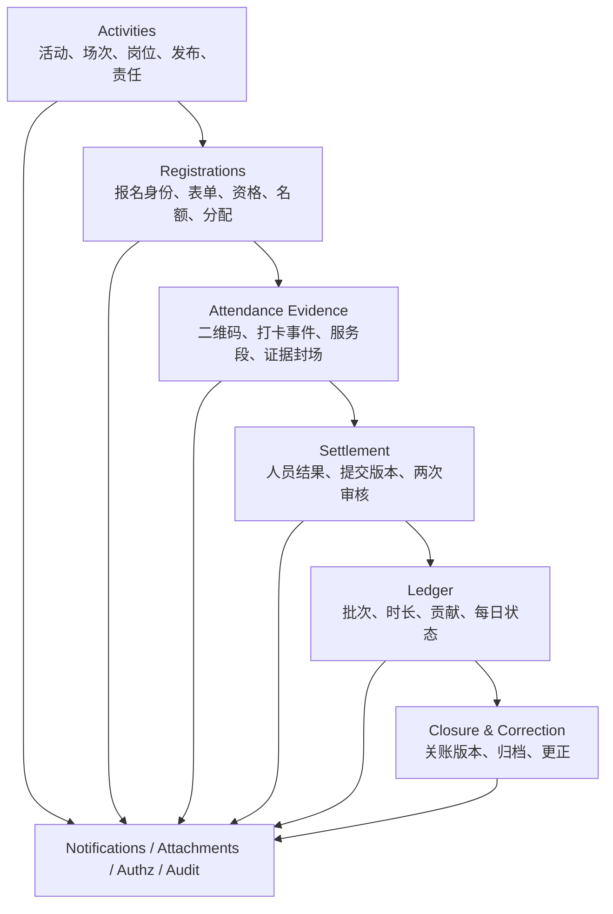

<!--
  SRVF 活动业务全流程改造详细开发文档
  v1.1：开发合同，吸收系统性对抗性复核全部结论。
-->

# SRVF 活动业务全流程改造详细开发文档

> 正式修订版 v1.1｜NestJS、Prisma、PostgreSQL、管理后台和手机端实施合同

- **文档状态：**详细开发合同 GO，必须在仓库预检与维护者授权后按依赖顺序实施
- **代码参照：**所提供的 `0.66.0` 仓库快照，目录标识 `47c4987514fef3772efb95a78adcd73dbd81c89c`
- **业务合同：**[SRVF_活动业务全流程修正方案_正式版_v1.1.md](./SRVF_活动业务全流程修正方案_正式版_v1.1.md)
- **355项追踪：**[SRVF_活动业务规则_355项追踪矩阵_v1.1.md](./SRVF_活动业务规则_355项追踪矩阵_v1.1.md)
- **修订说明：**[SRVF_活动业务文档_v1.1_修订说明.md](./SRVF_活动业务文档_v1.1_修订说明.md)
- **主要技术栈：**NestJS、Prisma、PostgreSQL、现有 Authz/RBAC、现有 Audit、现有 Notification Outbox、现有附件系统

> 本文不是示意图，也不是“开发时再讨论”的愿望清单。字段、状态、唯一约束、事务、锁顺序、接口、失败码、任务恢复和验收编号均属于实现合同。发现本文与当前代码或仓库权威源冲突时，必须停下上报，不能自行选择一种解释。

## 0. 开工协议与权威顺序

### 0.1 仓库恒读与权威顺序

每个实现会话先读：

1. `AGENTS.md`
2. `docs/current-state.md`
3. 触碰范围对应的 `docs/reference/*`
4. 改权限时读取生成源和 `RBAC_MAP` 规则
5. 改对外合同时读取 `docs/handoff/*` 和 contract 规范
6. 改流程、分级和并行时读取 `docs/process.md`

权威冲突顺序沿仓库现行规则：当前事实（current-state、代码、GitHub）高于本开发文档；本开发文档高于旧业务文档和历史归档。发生冲突时暂停上报。

### 0.2 预检、授权和并行

- 开工执行 `pnpm agent:preflight`。
- 新工作树执行 `pnpm install --frozen-lockfile && pnpm prisma:generate`。
- 以正式 goal 立项，明确 DoD、探针队列、写集、禁止域和授权清单。
- 并行 lane 最多3条；schema-touching lane 最多1条；写集相交或同一有界上下文不并行。
- Prisma schema、迁移、seed、权限、合同快照、生产入口、worker 入口和其他红区需要维护者授权。AI 不得执行 `harness:grant` 给自己授权。
- 不新增第3个 cron，不引入 Redis、BullMQ、Kafka 或其他 queue。活动批处理复用 PostgreSQL durable job 和现有 worker 运行形态。
- `RBAC_MAP`、代码地图、计数和合同快照等派生文件按仓库命令生成，禁止手改。

### 0.3 测试和迁移纪律

- 禁止删除测试、跳过测试或放宽已有断言来“适配实现”。
- 修改已有 e2e 断言等于修改行为合同，必须停下汇报。
- 不把必然红的测试单独合入主分支。可使用 `it.todo` 或与最小实现同一 PR 转绿。
- AI 不得执行 `prisma migrate dev`、`prisma migrate reset` 或 `prisma db push`。生产只能部署经审查的 migration。
- 本地基础自证：`pnpm lint && pnpm harness:selftest && pnpm test:contract`。
- 改 `common/*`、permissions、authz、audit、bootstrap 或其他枢纽时先列引用链，并按仓库要求执行完整检查。
- 每个批次由另一个模型做独立交叉复核。

### 0.4 本项目的明确禁止域

- 不建立坐标专用加密仓、隔离库、临时授权角色、专门保存期限或专用告知门。
- 不引入第二套活动权限系统，所有动作最终经过 `AuthzService`。
- 不创建新的 member+date advisory lock。现有 member-only lock 是唯一队员线性化锁域。
- 不新增第三定时任务或外部队列。
- 不保留旧活动考勤和新结算链的长期双读双写。
- 不在 Controller 对外暴露 cursor 分页。
- 不让业务人员提交最多200人的正式考勤数组。

## 1. 当前代码基线与差距

### 1.1 可保留能力

- 活动发起资格、组织范围、字典和时间校验。
- `ActivityPublishReview` 的完整快照、修订号、活动行锁和退回／撤回骨架。
- `ActivityPosition` 的岗位时间、岗位名额和同活动名称唯一约束。
- 报名五态、活动／岗位名额锁、候补递补和并发防超卖骨架。
- 考勤提交、一审、终审、退回、重提和人员隔离。
- `runMemberLinearizedTransaction`、`lockMembersForWrite` 和现有 member advisory lock。
- GPS 距离计算、失败不写记录、App/Admin 原始坐标不回显的字段策略。
- AuditLog、Notification Outbox、附件和现有 worker／lease／fencing 设计。
- App/Admin DTO 物理隔离、标准 `page/pageSize` 分页和统一 Authz。

### 1.2 必须替换或扩展的现状

| 当前文件／对象 | 当前行为 | v1.1目标 |
| --- | --- | --- |
| `activities.dto.ts` / `activities.service.ts` | 一活动一组时间地点；部分空日期写入存在 `new Date(null)` 风险 | 多场次；清空字段使用显式 null 语义；关键字段按阶段进入提案 |
| `activity-publish-review.service.ts` | 存在 `directPublish` 和兼容直接发布分支 | 删除自提自审成功路径；所有初次发布由另一人审核 |
| `app-managed-activities.service.ts#declareAttendanceComplete` | 负责人声明即可写完成标记，不逐人核验 | 删除其关账权威地位；由 EvidenceSeal＋ClosureService 机器检查替代 |
| `activity-closure-policy.ts` | 零考勤单等于零未解决单，活动 completed 后可显示 closed | 关闭读取最新有效 ClosureRevision，12项硬检查前不能生成 |
| `activity-check-in-policy.ts` | 普通签退最短仅36秒 | 普通签退30分钟；特殊提前离场闭合独立动作 |
| `app-activity-check-ins.service.ts` | 一报名一条GPS签到／签退；半径读全局配置 | 场次二维码＋追加事件＋按发布快照的定位规则＋多段服务 |
| `app.config.ts` | 全系统半径默认500米 | 只保留系统默认，发布时解析并冻结到活动／场次；不作为运行时唯一来源 |
| `attendances.dto.ts` | `records` 最大200 | 对外取消大数组业务合同；活动结算用分页编辑和后台任务 |
| `attendances.service.ts` | 终审把 Sheet 改 approved；统计实时读 approved records | 终审提交 LedgerPostingBatch；统计只读 committed batch |
| `ActivityRegistration` | 同活动同人当前报名唯一，取消后可再建新行 | 一活动一总报名、一队员一场次永久参与身份、历史版本追加 |
| `ActivityCheckIn` | 一报名一行，签到签退字段可更新 | 新写全部走 append-only `AttendancePunchEvent`；旧写入口退场 |
| `AttendanceRecord` | 当前有效行随重开、软删变化 | 转为结算版本内服务段快照；正式时长／贡献进入不可改账本 |
| `ContributionRule` | 无规则时保守预填0 | 应计分场次缺规则时禁止终审 |

### 1.3 12个阻断项的实现落点

| 阻断 | 唯一实现落点 |
| --- | --- |
| 封场缺失 | `ActivityEvidenceState`＋`EvidenceSeal`＋提交／一审／终审三次版本比较 |
| 发布后绕审核 | 动作×阶段矩阵＋ProposalValidator／ProposalApplier；关键子资源无直接写通路 |
| 30分钟早退死结 | `early_departure_close` 追加事件，关闭段但0时长0分 |
| 取消重报重复身份 | `ActivityParticipationIdentity(activityId, sessionId, memberId)` 永久唯一 |
| 取消吞现场事实 | CancelService 在 Activity 锁内查有效现场事实，有则只允许 terminate |
| 总名额单位不清 | 活动桶=去重人；场次／岗位桶=人次；第一场占、最后一场释放 |
| 防重串请求 | 每个关键写入持久化 `operationKey/eventKey + requestHash` |
| 锁域冲突 | 只用现有 member-only advisory lock；日状态行为其后行锁 |
| 账本重复 | PostingBatch、Entry、Operation、Reversal 数据库唯一约束 |
| 万人半批 | preparing 分录不可见＋短事务 committed 切换＋day-state CAS |
| 更正不一致 | 人员结果、服务段、账和关闭全部修订化，最新生效版本共同切换 |
| 离线倒填 | 设备绑定包、有效期、序列哈希链、上传时当前权限、异常进入复核暂存 |

## 2. 目标领域架构和硬不变量

### 2.1 有界上下文



模块依赖只允许从业务上游指向下游公共能力，禁止形成活动↔报名↔考勤环形 service 依赖。跨模块不变量通过独立 Policy／QueryService、事务协调器或窄接口注入。

### 2.2 主事实与投影

| 事实 | 唯一主事实 | 页面投影 |
| --- | --- | --- |
| 活动是否取消／终止 | `Activity.statusCode` 和对应审计字段 | phase、按钮状态 |
| 谁是当前主负责人 | 当前 active owner assignment 的数据库唯一槽 | 活动详情 owner |
| 某人是否占活动总名额 | 该人是否有至少一个 current active participation | Activity capacity bucket count |
| 某人某场次当前状态 | `ActivityParticipationIdentity.currentRevisionId` 指向的生效修订 | 报名状态、候补位 |
| 现场发生了什么 | append-only `AttendancePunchEvent` | 当前在场、服务段 |
| 本次结算审核什么 | immutable `AttendanceSettlementVersion` | 一审／终审页面 |
| 正式时长和贡献 | committed `ParticipationLedgerEntry` | 我的考勤、统计、入队进度 |
| 活动是否已结清 | 最新 active `ActivitySettlementClosureRevision` | closed 状态 |
| 更正后的当前结果 | 最新 committed result/service revision + committed ledger batch | 当前人数、时长、评价资格 |

投影可以重建，主事实不能互相反向更新。发现投影漂移时通过对账修复投影，不改写正式事实。

### 2.3 全系统硬不变量

1. 同一活动初次发布只有另一人审核成功路径。
2. 已发布关键字段不存在绕 ProposalService 的写通路。
3. 同一活动、场次、队员永久参与身份唯一，取消不释放身份主键。
4. 活动总名额按去重队员，场次和岗位按参与人次。
5. 同一参与身份同一时刻最多一个开放服务段。
6. 普通签退必须距离本段签到至少30分钟；特殊提前离场闭合永远0时长0分。
7. 正式打卡事件和账本分录不可更新、不可删除。
8. 结算提交、一审、终审都必须引用同一个不可变版本并验证 seal/revision/hash。
9. 审核人不能改结算内容，只能通过或退回。
10. 终审准备中的账本对所有读面不可见；只有 committed batch 生效。
11. 同一队员所有会改变时长、贡献或入队进度的写入共享现有 member-only advisory lock。
12. 北京日最终计入贡献不超过3分，认定分=计入分+未计入分。
13. 更正不覆盖历史，只追加新版本和冲回／替换分录。
14. 一场活动同一时刻最多一个 active closure revision。
15. 关账时所有人员、证据、结算、账本、任务和更正条件必须在 Activity 锁内复查。
16. 对外分页一律 `page/pageSize`，App 管理根路径保持 `/api/app/v1/my/managed-activities`。
17. 责任关系不能绕过 Authz，资源编号不能代替权限。
18. 坐标按普通业务字段保存，不增加本期专用坐标基础设施。

### 2.4 写入不可变与可变投影

**不可变：**发布审核快照、报名修订、分配批次结果、二维码版本历史、PunchEvent、EvidenceSeal、SettlementVersion、ReviewAction、LedgerEntry、CorrectionDecision、ClosureRevision、AuditLog。

**允许更新的当前指针／状态：**Activity 当前状态、ParticipationIdentity 当前修订指针、SettlementRun 当前版本指针、PostingBatch 状态、MemberContributionDayState 版本、BatchJob 进度、当前 active closure 指针。

可变对象的每次状态变化必须具备 CAS／版本字段或行锁，并保留对应不可变审计事实。

## 3. 数据模型详细设计

> 下列为业务字段合同，不是可以随意删减的伪代码。状态字段优先沿仓库惯例使用 String 常量并由 migration CHECK 兜底，避免为了新增状态频繁修改 PostgreSQL enum。所有新模型默认带 `id/createdAt/updatedAt`，不可变模型不带 `updatedAt/deletedAt`。

### 3.1 `Activity` 调整

建议在无生产旧数据的干净切换中调整现有语义，不保留 `completed` 同时代表活动结束和结算完成。

新增或调整字段：

| 字段 | 类型 | 语义 |
| --- | --- | --- |
| `statusCode` | String | `draft / published / cancelled / terminated`；自然进行阶段继续由时间派生，不再使用 `completed` 表示关账 |
| `registrationModeCode` | String | `open_apply / invitation_only / admin_only / paused` |
| `visibilityCode` | String | `internal / invitation`；不得兼任报名方式 |
| `defaultCheckInRadiusMeters` | Int? | 活动默认半径；null 代表沿模板／系统默认，不是“不限制” |
| `defaultLocationRequired` | Boolean | 活动默认是否要求定位 |
| `archiveWaitingDays` | Int | 默认7，范围0..365 |
| `currentEvidenceRevision` | Int | 活动证据总修订号，初始0，现场事实变化同事务+1 |
| `currentPopulationRevision` | Int | 应结算人口修订号，初始0，参与身份变化同事务+1 |
| `currentClosureRevision` | Int? | 当前生效关闭版本号，只是快速指针 |
| `terminatedAt/terminatedByUserId/terminationReason` | nullable | 提前终止事实 |
| `cancelOperationKey` | String? | 当前取消操作防重；实际全历史操作记录另表保存 |

保留：标题、类型、组织、发起人、总时间、地址、正文、附件、总名额、性别、报名截止、保险、发布审计、工作流修订号。

移除权威地位：

- `attendanceDeclaredCompleteAt` 和 `attendanceDeclaredCompleteByUserId` 不再参与关账。可在迁移中删除，或仅保留为不可读的旧字段并在下一合同版本删除；因无生产数据，推荐直接删除。
- `completed` 从活动状态闭集移除。页面“时间已结束”由 session 时间派生，“结算已关闭”由 ClosureRevision 派生。

数据库约束：

- `capacity IS NULL OR capacity >= 1`。
- `archiveWaitingDays BETWEEN 0 AND 365`。
- `terminatedAt` 只在 `statusCode='terminated'` 时有值；`cancelledAt` 只在 cancelled 时有值。
- 已发布活动必须有 `publishedAt/publishedBy` 和至少一个 live session。
- `currentEvidenceRevision/currentPopulationRevision >= 0`。

### 3.2 `ActivitySession`

一行代表一个实际执行场次。

| 字段 | 类型 | 说明 |
| --- | --- | --- |
| `activityId` | FK | 所属活动 |
| `code` | String | 同活动稳定业务编码，创建后不可改，用于排序和防重摘要 |
| `name` | String | 场次名称 |
| `startAt/endAt` | DateTime | 场次计划时间，北京时间仅在展示和业务日拆分时转换 |
| `locationText` | String | 场次地址 |
| `meetingPoint/executionPoint/evacuationPoint` | String? | 结构化现场说明 |
| `longitude/latitude` | Decimal? | 活动中心坐标，成对为空或成对有值 |
| `capacity` | Int? | 场次参与人次上限 |
| `checkInOpenAt/checkInCloseAt` | DateTime | 签到窗口 |
| `checkOutOpenAt/checkOutCloseAt` | DateTime | 签退窗口 |
| `preparationStartAt` | DateTime? | 可计入的准备时段开始；null代表不单独计准备时段 |
| `locationRequired` | Boolean | 最终冻结值，不在运行时再查模板 |
| `radiusMeters` | Int? | 要求定位时50..10000；不要求定位时必须null |
| `locationPolicySourceCode` | String | `system/template/activity/session/position`，仅说明最终值来源 |
| `accuracyWarningMeters` | Int | 固定100；本期只提醒 |
| `lateGraceMinutes/earlyLeaveThresholdMinutes` | Int | 默认15，可在0..60 |
| `terminationCheckOutDeadline` | DateTime? | 场次提前终止后的真实签退截止 |
| `statusCode` | String | `scheduled / cancelled / terminated`；进行中／结束按时间派生 |
| `workflowRevision` | Int | 该场次最近一次发布审核生效版本 |
| `sortOrder` | Int | 排序 |
| `deletedAt` | DateTime? | 仅草稿可软删；发布后取消走状态，不删除历史 |

约束：

- live `(activityId, code)` 和 `(activityId, name)` 唯一。
- `startAt < endAt`；正式签到签退场次时长至少30分钟。
- 四个窗口必须满足 `checkInOpenAt <= checkInCloseAt <= checkOutCloseAt`，且 `checkOutOpenAt <= checkOutCloseAt`；允许签到和签退窗口重叠，但业务语义必须有测试。
- `preparationStartAt <= startAt`，不得晚于场次开始。
- 坐标成对；`locationRequired=true` 时坐标与半径必填；false 时半径必须null，但坐标可保留作导航。
- session 必须落在 Activity 总时间范围内；活动总时间由最早场次开始和最晚场次结束自动派生或在写入时强制一致。
- 发布后的 session 不允许直接更新关键字段，更新只能由 ProposalApplier 在审核事务中执行。

索引：`activityId`、`statusCode`、`startAt`、`endAt`、`checkOutCloseAt`、`activityId+sortOrder`。

### 3.3 `ActivitySessionPosition`

取代“岗位只有活动级时间”的不足；现有 `ActivityPosition` 可在干净切换中重命名／重建为本模型，避免同时保留两套岗位。

| 字段 | 说明 |
| --- | --- |
| `activityId/sessionId` | 双锚点，service 与 DB 约束保证 session 属于 activity |
| `code/name` | 稳定编码和显示名称 |
| `attendanceRoleCode` | 贡献规则角色 |
| `capacity` | 岗位参与人次上限，null不限 |
| `startAt/endAt` | 可空；有值时必须同空同有且位于 session 内 |
| `genderRequirementCode` | 可空追加资格 |
| `qualificationRuleSetId` | 可空岗位资格版本 |
| `locationRequired/radiusMeters` | 可空覆盖 session；发布时解析最终值进入快照 |
| `leaderMemberId` | 岗位负责人业务关系，不直接产生权限 |
| `description/equipmentNotes/sortOrder` | 展示与排序 |
| `deletedAt` | 仅草稿软删；发布后用变更提案取消或替代 |

唯一约束：live `(sessionId, code)`、live `(sessionId, name)`。

### 3.4 配置模板与最终快照

业务文档承诺模板继承，不能只在页面写文案。第一版采用最小可控模型：

#### `ActivityTemplate`

- `id/code/name/activityTypeCode/statusCode/version`
- 默认报名方式、默认定位、窗口偏移、迟到／早退、归档等待、常用岗位模板。
- 模板更新形成新版本，不覆盖已发布活动。

#### `ActivityRuleSnapshot`

每次初次发布或关键变更审核通过时生成不可变快照：

- `activityId/workflowRevision/templateVersionId`
- 活动默认和每个 session／position 的最终解析配置。
- `snapshotHash`，使用 canonical JSON 计算。
- `createdByReviewId/createdAt`。

运行时打卡和结算读取当前审核生效的 snapshot 或已反范式到 session 的最终字段，不实时继承模板。模板变化不修改已发布活动。

### 3.5 活动责任关系

现有 `ActivityResponsibilityAssignment` 继续作为历史业务关系，不另建第二套 RBAC。

建议扩展：

- `scopeTypeCode`: `activity / session / position`
- `scopeSessionId/scopePositionId`
- `responsibilityType`: `owner / draft_editor / registration_collaborator / attendance_collaborator / onsite_operator / position_leader / readonly`
- 现有两个大布尔 `canManageRegistrations/canManageAttendance` 逐步退场，由 responsibilityType + scope 投影给 Authz。
- `startedAt/endedAt/status/assignedBy/endedBy/reason/source` 保留历史。

数据库不变量：

- published／terminated 活动恰好一个 live owner，使用 partial unique 保证一活动至多一个 active owner；发布和移交事务保证至少一个。
- 同一 member、activity、type、scope 同时至多一条 active assignment。
- 移交在 Activity 锁内先创建新 owner、再结束旧 owner，或用单事务 CAS，使外部不可观察到0人或2人状态。
- 责任关系本身不作为 Controller 判权结果。`AuthzService.explain()` 统一读取角色绑定、组织范围和责任关系后给出 allow/deny。

### 3.6 `ActivityRegistration`：活动级总报名头

一活动一队员永久唯一，不因取消重报另建头行。

字段：

- `activityId/memberId`，普通 unique，不排除 cancelled。
- `currentRevision`、`currentFormVersionId`、`statusSummaryCode`（可缓存投影）。
- `sourceCode`: `self/admin/invitation/onsite`。
- `createdAt/updatedAt`，不软删；彻底退出以修订表达。

`statusSummaryCode` 推荐由各场次参与身份实时聚合；若为性能保存，必须由同事务更新且可重建。聚合规则：只要有 active/pass/attended selection 即 active；所有终态后按优先级输出 `completed/cancelled/not_selected/expired`，不能把部分通过和部分候补压成错误单态。

唯一：`(activityId, memberId)`。

### 3.7 `ActivityRegistrationRevision`

不可变记录每次报名／重报／撤回／后台代建：

- `registrationId/revision` unique。
- `formVersionId/answersHash/sourceCode/submittedByUserId/submittedAt`。
- `requestKey/requestHash` unique idempotency。
- `priorRevisionId/reason`。
- 原始答案存 `RegistrationFormAnswer` 行，不在 audit context 复制敏感文件内容。

### 3.8 `ActivityParticipationIdentity`

P0-04 核心模型，一行代表一个队员参加一个场次的永久身份。

| 字段 | 语义 |
| --- | --- |
| `activityId/sessionId/registrationId/memberId` | 永久锚点 |
| `currentRevision` | 当前修订号 |
| `currentStatusCode` | 当前状态投影 |
| `currentPositionId` | 当前最终岗位，可空 |
| `capacityReservationId` | 当前占位记录，可空 |
| `populationIncluded` | 是否进入当前应结算人口；随状态原子更新 |
| `version` | CAS版本 |

普通 unique `(activityId, sessionId, memberId)`，不带删除条件。取消重报只追加 ParticipationRevision 并改当前指针。

### 3.9 `ActivityParticipationRevision`

不可变状态修订：

- `identityId/revision` unique。
- `statusCode`: `pending / pass / waitlisted / not_selected / rejected / cancelled / cancellation_requested / invitation_pending / invitation_declined / invitation_expired / review_expired / waitlist_expired / attended / settled`。
- `positionId/preferenceSnapshot/allocationBatchId/waitlistRank`。
- `reviewedBy/reviewedAt/reviewNote`。
- `cancelledBy/cancelledAt/cancelReason`。
- `effectiveAt/createdByUserId/sourceCode/requestKey/requestHash`。

当前 revision 指针和 PopulationRevision 必须在同一 Activity 事务中更新。

### 3.10 容量和占位

#### `ActivityCapacityBucket`

| 字段 | 说明 |
| --- | --- |
| `activityId` | 聚合根 |
| `scopeTypeCode` | `activity_person / session_participation / position_participation / reserve_group` |
| `scopeId` | activity/session/position/reserve group id |
| `capacity` | null不限；有值>=1 |
| `occupied` | 当前占用数，>=0且不大于capacity |
| `version` | CAS |

unique `(scopeTypeCode, scopeId)`。

#### `CapacityReservation`

每个当前占位的可追溯事实：

- `identityId/bucketId/reservationType/status/createdAt/releasedAt/releaseReason`。
- 活动总名额 reservation 以 registration/member 为单位；session／position 以 identity 为单位。
- partial unique 保证一个 identity 对一个 bucket 至多一条 active reservation；一个 member／activity 至多一条 active activity-person reservation。

占位事务：

1. 锁 Activity。
2. 锁相关 identity 和 capacity buckets，按 scopeType、scopeId 排序。
3. 重读当前 revision、容量和 existing reservations。
4. 第一个有效 session 时创建 activity-person reservation；每个 session／position分别创建人次 reservation。
5. 更新 bucket occupied 与 version。
6. 追加 ParticipationRevision、PopulationRevision、Audit 和通知 intent。

释放部分场次不释放 activity-person reservation；最后一个 active session 才释放。

### 3.11 分配、志愿、候补和预留名额

#### `ActivityPositionPreference`

`registrationRevisionId/sessionId/positionId/preferenceOrder`，unique `(registrationRevisionId, sessionId, preferenceOrder)` 和 `(registrationRevisionId, sessionId, positionId)`。

#### `ActivityAllocationBatch`

- `activityId/sessionId/positionId?`
- `modeCode`: `first_come / qualification_rank / lottery`
- `candidateSnapshotHash/ruleSnapshotId/randomCommitment?`
- `statusCode`: `preparing/committed/voided`
- `operationKey/requestHash/createdBy/committedAt`

#### `ActivityAllocationCandidate`

保存 identity、资格评分、稳定 tie-break、抽签序号、最终结果、候补序号和解释。结果 committed 后不可改。

#### `ActivityReservedQuotaGroup`

- scope、资格条件版本、capacity、releaseAt、fallbackMode。
- 释放到公共池时走 Activity 锁和 capacity transaction。

候补查询从最新 committed allocation batch 读取，不单独用 `registeredAt` 猜顺序。

### 3.12 报名表版本、字段、答案和上传会话

#### `RegistrationFormVersion`

- `activityId/version/statusCode(draft/active/retired)`
- `workflowRevision/schemaHash/activatedAt/retiredAt`
- unique `(activityId, version)`；一活动至多一个 active。

#### `RegistrationFormField`

- `formVersionId/fieldCode/label/helpText/typeCode`
- `required/minValue/maxValue/minLength/maxLength/maxSelections`
- `optionsJson/visibilityCode/exportable/sortOrder`
- unique `(formVersionId, fieldCode)`。

支持类型：`short_text/long_text/number/date/single_choice/multi_choice/file/confirmation`。

#### `RegistrationFormAnswer`

- `registrationRevisionId/fieldId`
- `valueText/valueNumber/valueDate/valueJson/attachmentId`，exactly-one 由 CHECK 保证。
- unique `(registrationRevisionId, fieldId)`。
- 服务端按该 revision 绑定的 formVersion 校验，禁止把新版本字段填进旧报名修订。

#### `RegistrationUploadSession`

- `activityId/memberId/formVersionId/tokenHash/expiresAt/consumedAt/statusCode`
- 文件上传后 attachment 临时 owner 绑定 session；提交报名时同事务验证并转移归属。
- 原始 token 只返回一次，不入库；不新增自动清理 cron，过期会话由现有手动 retention SOP 清理。

### 3.13 资格规则和评估快照

#### `ActivityQualificationRuleSet`

- `activityId/sessionId?/positionId?/version/statusCode`
- 一组规则的冻结版本，发布审核后 active。

#### `ActivityQualificationRule`

- `ruleSetId/ruleTypeCode/enforcementCode(block/warn)`
- `operator/valueJson/message/sortOrder`
- 支持 grade、organization、certificate、age、training、gender、insurance。

#### `QualificationEvaluationSnapshot`

- `identityId/registrationRevisionId/ruleSetVersionId/evaluatedAt`
- `resultCode(pass/warn/fail)`、`detailsJson`、`inputFactsHash`。
- 展示、提交和审核三次评估分别留快照；正式通过使用审核时快照。
- 不把证件号、完整保单或其他高敏感原值复制进 details，只保存规则编号、结果和必要引用。

### 3.14 邀请和访客

#### `ActivityInvitation`

- `activityId/memberId/sessionId?/positionId?`
- `statusCode`: `pending/accepted/declined/revoked/expired`
- `expiresAt/invitedByUserId/respondedAt/revokedAt/reason`
- `operationKey/requestHash`
- active partial unique `(activityId, memberId, sessionId)`。
- 接受时调用同一 registration/qualification/capacity service，不直接改为 pass。

#### `ActivityVisitor`

- `activityId/sessionId/name/organization/invitedByMemberId/note/attendanceCode`
- 与 Member、Participation、Ledger 无 relation；禁止通过访客创建贡献分。

### 3.15 二维码凭证 `AttendanceQrCredential`

| 字段 | 说明 |
| --- | --- |
| `activityId/sessionId/actionCode` | action为check_in或check_out |
| `credentialVersion` | 单调递增 |
| `statusCode` | active/revoked/expired |
| `tokenDigest` | 服务端签名载荷摘要，不保存可直接使用的完整二维码文本 |
| `signingKeyVersion` | 使用的密钥版本 |
| `validFrom/validUntil` | 有效窗口 |
| `issuedByUserId/issuedAt` | 签发审计 |
| `revokedByUserId/revokedAt/revokeReason` | 作废审计 |
| `operationKey/requestHash` | 重发／作废防重 |

约束：

- 同一 session/action 至多一个 active credential，DB partial unique。
- unique `(sessionId, actionCode, credentialVersion)`。
- 打卡事务在锁内按 session/action/version 重读 active 状态；不只验证签名。
- 二维码读取返回短时生成的可打印内容，只有 `attendance-qr.read/print` 权限可得；列表响应不永久回显完整 token。

### 3.16 追加式打卡事件 `AttendancePunchEvent`

正式现场事实的唯一写入表，不提供 update/delete endpoint。

| 字段 | 说明 |
| --- | --- |
| `activityId/sessionId/positionId?` | 场次和岗位上下文 |
| `participationIdentityId/memberId` | 永久身份和队员 |
| `eventTypeCode` | check_in/check_out/early_departure_close/void/replace |
| `occurredAt` | 真实发生时间；在线由服务端生成 |
| `receivedAt` | 服务端收到时间 |
| `sourceCode` | self_qr/staff_scan/proxy/bulk/import/offline/correction |
| `operatorUserId/operatorMemberId?` | 操作者；本人自助也记录User |
| `reason` | 人工、特殊闭合、作废和替代必填 |
| `qrCredentialId?` | 本人扫码或工作人员扫场次码时关联 |
| `deviceId?/offlinePackageId?/importJobItemId?` | 来源证据 |
| `longitude/latitude/accuracy/distance?` | 普通业务字段，可空 |
| `geoVerified/outOfRange/lowAccuracy` | 判定快照 |
| `eventKey` | 客户端或任务防重号，全局unique |
| `requestHash` | canonical request摘要 |
| `supersedesEventId?` | void/replace 目标 |
| `evidenceRevision` | 本事件提交后活动证据版本 |
| `createdAt` | 入库时间；无updatedAt/deletedAt |

数据库约束：

- unique `eventKey`。
- `eventType=void/replace` 时 `supersedesEventId` 和 reason 必填；普通签到签退不得带 supersedes。
- 一条原事件至多被一个当前有效 void/replace 操作处理，使用 operation unique 或 effect projection 约束。
- 位置字段成对；不要求定位时允许全部null。
- 在线 source 的 `occurredAt` 必须等于事务内 authoritative now；DTO不接客户端时间。
- append-only trigger／权限：生产业务角色不得 UPDATE/DELETE。迁移和恢复账号另受运维流程控制。

`requestHash` canonical 输入至少包含：operatorUserId、memberId、identityId、activityId、sessionId、positionId、eventType、source、device／package、occurredAt、位置、qrVersion和reason归一值。相同eventKey但hash不同抛 dedicated BizCode。

### 3.17 `ActivityEvidenceState` 与 `EvidenceSeal`

#### `ActivityEvidenceState`

一活动一行：

- `activityId` unique。
- `evidenceRevision/populationRevision/version`。
- `lastEvidenceAt/lastPopulationAt`。
- 由 PunchEvent、ParticipationRevision、场次取消／终止、人工复核正式化同事务递增。

#### `EvidenceSeal`

不可变封场凭证：

- `activityId/sealRevision` unique。
- `evidenceRevision/populationRevision/workflowRevision`。
- `allWindowsClosedAt`、`openSegmentCount`、`manualReviewPendingCount`。
- `populationCountDistinct/populationCountBySession`。
- `contentHash/statusCode(active/superseded)`。
- `sealedByUserId/sealedAt`。

生成条件：Activity 锁内确认所有 session 的有效 checkout deadline 已过、无开放段、无待人工复核、无待生效关键变更。新证据或人口变化会递增 state revision，使旧seal失配；不直接修改旧seal。

### 3.18 服务段投影与修订

#### `ParticipantServiceSegmentRevision`

- `participationIdentityId/segmentKey/revision` unique。
- `sourceCheckInEventId/sourceCloseEventId`。
- `resultCode`: `valid/early_departure_zero/voided/replaced`。
- `checkInAt/checkOutAt/serviceHours`。
- `lateFlag/earlyLeaveFlag/exceptionFlagsJson`。
- `baseRevisionId/effectiveBatchId?`。
- `statusCode`: `draft/committed/superseded`。

服务段不是直接人工编辑的主事实。普通草稿由 PunchEvent 重建；负责人在结算前的认定变更形成新的 segment revision，并记录依据和原因。正式生效后只能通过 correction 创建后继revision。

同一 identity 同一时刻至多一个 current non-superseded segment；时间重叠校验在现有 member lock 内完成。

### 3.19 结算根与不可变提交版本

#### `AttendanceSettlementRun`

一活动一行：

- `activityId` unique。
- `statusCode`: `not_started/drafting/submitted/pending_first_review/pending_final_review/posting/posted/correction_open/closed`。
- `currentDraftVersion/currentSubmittedVersion/currentPostedVersion/currentClosureRevision`。
- `version` CAS。
- 状态是页面投影和流程根，正式人员结果／账本仍由版本和batch主导。

#### `AttendanceSettlementVersion`

每次提交或重提一版，不可变：

- `settlementRunId/version` unique。
- `evidenceSealId/evidenceRevision/populationRevision/workflowRevision`。
- `contentHash/personCount/sessionParticipationCount/serviceSegmentCount`。
- `createdByUserId/createdAt/submittedAt`。
- `statusCode`: `draft/submitted/returned/approved/voided`。
- `priorVersionId/returnFromStage/returnReason`。
- `operationKey/requestHash`。

草稿可通过独立 draft working tables编辑；点击提交时在事务中把当前草稿固化为 immutable SettlementVersion。审核永远引用 versionId，不引用可变run内容。

#### `SettlementReviewAction`

append-only：

- `settlementVersionId/stageCode(first/final)/actionCode(approve/return)`。
- `actorUserId/actedAt/note/operationKey/requestHash`。
- unique operationKey；一版本一阶段只允许一个生效决定。
- Authz action constraint 和事务内锁后复判提交人／一审人／终审人分离。

### 3.20 人员结算结果修订

#### `ParticipantSettlementResultRevision`

- `settlementVersionId/participationIdentityId/revision`。
- `resultCode`: `present/leave/absent/cancelled/not_selected/waitlist_expired/review_expired/invitation_expired/exempt/early_departure_zero`。
- `lateFlag/earlyLeaveFlag/exceptionFlagsJson`。
- `recognizedServiceHours/recognizedContributionPoints`。
- `calculatedServiceHours/calculatedContributionPoints`。
- `adjustmentReason`：认定与计算不同必填。
- `statusCode`: `draft/committed/superseded`。
- `baseResultRevisionId/correctionRequestId?`。

unique `(settlementVersionId, participationIdentityId)`；一个identity每个正式版本一条。最新当前结果通过SettlementVersion／Correction committed指针确定，不按最大时间猜。

### 3.21 北京日拆分 `ParticipantSettlementDay`

- `resultRevisionId/memberId/ledgerDate`。
- `serviceHours/recognizedPoints`。
- `sequenceStartAt/stableOrderKey`。
- `creditedPoints/cappedOutPoints`，preparing阶段可重算，committed后不可改。
- unique `(resultRevisionId, ledgerDate)`。

`ledgerDate` 使用 PostgreSQL `Date`（Prisma DateTime `@db.Date` 或仓库明确的日期封装，必须唯一选型）。业务转换统一调用 `BeijingCalendarService`，禁止散落 `toLocaleString` 或字符串切割。

### 3.22 账本发布批次 `LedgerPostingBatch`

| 字段 | 说明 |
| --- | --- |
| `settlementRunId/settlementVersionId` | 结算来源 |
| `batchRevision` | 同一run单调递增 |
| `statusCode` | preparing/ready/committed/failed/voided |
| `requestKey/requestHash` | 操作防重 |
| `baselineJsonHash` | seal、人员、day-state基线摘要 |
| `preparedCount/totalCount/failureCount` | 进度 |
| `preparedAt/committedAt/failedAt/voidedAt` | 状态时间 |
| `preparedByUserId/committedByUserId` | 操作者 |
| `version` | CAS |

唯一：`requestKey`；`(settlementVersionId, batchRevision)`；一个SettlementVersion至多一个committed posting batch。

准备中和ready分录必须对所有正常读面不可见。只允许通过 `batch.statusCode='committed'` join后读取。

### 3.23 正式账本 `ParticipationLedgerEntry`

append-only，无 `updatedAt/deletedAt`：

- `postingBatchId/entryKey/operationKey/requestHash`
- `memberId/activityId/sessionId/participationIdentityId/resultRevisionId`
- `ledgerDate`
- `entryTypeCode`: `service_credit/contribution_credit/service_reversal/contribution_reversal`。
- `serviceHoursDelta/recognizedPointsDelta/creditedPointsDelta/cappedOutPointsDelta`。
- `reversesEntryId?`。
- `createdAt`。

数据库唯一与CHECK：

1. unique `entryKey`。
2. unique `operationKey`（或 operation+entry ordinal）。
3. unique `(postingBatchId, resultRevisionId, ledgerDate, entryTypeCode)`。
4. reversal entry 必须带 `reversesEntryId`；普通credit不得带。
5. 一条原entry至多被一个 committed reversal 逻辑冲回；因跨batch状态，service锁后检查+partial unique辅助表 `LedgerEntryReversalClaim(originalEntryId unique)`。
6. recognized = credited + cappedOut 对每个贡献分录成立。
7. service／points小数位和范围有CHECK。
8. 只允许 INSERT；数据库角色层禁止业务账号UPDATE/DELETE。

### 3.24 `MemberContributionDayState`

持久化的日版本行，不是新的 advisory lock：

- `memberId/ledgerDate` unique。
- `version`、`committedCreditedPoints`、`latestBatchId`、`updatedAt`。
- 在取得现有member advisory lock后，按 `(memberId, ledgerDate)` 排序 `FOR UPDATE`。
- 最终commit比较准备时baseline version；不一致则本batch不能提交，重算受影响member/date。
- committed后递增version并更新日合计，日合计必须0..3。

### 3.25 更正模型

#### `AttendanceCorrectionRequest`

- `activityId/settlementRunId/participationIdentityId?`
- `baseSettlementVersionId/baseResultRevisionId?/baseClosureRevision`
- `requestTypeCode`: result/service/time/points/person_identity/other。
- `requestedChangeJson/reason/attachmentIds`。
- `statusCode`: `pending/returned/approved/rejected/applying/applied/voided`。
- `submittedByUserId/submittedAt/reviewedByUserId/reviewedAt/reviewNote`。
- `operationKey/requestHash/version`。

partial unique 保证同一target同一时刻至多一个 pending/returned/approved/applying request。审核时基础版本变化则置voided并要求新申请。

#### `CorrectionApplication`

批准后创建不可变应用版本：

- `correctionRequestId/newSettlementVersionId/newResultRevisionIds/newPostingBatchId`。
- `statusCode`: preparing/committed/failed/voided。
- 更正posting batch先产生 reversal，再产生replacement credits。
- committed后旧Result／Segment revision标为superseded投影，新版本成为current；旧记录不更新删除。

### 3.26 关闭版本 `ActivitySettlementClosureRevision`

不可变：

- `activityId/revision` unique。
- `settlementVersionId/postingBatchId/evidenceSealId`。
- `evidenceRevision/populationRevision/workflowRevision`。
- `personCount/sessionParticipationCount/resultCountsJson/serviceHours/contributionPoints`。
- `checksHash/checksJson`（仅保存非敏感摘要和失败计数，不复制人员明细）。
- `statusCode`: `active/superseded/voided`。
- `closedByUserId/closedAt/supersededAt/supersededByCorrectionId?`。

partial unique 保证一活动至多一个active closure。更正正式应用时旧active closure在同一事务变superseded；更正完成后重新关账追加revision，不覆盖旧行。

### 3.27 后台任务

#### `ActivityBatchJob`

- `jobTypeCode`: settlement_prepare/bulk_proxy/import_preview/import_execute/export/notification_expand/reconciliation。
- `activityId/sessionId?/settlementVersionId?/postingBatchId?`
- `statusCode`: pending/processing/succeeded/partial_failed/failed/cancelled/dead。
- `operationKey/requestHash/payloadVersion/payload`。
- `total/succeeded/failed/skipped`。
- `leaseOwner/leaseGeneration/leaseExpiresAt/attempts/availableAt`。
- `createdByUserId/createdAt/startedAt/completedAt/lastErrorCode`。

#### `ActivityBatchJobItem`

- `jobId/itemKey/statusCode/attempts/lastErrorCode/safeMessage`。
- `resourceType/resourceId`，用于逐项防重。
- `payloadHash/resultReference`，不存异常堆栈、SQL和敏感原值。
- unique `(jobId, itemKey)`。

worker协议：复用现有PostgreSQL `SKIP LOCKED + lease/fencing`模式，在现有worker进程注册ActivityBatchWorker，不新增cron和外部队列。业务写成功但item尚未标成功时，重试由业务operationKey防重恢复。

## 4. 状态机

所有状态迁移由独立 StateMachine／Policy 实现；Controller 不写状态，Service 不手写未注册裸字符串。状态机单测必须覆盖允许边、拒绝边和幂等重试。

### 4.1 活动执行状态

| 当前 | 动作 | 下一状态 | 条件 |
| --- | --- | --- | --- |
| draft | submit_publish_review | draft | 创建pending review，活动本身仍draft |
| draft | publish_review_approve | published | 另一人审核、快照一致、至少一场次 |
| draft | cancel | cancelled | 原因必填；无现场事实 |
| published | cancel | cancelled | 第一场开始前且无有效现场事实；强确认规则满足 |
| published | terminate | terminated | 已开始或已有有效现场事实；原因必填 |
| published | natural_time_progress | published | ongoing/ended由时间派生，不写状态 |
| terminated | correction | terminated | 只改结算版本，不回到published |
| cancelled/terminated | normal_update | 拒绝 | 只允许展示白名单或更正路径 |

自然结束不需要定时任务写状态；`phase` 从sessions与当前时间派生。关账不修改Activity执行状态。

### 4.2 发布审核状态

`pending → approved | returned | withdrawn | cancelled`。

- 初次发布和change proposal同一状态机。
- `submittedByUserId != reviewedByUserId` 为事务内硬不变量。
- review引用snapshotHash和base workflowRevision。
- approved时ProposalApplier在Activity锁内原子应用全部父子资源，并递增workflowRevision。
- 任何关键子资源直接写方法在published阶段返回 `ACTIVITY_CHANGE_REVIEW_REQUIRED`。

### 4.3 参与身份状态

`invitation_pending / pending / waitlisted / pass / cancellation_requested / cancelled / not_selected / rejected / review_expired / waitlist_expired / invitation_declined / invitation_expired / settled`。

允许主路径：

- invitation_pending → pending/pass（接受并通过资格／名额流程）或 declined/expired/revoked。
- pending → pass/waitlisted/rejected/review_expired。
- waitlisted → pending/pass/not_selected/waitlist_expired/cancelled。
- pass → cancellation_requested/cancelled/settled。
- cancelled → pending/waitlisted/pass（重报时追加revision，identity不变）。
- 任一有现场事实的pass身份不可直接变cancelled；最终由settlement result表达离场／缺席等。

### 4.4 二维码状态

`active → revoked | expired`，不可逆。重发创建新version，不把旧row改回active。

### 4.5 服务段状态

服务段从PunchEvent投影：

- 无开放段＋check_in → open。
- open＋check_out（>=30分钟）→ closed_valid。
- open＋early_departure_close（<30分钟或明确特殊原因）→ closed_zero。
- open＋第二次check_in → 拒绝。
- closed_valid／closed_zero＋新check_in → 新segment open。
- 相关event被void／replace → 生成新的segment revision，不覆盖旧revision。

### 4.6 证据封场状态

`unsealed → active seal → superseded`。

- 新PunchEvent、正式化的离线复核、Participation current revision变化或关键workflow revision变化，使旧seal版本不匹配。
- 不需要主动update旧seal也能判过期；可在新seal写入时把旧active改superseded作为投影。

### 4.7 结算状态

`not_started → drafting → submitted → pending_first_review → pending_final_review → posting → posted → closed`。

分支：

- pending_first_review / pending_final_review → returned → drafting。
- posted / closed → correction_open → posting → posted → closed。
- review只处理immutable SettlementVersion；returned后新提交版本递增。
- posting失败保持posted之前不可见，不允许把run标posted。

### 4.8 账本批次状态

`preparing → ready → committed`；失败分支 `preparing/ready → failed → voided`。

- committed不可回退、不可删除。
- failed可以重新准备新batch revision，不能把原batch改回preparing。
- ready只表示所有分录已准备、基线已保存，不表示对用户可见。

### 4.9 更正状态

`pending → returned | approved | rejected | voided`；`approved → applying → applied | failed | voided`。

- base version变化时pending/returned/approved均可被系统置voided。
- applied后不能重开同一申请；再次发现错误创建新申请。

### 4.10 关闭和归档状态

- ClosureRevision: `active → superseded | voided`。
- Activity archive projection: `unarchived → waiting → archived`。
- 新更正进入applying时，当前active closure在最终更正commit事务内才变superseded；准备阶段页面仍显示旧正式结果并标记“有更正处理中”。
- 更正commit后活动不再closed，直到新12项检查通过并写新active closure。

## 5. 核心算法和事务协议

### 5.1 北京时间服务单一来源

新增纯业务服务 `BeijingCalendarService`，禁止各模块自行写时区转换：

- `toLedgerDate(instant): LocalDate`
- `splitIntervalByLedgerDate(start,end): DaySlice[]`
- `startOfLedgerDate/endOfLedgerDate`
- `compareStableServiceOrder(startAt, activityId, sessionId, segmentKey)`

存储仍使用UTC DateTime；`ledgerDate`使用数据库Date。测试覆盖23:59:59.999、00:00:00、夏令时无关性（北京时间无DST）和跨多日。

### 5.2 发布提案应用算法

`ActivityProposalSnapshot` schemaVersion升级，包含：

- Activity全部关键字段。
- sessions数组。
- sessionPositions数组。
- formVersion、qualificationRuleSets、template resolution snapshot。
- visibility、registrationMode、notification audience snapshot。

流程：

1. submit时Activity `FOR UPDATE`。
2. ProposalValidator从数据库现状＋patch构建canonical完整snapshot。
3. 校验父子归属、时间、名额、活动已占用数、现场事实和生命周期。
4. 保存base workflowRevision、snapshotHash、受影响member count。
5. approve时再次Activity锁，重建或解析snapshot，比较base revision与hash。
6. ProposalApplier按固定顺序写Activity→Sessions→Positions→Form/Rules→capacity buckets→QR revoke／reissue requirements→population revision→notifications。
7. 递增workflowRevision，写RuleSnapshot、Audit和冻结Notification intent。

直接小改仅允许白名单字段，走独立 `updateDisplayOnly()`，代码常量列出字段且测试确保关键字段不在白名单。

### 5.3 名额占用和释放

所有名额操作使用Activity聚合锁：

```text
Activity FOR UPDATE
→ ParticipationIdentity（按 id 排序）
→ CapacityBucket（按 scopeType, scopeId 排序）
→ CapacityReservation
→ ParticipationRevision
→ ActivityEvidenceState.populationRevision + 1
→ Audit / Notification intent
```

首次获得有效session：如果该member尚无其他active identity，先占activity_person bucket。随后占session和position bucket。任一层容量不足时全事务回滚或进入该分配方式的waitlist。

释放：先释放position、session；只有该member无其他active session时才释放activity_person。occupied由reservation变化同事务更新，定期人工／后台对账只负责发现和修复投影，不能成为正常写路径。

### 5.4 分配批次

#### 先到先得

- 以服务端事务受理序号作为稳定顺序。
- 符合资格且容量可占时直接pass；否则进入waitlisted并保存rank source。

#### 资格排序

- 截止后锁Activity，冻结候选identity、registration revision、qualification snapshot和评分规则。
- 在ActivityAllocationCandidate保存每项评分和tie-break。
- committed batch应用名额和current revision。

#### 抽签

- 冻结候选集合和排序后的identity ids。
- 保存random commitment和实现版本；执行后保存seed reveal（若业务要求公开）或内部可审计seed引用。
- 结果与候补序列committed后不可改；重新抽签必须void旧batch并写原因。

### 5.5 打卡验证顺序

所有来源统一调用 `AttendancePunchCommandService`，顺序不可随入口变化：

1. 解析当前User／Member和source。
2. 取得Activity `FOR SHARE` 或需要变更聚合时 `FOR UPDATE`。
3. 取得ParticipationIdentity行锁。
4. 事务内重读当前Authz、活动／场次状态、身份revision、场次／岗位窗口和RuleSnapshot。
5. 扫码入口锁内重读QrCredential active/version/action。
6. 生成authoritative now；在线DTO不接occurredAt。
7. 按source校验定位、离线包、导入预览、reason和device。
8. 计算canonical requestHash，查询eventKey：同hash返回原结果，不同hash报冲突。
9. 读取当前有效segment projection，校验开放／闭合和30分钟。
10. 插入PunchEvent，递增EvidenceState.evidenceRevision，写Audit。
11. 事务后返回安全Presenter，不返回原始经纬度。

普通check_out不足30分钟拒绝；`early_departure_close`只允许onsite权限，reason必填，并固定zero outcome。

### 5.6 作废和替代

- `void`引用原event，锁identity和原event，验证未被当前effect处理。
- 插入void event，递增evidenceRevision。
- 根据完整事件链重建受影响segment revision。
- 若已有submitted但未posted结算，使版本比较失败，要求退回重提。
- 若已有committed ledger，只能通过Correction流程，普通void endpoint拒绝。

### 5.7 离线包协议

#### 签发

- 有onsite权限的工作人员在线申请package。
- 绑定activity/session/operator/deviceId、名单snapshotHash、规则版本、validFrom/validUntil、sequenceStart、packageKeyVersion。
- 原始package token／签名材料只返回一次，数据库存digest和非秘密元数据。

#### 本地事件

每条包含sequence、priorHash、eventPayloadHash、deviceTime和signature。客户端不能自由跳号或重排。

#### 上传

1. 上传时当前User仍需onsite权限。
2. 验证package未过期、device一致、sequence连续、hash chain完整。
3. 设备时间在允许漂移和补传窗口内，且不在未来。
4. 正常事件逐条调用同一PunchCommandService，source=offline。
5. 撤权、过期、异常时间、链断裂或换设备写入`OfflinePunchReviewItem`，不进入PunchEvent。
6. 人工复核通过后以review actor和reason生成新的正式PunchEvent，保留原staging证据引用。

### 5.8 Evidence Seal算法

`EvidenceSealService.seal(activityId)`：

1. Activity `FOR UPDATE`。
2. 重读所有live sessions和termination deadlines。
3. authoritative now必须晚于所有有效checkout deadline。
4. 查询开放segment数量、待人工复核数量和未处理event effect。
5. 读取ActivityEvidenceState的evidence/population/workflow revision。
6. 计算当前population distinct和by-session摘要。
7. 若有pending change review或版本在本事务内变化，拒绝。
8. 写immutable EvidenceSeal和audit；旧active seal可标superseded投影。

seal不是“负责人承诺”，没有所有条件不能写。

### 5.9 结算草稿生成

- 输入必须是active EvidenceSeal。
- 以ParticipationIdentity current revision和populationIncluded生成每个队员×场次一项。
- 从有效PunchEvent链重建segments，不能用计划endAt补签退。
- 无event者默认待负责人选择，不自动认定absent；系统可建议，但提交前必须明确。
- 迟到／早退按冻结阈值计算成标签。
- 贡献规则按activityType×role×version查找；应计分无规则标blocker。
- 500人以内可同步生成working draft；更大规模创建ActivityBatchJob，业务页面仍显示一张run。

### 5.10 提交不可变SettlementVersion

事务内：

1. Activity `FOR UPDATE`。
2. SettlementRun `FOR UPDATE`。
3. 验证EvidenceSeal仍与EvidenceState revisions一致且active。
4. 验证所有working items数量=population，并无重复identity／未决结果／开放segment／missing rule。
5. 计算canonical contentHash。
6. 根据operationKey+requestHash防重。
7. 写immutable SettlementVersion及Result／Segment snapshot rows。
8. 更新run currentSubmittedVersion/status。
9. 写Review待办、Audit和通知intent。

提交后working draft不再是审核依据。修改必须从returned状态创建新version。

### 5.11 一审和终审

一审：

- Authz、版本状态、提交人隔离在事务内重查。
- 比较seal/revisions/workflow/contentHash。
- 只允许approve或return。
- approve写ReviewAction并推进pending_final_review；return写原因并推进returned。

终审：

- 同样重验版本和人员隔离。
- approve只创建／恢复LedgerPostingBatch准备，不立即把run标posted。
- return只能在batch未committed前执行；与approve并发通过SettlementVersion／Batch row lock只能一个成功。

### 5.12 万人账本准备协议

ActivityBatchWorker分块处理ResultRevision：

1. 领取job item时用lease/fencing。
2. 读取SettlementVersion、EvidenceSeal和Result immutable rows。
3. 按BeijingCalendarService拆day rows。
4. 保存每个member/date的baseline dayState version和当前已committed ledger摘要。
5. 按稳定服务顺序计算recognized、credited、cappedOut。
6. 插入preparing LedgerEntry，所有entry带postingBatchId且正常读面不可见。
7. 更新job item成功；崩溃后operationKey和unique constraints保证重试不重复。
8. 全部item成功且数量、摘要一致时batch进入ready。

准备阶段不持有一万人member locks长事务；基线变化在最终提交时统一发现。

### 5.13 万人短事务统一生效

`LedgerPostingService.commitBatch(batchId)`：

1. 使用 `runMemberLinearizedTransaction` 或同一现有事务框架，严格遵守7秒预算和锁等待约束。
2. 固定锁序：Activity → SettlementRun → SettlementVersion → PostingBatch。
3. 收集受影响memberIds排序去重，调用现有 `lockMembersForWrite(tx, memberIds)`；不得新建member+date advisory lock。
4. 按memberId、ledgerDate排序锁MemberContributionDayState行；不存在行按稳定顺序创建／锁定。
5. 批量比较准备baseline version与当前version；重读其他committed batch和时间重叠。
6. 任一变化：batch不能commit，标记需重算的member/date，事务回滚或保持ready-with-conflict，不允许部分commit。
7. 全部一致：批量把batch改committed、run改posted、result/segment revisions改committed、dayState版本递增和合计更新、写ReviewAction／Audit／NotificationOutbox。
8. commit后的读取才可见该batch entries。

必须先做性能探针：10000人相关member locks和day-state rows能否在当前预算内完成。若不能，不允许扩大超时掩盖；需要升级仓库锁框架或重新拍板分段生效语义。本合同当前仍要求整场0%／100%。

### 5.14 更正应用算法

1. 提交更正时保存base SettlementVersion、ResultRevision、ClosureRevision和requestHash；同target处理中唯一。
2. 审核只approve/return/reject，不直接改数据。
3. approve后生成新的SettlementVersion revision和Result／Segment revisions。
4. 创建新的PostingBatch：先为受影响旧entries创建reversal claims和负数entries，再创建replacement entries。
5. 使用与正常终审相同的member lock、day state CAS和batch commit协议。
6. commit事务内：旧current revisions投影为superseded，新revisions committed，旧active closure superseded，Activity currentClosureRevision清空／指向无active状态，correction applied。
7. 重新执行ClosureService后追加新ClosureRevision。

更正准备失败不会改变当前正式页面；只有commit后才一起切换。

### 5.15 机器关账算法

`ActivityClosureService.close(activityId, operationKey)`：

1. Activity `FOR UPDATE`。
2. operationKey+requestHash防重。
3. 重读Execution状态、sessions、EvidenceState、active EvidenceSeal。
4. 检查无pending change、pending correction、manual review、open segment和unfinished jobs。
5. 检查Registration／Invitation终态和ParticipationIdentity population一一对应。
6. 检查最新posted SettlementVersion覆盖全部population，result数量唯一。
7. 检查所有服务结果、零时长结果和标签一致。
8. 检查committed PostingBatch、LedgerEntry、day cap、重叠和reconciliation状态。
9. 检查没有active closure，或当前操作是更正后新revision。
10. 计算checksJson／checksHash和摘要。
11. 写新active ClosureRevision，更新Activity／Run current closure指针，进入archive waiting，写Audit和评价开放intent。
12. 任一失败返回结构化缺口码和数量，不写半张closure。

### 5.16 取消和提前终止算法

普通取消：Activity锁内检查第一场startAt、当前时间和有效现场事实。有效现场事实定义为未被void／replace失效的check-in、check-out、early close或已形成segment。存在任一事实时返回“必须提前终止”。

取消事务：冻结受影响人员收件人、结束pending/waitlisted/invitation、释放capacity、作废未开始session二维码、递增population revision、写audit/outbox。已有pass但无现场事实人员形成cancelled result终态，不进入服务账。

提前终止：保存terminatedAt，设置每个未结束session的terminationCheckOutDeadline=terminatedAt+30min，作废未来签到码，签退码保留至deadline，冻结通知对象。deadline后可seal，现场人员收口开放段。

## 6. API 设计

### 6.1 通用合同

- 所有Controller继续使用全局ValidationPipe和仓库响应装饰器，不手工包响应。
- 所有列表使用 `page/pageSize` 和标准分页响应；对外DTO禁止cursor。
- App DTO不得派生或引入Admin DTO；Presenter／Policy不访问数据库。
- 关键写动作在body中显式带 `operationKey` 或 `eventKey`。服务端持久化canonical requestHash。
- 所有空值清除使用显式nullable字段或专门动作，不能让 `undefined/null/''` 混用。
- 所有日期入参ISO 8601；在线打卡不接受客户端occurredAt。
- 关键动作返回当前版本、状态和安全业务提示，不返回原始坐标、二维码签名密钥、token或内部job payload。

### 6.2 App活动管理

根路径必须保持：`/api/app/v1/my/managed-activities`。

| 方法与路径 | 用途 | 关键入参／约束 |
| --- | --- | --- |
| `GET /api/app/v1/my/managed-activities` | 我的发起／负责／协作活动 | page/pageSize、status、q；按当前责任关系和发起人过滤 |
| `POST /api/app/v1/my/managed-activities` | 建立草稿 | CreateManagedActivityDto；真实发起资格；operationKey |
| `GET /api/app/v1/my/managed-activities/:activityId` | 完整管理详情 | 返回activity、sessions、positions、roles、review、closure缺口和versions |
| `POST .../:activityId/clone` | 复制为新草稿 | title?、organizationId?、operationKey；只复制配置 |
| `PATCH .../:activityId` | 草稿或展示小改 | draft全字段；published只允许display whitelist |
| `DELETE .../:activityId` | 删除草稿 | 仅无发布审核／参与事实的本人草稿，沿软删合同 |
| `POST .../:activityId/publish-reviews` | 提交初次发布 | operationKey、confirmation、snapshot由服务端生成 |
| `POST .../:activityId/change-reviews` | 提交关键变更 | activityPatch＋完整children proposal＋operationKey |
| `POST .../:activityId/reviews/withdraw` | 撤回本人pending申请 | operationKey |
| `POST .../:activityId/cancel` | 开始前普通取消 | reason、strongConfirmed、operationKey |
| `POST .../:activityId/terminate` | 提前终止 | reason、operationKey；服务器生成terminatedAt |
| `POST .../:activityId/evidence-seals` | 机器封场 | operationKey；返回缺口或seal |
| `POST .../:activityId/settlement/close` | 机器关账 | operationKey；12项检查 |
| `POST .../:activityId/archive` | 归档 | operationKey；等待期和更正状态检查 |

草稿session／position可以通过nested endpoint直接维护；published阶段同路径必须返回change-review-required，不能直接写。

### 6.3 场次、岗位和规则

| 方法与路径 | 用途 |
| --- | --- |
| `GET /api/app/v1/my/managed-activities/:activityId/sessions` | 管理端分页／排序列表；通常数量小但仍使用page/pageSize |
| `POST .../sessions` | 草稿新增场次 |
| `PATCH .../sessions/:sessionId` | 草稿修改；published拒绝直接改 |
| `DELETE .../sessions/:sessionId` | 草稿软删；published走change proposal |
| `GET/POST/PATCH/DELETE .../sessions/:sessionId/positions` | 草稿岗位管理，published同样拒直接改 |
| `GET .../:activityId/template-resolution` | 查看模板、活动、场次和岗位最终解析值及来源 |
| `GET/PUT .../:activityId/registration-form` | 草稿表单设计；published PUT自动构建change proposal或拒绝 |
| `GET/PUT .../:activityId/qualification-rules` | 草稿资格设计；published同上 |

`ChangeReviewDto`必须能表达session/position/form/rule的create/update/cancel集合，而不是分别调用多个直接写endpoint。

### 6.4 发布审核Admin面

| 方法与路径 | 用途 |
| --- | --- |
| `GET /api/admin/v1/activity-publish-reviews` | 跨活动审核工作台，page/pageSize、status、activityQ、organization scope |
| `GET /api/admin/v1/activity-publish-reviews/:reviewId` | 完整快照、变更差异、影响人数 |
| `POST /api/admin/v1/activity-publish-reviews/:reviewId/approve` | 通过，requiresInsuranceConfirmed、operationKey、note? |
| `POST /api/admin/v1/activity-publish-reviews/:reviewId/return` | 退回，note和operationKey必填 |

删除或封死任何 `direct-publish` 成功合同。兼容旧 `/activities/:id/publish` 时，在workflow开启后只能提交review，不能直接approved。

### 6.5 普通队员活动读取和报名

| 方法与路径 | 用途 |
| --- | --- |
| `GET /api/app/v1/activities` | 内部活动列表，page/pageSize、q、type、date、organization |
| `GET /api/app/v1/activities/:activityId` | 详情＋本人资格＋registrationMode＋sessions＋positions＋formVersion |
| `POST /api/app/v1/activities/:activityId/registrations` | 建立／重新提交总报名revision；operationKey＋answers＋preferences |
| `GET /api/app/v1/my/activity-registrations` | 本人报名列表，page/pageSize |
| `GET /api/app/v1/my/activity-registrations/:registrationId` | 总报名和各session identity当前状态／历史 |
| `POST /api/app/v1/my/activity-participations/:identityId/cancel-requests` | 截止后取消申请 |
| `POST /api/app/v1/my/activity-invitations/:invitationId/accept` | 接受邀请，answers／preferences／operationKey |
| `POST /api/app/v1/my/activity-invitations/:invitationId/decline` | 拒绝邀请 |

后台代报名和导入最终调用同一个RegistrationCommandService。

### 6.6 报名管理和分配

| 方法与路径 | 用途 |
| --- | --- |
| `GET /api/app/v1/my/managed-activities/:activityId/participations` | page/pageSize、session、position、status、q、qualification result |
| `POST .../participations/:identityId/approve` | 通过或进入容量／候补流程；operationKey |
| `POST .../participations/:identityId/reject` | 拒绝，reason必填 |
| `POST .../participations/:identityId/reopen` | 重新待审，追加revision |
| `POST .../participations/:identityId/cancel-request/approve` | 批准截止后取消 |
| `POST .../participations/:identityId/cancel-request/reject` | 拒绝取消申请 |
| `POST .../allocation-batches` | 资格排序或抽签准备／执行，operationKey |
| `GET .../allocation-batches/:batchId` | 候选、评分、结果、候补序列，page/pageSize |
| `POST .../onsite-participations` | 现场临时参加，同事务身份＋名额＋批准事实 |
| `GET/POST .../invitations` | 邀请列表和创建，page/pageSize |
| `POST .../invitations/:id/revoke` | 接受前撤回 |
| `GET/POST .../visitors` | 访客名单，不触发内部结算 |

批量审核使用ActivityBatchJob；请求不接受超过100／200等业务数组。可以接受筛选条件＋明确选择快照或上传文件预览task。

### 6.7 二维码

| 方法与路径 | 权限 |
| --- | --- |
| `GET .../sessions/:sessionId/qr-credentials` | 只返回版本和状态，不返回可用token；attendance-qr.read-metadata |
| `POST .../sessions/:sessionId/qr-credentials/:action/issue` | 签发／重发；attendance-qr.manage |
| `POST .../qr-credentials/:credentialId/revoke` | 作废；reason＋operationKey；attendance-qr.manage |
| `POST .../qr-credentials/:credentialId/render` | 生成可打印二维码；attendance-qr.print |

render返回受权限保护的短期内容或文件，不把完整可用token长期放在普通详情DTO。

### 6.8 本人自助扫码

| 方法与路径 | 入参 |
| --- | --- |
| `POST /api/app/v1/activities/:activityId/sessions/:sessionId/punches/check-in` | `qrToken,eventKey,longitude?,latitude?,accuracy?` |
| `POST /api/app/v1/activities/:activityId/sessions/:sessionId/punches/check-out` | 同上；不接occurredAt |
| `GET /api/app/v1/activities/:activityId/sessions/:sessionId/my-punch-state` | 当前是否在场、签到时间、可签退时间、低精度提醒和安全距离 |

返回只包含安全字段：eventId、segment状态、server time、距离、geoVerified、nextAllowedAction。原始经纬度不返回。

### 6.9 现场工作台

根路径：`/api/app/v1/my/managed-activities/:activityId/onsite`。

| 路径 | 用途 |
| --- | --- |
| `GET /sessions/:sessionId/participants` | page/pageSize现场名单、当前在场、异常、未签退 |
| `POST /sessions/:sessionId/staff-scan` | 工作人员扫队员可信码，action＋eventKey |
| `POST /sessions/:sessionId/proxy-punch` | 单人代签／代退，reason必填，在线服务端时间 |
| `POST /sessions/:sessionId/early-departure-close` | 特殊闭合，identityId、reason、eventKey；固定0时长0分 |
| `POST /punch-events/:eventId/void` | 错扫作废，reason＋operationKey |
| `POST /punch-events/:eventId/replace` | 以新事实替代，reason＋operationKey |
| `POST /sessions/:sessionId/bulk-punch-jobs` | 创建批量任务，按选择快照或已核验名单 |
| `POST /sessions/:sessionId/import-previews` | 上传／引用附件并生成预览job |
| `POST /import-previews/:previewId/execute` | 文件hash和parser version匹配后执行 |
| `POST /sessions/:sessionId/offline-packages` | 签发设备绑定离线包 |
| `POST /offline-packages/:packageId/upload` | 上传离线事件链 |
| `GET /offline-review-items` | page/pageSize异常离线复核队列 |
| `POST /offline-review-items/:id/approve|reject` | 人工复核，reason必填 |

所有任务item执行时重查当前Authz。权限撤销后未执行项目停止。

### 6.10 结算工作台

| 方法与路径 | 用途 |
| --- | --- |
| `GET .../:activityId/settlement` | run、seal、当前draft/submitted/posted/closure和缺口摘要 |
| `POST .../:activityId/settlement/generate` | 生成／刷新草稿，operationKey；大规模返回job |
| `GET .../:activityId/settlement/items` | page/pageSize逐人结果，session/result/q过滤 |
| `PATCH .../settlement/items/:identityId` | 负责人修改working draft；expectedDraftVersion、reason |
| `POST .../:activityId/settlement/submit` | 固化SettlementVersion；operationKey |
| `GET .../settlement/versions/:versionId` | immutable version详情、差异和seal revisions |
| `POST .../settlement/versions/:versionId/resubmit` | returned后基于新working draft提交新version |

PATCH working item不修改已提交version；提交后编辑入口锁定，退回后复制为新working revision。

### 6.11 一审、终审和账本

Admin审核根路径：`/api/admin/v1/attendance-settlements`。

| 路径 | 用途 |
| --- | --- |
| `GET /api/admin/v1/attendance-settlements` | page/pageSize跨活动工作台 |
| `GET .../:settlementVersionId/review-detail` | immutable内容、seal、版本、差异、缺口 |
| `POST .../:id/first-approve` | 只通过，operationKey |
| `POST .../:id/first-return` | 退回，note必填 |
| `POST .../:id/final-approve` | 创建／恢复posting batch，operationKey；不直接改记录 |
| `POST .../:id/final-return` | batch未committed前退回 |
| `GET .../:id/posting-batch` | preparing/ready/committed进度 |

账本读取：

- `GET /api/app/v1/my/participation-ledger?page&pageSize&activityId?`
- `GET /api/admin/v1/members/:memberId/participation-ledger?page&pageSize&dateFrom&dateTo`
- `GET /api/admin/v1/activities/:activityId/participation-ledger?page&pageSize`

所有读查询强制join committed batch。

### 6.12 更正、关闭和归档

| 方法与路径 | 用途 |
| --- | --- |
| `POST /api/app/v1/my/attendance-corrections` | 本人申请，base versions、reason、attachments、operationKey |
| `POST .../:activityId/attendance-corrections` | 负责人代申请 |
| `GET /api/admin/v1/attendance-corrections` | page/pageSize审核工作台 |
| `POST .../:id/approve|return|reject` | 独立审核，不直接改账 |
| `GET .../:activityId/closure-revisions` | page/pageSize关闭历史 |
| `GET .../:activityId/closure-gaps` | 当前12项缺口及安全resource refs |
| `POST .../:activityId/close` | 机器关账，operationKey |
| `POST .../:activityId/archive` | 归档，operationKey |

### 6.13 后台任务

- `GET /api/app/v1/my/activity-batch-jobs?page&pageSize&activityId?`
- `GET /api/app/v1/my/activity-batch-jobs/:jobId`
- `GET /api/app/v1/my/activity-batch-jobs/:jobId/items?page&pageSize&status?`
- `POST /api/app/v1/my/activity-batch-jobs/:jobId/retry-failed`
- `POST /api/app/v1/my/activity-batch-jobs/:jobId/cancel`

服务端根据job.activityId和当前责任／组织范围判权。知道jobId不能查看或重试他人的任务。

### 6.14 关键请求示例

本人签到：

```json
{
  "qrToken": "<opaque>",
  "eventKey": "device-generated-cuid",
  "longitude": 114.1234567,
  "latitude": 22.1234567,
  "accuracy": 42.5
}
```

特殊提前离场：

```json
{
  "participationIdentityId": "...",
  "reason": "身体不适提前离场",
  "eventKey": "onsite-operation-cuid"
}
```

提交结算：

```json
{
  "operationKey": "settlement-submit-cuid",
  "expectedDraftVersion": 7,
  "evidenceSealId": "...",
  "confirmation": true
}
```

关闭活动：

```json
{
  "operationKey": "closure-cuid",
  "expectedSettlementVersionId": "...",
  "expectedPostingBatchId": "..."
}
```

## 7. 权限与资源范围

### 7.1 原则

- Controller只挂JwtAuthGuard；业务权限在Service调用Authz。
- Activity responsibility是Authz输入，不是独立权限判定器。
- App self操作仍走self scope；工作人员、负责人、岗位负责人按activity/session/position资源范围。
- 审核隔离由ActionConstraint＋事务内锁后复判双层执行。
- SUPER_ADMIN可作为范围兜底，但不能绕自审、同人、不可变和版本不变量。

### 7.2 新资源引用

Authz ResourceRef扩展：

- `activity_session`
- `activity_session_position`
- `activity_participation_identity`
- `attendance_qr_credential`
- `attendance_punch_event`
- `attendance_settlement_version`
- `ledger_posting_batch`
- `attendance_correction_request`
- `activity_closure_revision`
- `activity_batch_job`

ResourceResolver必须从子资源回到Activity→organization，不能只按传入activityId相信调用者。

### 7.3 建议权限码

最终权限码由RBAC生成流程审查，但语义至少覆盖：

| 域 | 权限语义 |
| --- | --- |
| activity | create、update-display、submit-review、cancel、terminate、close、archive、clone |
| session/position | draft create/update/delete；published proposal read/write |
| registration | read、review、allocation、invite、onsite-create、cancel-review |
| qr | read-metadata、read-token、print、manage |
| punch | self-create、onsite-create、void、replace、offline-review、read |
| settlement | generate、update-draft、submit、read、first-review、final-review |
| ledger | read-self、read-scoped、post（仅系统协调器，不直接给普通角色） |
| correction | create-self、create-managed、review、apply-system |
| batch | read、create、retry、cancel |

不能创建“有责任记录就直接放行”的旁路。每个Service用具体action和ResourceRef调用 `authz.explain`。

### 7.4 活动角色到能力的投影

| 责任类型 | 默认范围能力 |
| --- | --- |
| owner | activity范围管理、报名、现场、结算草稿、取消／终止、关账申请，不含独立审核 |
| draft_editor | draft display/content editing，不含提交审核 |
| registration_collaborator | registration review/allocation/invitation within activity |
| attendance_collaborator | settlement draft generate/update/submit within activity，不含审核 |
| onsite_operator | punch onsite actions within activity或指定session |
| position_leader | 指定position人员读取和现场动作，不跨position |
| readonly | read managed projection，排除二维码token、敏感附件和写动作 |

投影由AuthzService集中解释并有table-driven tests，不在每个Service手写一套if。

### 7.5 审核隔离

- PublishReview：submitter != reviewer。
- Settlement first review：version creator／last submitter != reviewer。
- Settlement final review：version creator／last submitter != final reviewer，first reviewer != final reviewer。
- Correction review：request submitter != reviewer；若更正由原结算提交人提出仍适用。
- 审核人不能调用working draft update以修改正在审核的版本。
- 所有检查在锁后authoritative row上执行，Authz解释只做前置友好拒绝。

## 8. 后端模块与文件改造建议

> 新文件名是建议写集，最终以仓库现有命名和 code map 为准。实施前必须通过符号引用确认，禁止只凭同名grep盲改。

### 8.1 `activities` 模块

保留并改造：

- `activities.service.ts`：Activity执行状态、草稿、小改白名单、取消／终止协调。
- `activity-publish-review.service.ts`：删除directPublish成功分支，升级完整proposal。
- `activity-proposal-validator.ts`：扩展sessions、positions、form、qualification、visibility、registrationMode和rule snapshot。
- `activity-proposal-applier.ts`：原子应用完整父子资源并冻结notification audience。
- `activity-responsibility.service.ts`：scope和责任类型扩展，仍交Authz判权。
- `activity-workflow-query.service.ts`：关闭状态改读ClosureRevision，不用单据数量猜。

新增建议：

```text
src/modules/activities/
  activity-session.dto.ts
  activity-session.service.ts
  activity-session-policy.ts
  activity-template.dto.ts
  activity-template.service.ts
  activity-rule-snapshot.service.ts
  activity-cancellation.service.ts
  activity-termination.service.ts
  activity-display-update-policy.ts
  activity-evidence-state.service.ts
  activity-closure-query.service.ts
```

废止／修改：

- `compatibilityPublish/directPublish`不可保留成功路径。
- `declareAttendanceComplete`删除或改成“查看封场缺口”，不得写关账事实。
- `ActivityClosurePolicy`不再以`statusCode=completed + unresolvedSheets=0`返回closed。

### 8.2 `activity-registrations` 模块

新增建议：

```text
src/modules/activity-registrations/
  registration-revision.dto.ts
  registration-form-version.service.ts
  registration-form-validator.ts
  registration-upload-session.service.ts
  participation-identity.service.ts
  participation-revision-state-machine.ts
  capacity-reservation.service.ts
  allocation-batch.service.ts
  allocation-policy.ts
  qualification-evaluator.ts
  invitation.service.ts
  visitor.service.ts
  cancellation-request.service.ts
  registration-reconciliation.service.ts
```

现有 `ActivityRegistrationsService` 应拆分协调职责，避免继续膨胀。App self、managed activity和Admin入口复用同一个RegistrationCommandService，不能三路复制校验。

### 8.3 `attendances` 模块

新增建议：

```text
src/modules/attendances/
  qr/
    attendance-qr.dto.ts
    attendance-qr.service.ts
    attendance-qr-presenter.ts
  punches/
    attendance-punch.dto.ts
    attendance-punch-command.service.ts
    attendance-punch-query.service.ts
    attendance-punch-policy.ts
    punch-request-hash.ts
    service-segment-projector.ts
    offline-package.service.ts
    offline-review.service.ts
  settlement/
    evidence-seal.service.ts
    settlement-run.service.ts
    settlement-draft.service.ts
    settlement-version.service.ts
    settlement-review.service.ts
    settlement-presenter.ts
    settlement-state-machine.ts
  ledger/
    ledger-preparation.service.ts
    ledger-posting.service.ts
    ledger-query.service.ts
    member-contribution-day.service.ts
    beijing-calendar.service.ts
  corrections/
    attendance-correction.service.ts
    correction-application.service.ts
  closure/
    activity-closure.service.ts
    activity-closure-policy.ts
    activity-closure-presenter.ts
```

现有 `attendances.service.ts` 不应继续承载所有功能。旧Sheet API在切换版本退场；若短期留代码，必须无路由、无调用和契约断言，下一版本删除。

### 8.4 `activity-batch-jobs` 模块

建议独立模块但复用现有worker进程：

```text
src/modules/activity-batch-jobs/
  activity-batch-job.dto.ts
  activity-batch-job.service.ts
  activity-batch-job-query.service.ts
  activity-batch-worker.ts
  handlers/
    settlement-prepare.handler.ts
    bulk-punch.handler.ts
    import-preview.handler.ts
    import-execute.handler.ts
    notification-expand.handler.ts
    reconciliation.handler.ts
```

worker使用现有lease/fencing和PostgreSQL transaction helper。新增生产入口／worker注册涉及红区，必须提前列授权。

### 8.5 公共能力

可能触碰：

- `common/prisma/member-advisory-lock.util.ts`：原则上只复用，不新增锁域。若万人探针证明现有API不足，另立goal修改，不在活动PR顺手改。
- `authz/*`：新增ResourceRef和resolver；属于权限枢纽，必须列完整引用链并全量检查。
- `audit-logs/*`：新增event union和安全context shape，不把答案、坐标、token或文件内容复制进去。
- `notifications/*`：新增活动事件producer，继续使用唯一受众判定入口和outbox。
- `attachments/*`：新增ownerType需按现有配置和权限流程接线。

### 8.6 Prisma和迁移

建议按expand→write→read→contract顺序：

1. Expand migration：新表、新列、nullable pointer、索引和CHECK，不切旧读写。
2. Seed／dictionary／permission：经授权增加状态字典和权限；生成RBAC map。
3. 新写链：功能开关关闭情况下写新模型，e2e独立验证。
4. 新读链：所有统计和App/Admin查询切新主事实。
5. Contract migration：收紧NOT NULL、唯一和append-only trigger；关闭旧写入口。
6. Clean migration：正式上线前因无生产数据清理旧字段／旧表；不得修改既有migration。

AI不执行reset/dev/db push。开发环境需要重置时由用户当场执行仓库允许命令。

## 9. 前端交付设计

### 9.1 建活动向导

十个区块与业务文档一致。每一步保存草稿，顶部显示：草稿版本、当前发布审核、最后保存人、缺少字段和是否存在待处理草稿提醒。

- 时间和场次用北京时间展示；跨日明确日期，不只显示时分。
- 地址和定位分开：地址可公开展示，定位规则显示“不限制／半径”。
- 模板继承旁显示来源标签，用户覆盖后显示“本活动自定义”。
- 报名截止、取消截止、坐标等nullable字段有明确“清空”动作。
- published关键字段编辑按钮进入“变更申请草稿”，不直接PATCH。

### 9.2 活动管理详情

顶部三轴：执行阶段、结算阶段、归档阶段。不要只显示一个“已完成”。

固定卡片：

- 当前主负责人和协作范围。
- 最新发布审核与workflow revision。
- 报名去重人数、场次人次、待审、候补、未入选。
- 打卡窗口、当前在场、未签退、离线待复核。
- EvidenceSeal状态和版本。
- 结算版本、一审、终审、PostingBatch进度。
- 12项关闭缺口和ClosureRevision历史。

### 9.3 普通队员活动详情

- 显示系统内部可见内容、报名方式、场次、岗位、名额分配方式、本人资格和不能报名原因。
- 邀请活动未授权时整页404式不可见，不返回“存在但无权”的细节。
- 报名后按场次展示current identity状态和历史修订。
- 扫码按钮只在当前session窗口和身份允许时出现。

### 9.4 报名页

- 分步选择场次和岗位志愿，再填表单。
- 展示活动人数与场次人次，避免把多场次误解为重复报名。
- 资格提醒和强制失败分开。
- 文件先上传到session，提交后绑定。
- 重报显示原永久身份和历史，不创建新的“第二份报名”。

### 9.5 现场工作台

适合手机：

- 场次切换、当前时间窗、二维码版本、定位规则。
- 在场、未到、已离场、提前离场、异常、离线待复核筛选。
- 工作人员扫会员码、单人代签、特殊闭合、作废替代。
- 批量任务显示当前权限；撤权后即时停止并提示。
- 原始坐标不展示，只显示距离、是否合格和低精度提醒。

### 9.6 结算工作台

- EvidenceSeal未满足时显示缺口，不显示可提交按钮。
- 逐人列表按session/result/q分页。
- 每项同时显示系统计算、负责人认定和调整原因。
- 迟到、早退为独立标签。
- 缺贡献规则、开放段、离线待复核和版本变化作为阻断。
- 提交后只读，退回后生成新working版本并显示差异。

### 9.7 审核工作台

- 显示immutable version id、seal revision、population/evidence/workflow revision和content hash短摘要。
- 一审、终审只有通过和退回，不提供可编辑输入格。
- PostingBatch preparing时显示进度，但明确“尚未正式生效”。
- 终审退回与通过并发后，失败的一方刷新当前状态，不能显示假成功。

### 9.8 账本、更正和关闭

账本：按活动、场次、日期显示service credit、contribution credit、reversal和replacement，普通用户看到人话，不需要理解会计术语。

更正：选择当前结果／服务段，系统自动带base versions；审核后显示“准备中／已生效”，生效前当前正式统计不变化。

关闭：逐条显示12项检查，点击失败项跳转到对应人员、任务或版本。更正后显示ClosureRevision 1→2的变化摘要。

### 9.9 后台任务

统一组件显示：job type、activity、创建人、状态、总数、成功、失败、跳过、lease／重试人话状态和失败项目分页。下载和重试都重新判权。

## 10. 事务、锁顺序、CAS和幂等

### 10.1 全仓固定锁顺序

活动域所有多写事务遵守以下总顺序；不需要的层跳过，但不能逆序：

1. `Activity` row lock。
2. 业务聚合根：Session／ParticipationIdentity／SettlementRun／SettlementVersion／PostingBatch／Correction／Closure，按类型和id稳定排序。
3. 当前状态行：CapacityBucket、QR credential、EvidenceState等，按主键稳定排序。
4. **现有 member-only advisory lock**：通过 `lockMembersForWrite` 按memberId排序。禁止另造member+date key。
5. `MemberContributionDayState`行锁，按memberId、ledgerDate排序。
6. 具体append-only rows和current pointer更新。
7. Audit和NotificationOutbox intent，同一事务最后写。

`team-join`若仓库已有明确例外继续保留；活动代码不得复制例外。

### 10.2 事务入口

- 触及member账／重叠／入队进度的事务使用现有 `runMemberLinearizedTransaction` 或经独立goal扩展后的同一helper。
- 普通Activity／registration／punch事务使用Prisma transaction，并按现有lock timeout预算。
- Worker item每项独立短事务；最终PostingBatch commit是单一短事务。
- 外部短信、企业微信、文件provider等Effect永远不在业务事务中执行，只写durable intent。

### 10.3 幂等合同

关键动作统一：

```text
operationKey/eventKey 唯一
+ canonical requestHash 持久化
+ 成功结果reference持久化
```

处理：

- key不存在：正常执行。
- key存在且hash相同：返回原结果。
- key存在但hash不同：抛领域冲突码，不泄露原请求内容。
- key对应失败且没有业务效果：按动作定义允许新key重试，或同key恢复job；不能模糊处理。

必须覆盖：发布提交、审核通过／退回、取消、终止、报名、邀请响应、名额分配、打卡、作废替代、导入执行、结算提交、一审、终审、PostingBatch commit、更正、关闭、归档和job retry。

### 10.4 CAS和版本

- Activity `workflowRevision`。
- EvidenceState `evidenceRevision/populationRevision/version`。
- ParticipationIdentity `currentRevision/version`。
- SettlementRun `version/current*Version`。
- PostingBatch `version/status`。
- MemberContributionDayState `version`。
- Correction `version/base*Version`。
- Activity `currentClosureRevision`。

所有先读后写必须在事务中使用行锁或`WHERE id=? AND version=?` claim，count守护与写入同事务。

### 10.5 防死锁规则

- 多member锁先去重排序。
- 多day row按memberId、ledgerDate排序。
- 多identity、bucket、session按id排序。
- 禁止在取得member lock后再回头锁Activity或Settlement root。
- Notification/Audit query不得在锁内发外部请求。
- 新锁序必须有两事务对撞测试和数据库死锁重试边界；不允许用无限重试掩盖逆序。

### 10.6 万人事务预算

最终commit前必须用真实PostgreSQL规格做探针，记录：

- member advisory lock数量和耗时。
- day state row lock／compare耗时。
- batch status、run、review、audit、outbox的最终写耗时。
- 当前7秒事务预算内的P95/P99。

若10000人不能在预算内稳定完成，不允许直接把timeout改到数分钟。先提出锁框架扩展或重新拍板生效粒度。

## 11. 查询、索引与万人性能

### 11.1 对外分页

所有App/Admin/System Controller列表使用仓库标准：

```text
?page=1&pageSize=20
```

响应使用标准 `PageResultDto`。禁止在DTO、OpenAPI、前端请求或响应出现cursor。内部worker扫描可以使用Prisma cursor或keyset，但不得向外泄漏。

### 11.2 搜索和筛选

- 活动：title、type、organization、date、phase、registrationMode、visibility。
- 参与身份：memberNo/displayName、session、position、current status、qualification result。
- Punch：member、session、event type、source、time、open segment、manual review。
- Settlement：session、result、late／early flag、missing rule、unresolved。
- Ledger：member、activity、session、ledgerDate、entryType、batch status。
- Jobs：activity、type、status、creator、createdAt。

模糊搜索统一trim、长度上限和case-insensitive策略。不得对10000行在内存中filter/sort。

### 11.3 必需索引

除每模型已列索引外，至少检查：

- Session `(activityId, startAt)`、`(activityId,statusCode)`。
- ParticipationIdentity `(activityId,currentStatusCode)`、`(sessionId,currentStatusCode)`、`(memberId,activityId)`。
- ParticipationRevision `(identityId,revision)`、`(allocationBatchId,statusCode)`。
- CapacityReservation `(bucketId,status)`、`(identityId,status)`。
- Invitation `(activityId,statusCode)`、`(memberId,statusCode)`。
- PunchEvent `(activityId,sessionId,occurredAt)`、`(identityId,occurredAt)`、`(operatorUserId,createdAt)`、`eventKey unique`。
- SettlementVersion `(settlementRunId,version)`、`statusCode`。
- ResultRevision `(settlementVersionId,resultCode)`、`(participationIdentityId,statusCode)`。
- PostingBatch `(statusCode,createdAt)`、`settlementVersionId`。
- LedgerEntry `(memberId,ledgerDate)`、`(activityId,postingBatchId)`、`(postingBatchId,resultRevisionId)`。
- DayState unique `(memberId,ledgerDate)`。
- Correction `(activityId,statusCode)`、`(participationIdentityId,statusCode)`。
- Closure unique `(activityId,revision)`、partial unique active activity。
- BatchJob `(statusCode,availableAt,leaseExpiresAt)`、`(activityId,createdAt)`；Item `(jobId,statusCode)`。

索引以真实EXPLAIN和压测验证，不盲目全加。partial unique、CHECK和trigger必须在migration有命名并被数据库约束测试覆盖。

### 11.4 查询预算

- 列表主查询＋count最多2次；关联摘要用select/join或当前页批量IN，禁止N+1。
- 活动管理详情可以按固定并行查询预算读取sessions、counts、versions和closure gaps，查询次数不得随参与人数变化。
- 10000人逐人页每页只查当前页，不加载整场identity ids到应用内存。
- 候补排名由AllocationCandidate可索引rank读取，不在每次列表对全队列重新排序。
- 账本汇总使用committed batch和DayState，不对每次页面请求实时重算全生涯。
- 关闭检查允许在后台预计算缺口投影，但最终close必须在锁内重读主事实。

### 11.5 后台任务吞吐

- item批次建议100至500条，由性能探针决定，不形成业务上限。
- 每个job handler支持lease renew、fencing token、attempt上限和dead状态。
- shutdown先停止领取，再在限定时间内完成或释放lease。
- retry-failed只重试失败／dead前允许重试的items，成功items不重复执行。
- 业务operationKey作为最终防重，不能只信job item status。

### 11.6 性能门槛

测试报告必须写固定环境：PostgreSQL版本和规格、App CPU/内存、worker数、数据分布、并发脚本、缓存冷热和commit SHA。

| 场景 | 门槛 |
| --- | --- |
| 自助打卡 | 100 RPS持续5分钟，P95≤1秒，无重复事件 |
| 现场名单分页 | 10000人数据，P95≤2秒，查询次数固定 |
| 500人结算 | 同步或短任务完成，记录生成／提交／审核耗时 |
| 2000人准备 | 宕机恢复，无重复分录和通知 |
| 10000人准备 | 持续进度、可中断恢复，preparing结果不可见 |
| 10000人commit | 当前事务预算内稳定；读面从0%直接变100% |
| 混合负载 | 报名、打卡、结算、通知、导出、关账并发，无死锁和容量漂移 |

## 12. 审计、日志、坐标、指标与对账

### 12.1 新增审计事件建议

最终event名称按仓库AuditLogEvent规范审查，语义至少覆盖：

- activity.session.create/update/cancel
- activity.clone
- activity.proposal.submit/approve/return
- activity.cancel/terminate
- activity.responsibility.assign/end/transfer
- registration.revision.submit/review/cancel-request
- allocation.batch.prepare/commit/void
- invitation.create/respond/revoke
- attendance.qr.issue/revoke/render
- attendance.punch.create/void/replace
- attendance.offline-package.issue/upload/review
- attendance.evidence.seal
- settlement.generate/submit/return/approve
- ledger.batch.prepare/commit/fail/void
- correction.submit/review/apply
- closure.close/supersede
- activity.archive
- activity-batch.create/retry/cancel/dead

Audit与业务写同事务。运行Logger不在数据库事务内，文档和代码都不能再声称日志可随事务回滚。

### 12.2 Audit context安全形状

只保存：resource ids、版本、状态前后、计数、字段名列表、operationKey的安全摘要、requestId、IP／UA按仓库标准。

禁止进入Audit／日志：

- 二维码完整token、签名密钥、离线包原始token。
- 报名表自由答案、文件内容、手机号、证件号、保险号。
- 原始经纬度和定位精度明细。
- provider原始请求响应、signed URL、secret。
- SQL、stack trace和内部job payload。

### 12.3 坐标处理

按业务决定保持简单：

- Activity／Session导航坐标和PunchEvent位置继续普通字段存储。
- App和Admin普通响应只返回距离、是否在范围、geoVerified和lowAccuracy，不返回PunchEvent原始坐标。
- 运行日志、Audit、通知、BizException message不输出经纬度。
- 不新增坐标专用加密仓、隔离库、临时授权、专门retention或告知endpoint。

这属于既有安全Presenter和日志纪律，不是新坐标系统。

### 12.4 业务指标

- 活动按执行／结算／归档状态数量。
- pending publish/change review时长。
- 人数、场次人次、容量占用和reconciliation mismatch。
- punch成功／拒绝／重复／hash冲突／低精度／offline review。
- open segments和未签退人数。
- settlement draft／submitted／returned／posting／closed时长。
- PostingBatch preparing速度、conflict、retry、fail、commit耗时。
- ledger reversal和correction频率。
- closure gap分类和关闭耗时。
- job lease失效、dead items、恢复时长。
- notification expand/send失败率。

### 12.5 告警

- 活动结束后超过配置时间仍有open segment。
- EvidenceSeal生成后revision迅速变化。
- capacity occupied与active reservations不一致。
- 一Activity出现多个active owner／closure／QR槽位。
- ready PostingBatch长期未commit或preparing无进度。
- DayState合计不在0..3或与committed ledger不一致。
- job processing lease过期、dead items、重复requestHash冲突。
- published关键资源被直接写的机器守护触发。

### 12.6 对账和修复

对账任务只计算差异并生成受权限保护的修复建议／job，不直接静默改正式事实：

- CapacityBucket ↔ active reservations。
- Participation current pointer ↔ latest committed revision。
- PunchEvent链 ↔ current segment projection。
- SettlementVersion population ↔ identities。
- committed ledger ↔ DayState totals。
- Activity currentClosureRevision ↔ active ClosureRevision。
- Notification intent target snapshot ↔ deliveries。

正式Ledger和PunchEvent不能被对账update/delete。需要改事实时走Correction或追加式修复事件。

## 13. 测试方案与验收映射

### 13.1 单元测试

- 全部状态机允许／拒绝边。
- BeijingCalendar跨日拆分和稳定排序。
- 三层容量占用、第一场占活动人头、最后一场释放。
- 三种allocation模式及候补顺序。
- form validator所有题型和文件session。
- qualification block/warn和版本快照。
- QR payload、action、version和revocation policy。
- requestHash canonicalization和同key冲突。
- service segment event projection、void／replace和early close。
- evidence seal条件。
- contribution cap、跨日和recognized=credited+cappedOut。
- closure 12项policy。
- display-only field whitelist。

### 13.2 数据库约束测试

使用真实PostgreSQL验证：

- 一活动一个active owner。
- activity/member、activity/session/member永久identity unique。
- current QR active slot unique。
- active capacity reservation unique和CHECK。
- form field／answer unique和exactly-one。
- PunchEvent append-only、eventKey unique、void形状。
- SettlementVersion／ReviewAction unique。
- PostingBatch committed slot、LedgerEntry key、reversal claim unique、append-only。
- DayState unique和0..3 CHECK。
- Correction pending target unique。
- Closure active slot和revision unique。
- Job active operation unique和lease fencing。

绕过Service直接UPDATE／DELETE PunchEvent和LedgerEntry必须失败。

### 13.3 合同测试

- 所有新路由进入EXPECTED_ROUTES和OpenAPI snapshot。
- App根路径包含`/my/managed-activities`，不存在`/app/v1/managed-activities`旁路。
- 所有列表仅page/pageSize，schema不含cursor。
- App DTO不含Admin字段、原始坐标、token、secret或job payload。
- 直接发布路由／success response不存在。
- 旧200人Sheet create/edit endpoint不在新正式合同。
- BizCode、AuditLogEvent、permission count和RBAC map按生成流程更新。

### 13.4 端到端测试

按业务合同AC-001至AC-072建立e2e，建议文件分组：

```text
test/e2e/activity-management-v11.e2e-spec.ts      # AC-001..015
test/e2e/activity-registration-v11.e2e-spec.ts    # AC-016..030
test/e2e/activity-punch-v11.e2e-spec.ts           # AC-031..046
test/e2e/activity-settlement-v11.e2e-spec.ts      # AC-047..065
test/e2e/activity-scale-contract-v11.e2e-spec.ts  # AC-066..072
```

每个`it`名称包含AC编号。不得以一个大happy path冒充72项全部覆盖。

### 13.5 并发和对抗测试

ADV-001至ADV-023每项至少一个真实数据库并发测试。重点使用两个独立连接／事务和barrier控制，不用单进程Promise顺序伪装并发。

建议：

```text
test/e2e/activity-v11-race.e2e-spec.ts
  ADV-001..007,010..012,017,021..023

test/e2e/activity-v11-recovery.e2e-spec.ts
  ADV-008,009,013,014,016

test/e2e/activity-v11-authz.e2e-spec.ts
  ADV-003,015,018,019,023

test/e2e/activity-v11-immutability.e2e-spec.ts
  ADV-020
```

### 13.6 故障注入

在以下点强制抛错／杀进程：

- PunchEvent插入后、EvidenceState更新前。
- Capacity reservation写入后、bucket更新前。
- 业务写成功、job item成功标记前。
- PostingBatch第1、199、200、201、9999、10000项准备后。
- Batch ready后、最终commit前。
- Ledger batch committed后、通知intent前（应同事务回滚或全部成功）。
- Correction reversal准备后、replacement准备前。
- Closure写入前最后一项检查后。

恢复后验证无半批正式可见、无重复账、无漏population和无重复通知。

### 13.7 规模和性能测试

- 固定fixture构造30、500、2000、10000规模。
- 30人真人演练另留操作证据，不取代自动测试。
- k6／仓库允许的压测工具脚本和数据库统计报告进入非生产测试目录。
- 性能测试日期使用动态基线或远未来规则，遵守仓库near-future-date防炸弹规则。
- 报告记录commit、环境、数据分布和命令，不只写“通过”。

### 13.8 AC编号到测试层映射

| AC范围 | 主要自动测试 | 额外证据 |
| --- | --- | --- |
| AC-001..015 | unit＋contract＋activity management e2e | 管理后台／手机端页面演示 |
| AC-016..030 | validator unit＋DB unique＋registration e2e | 表单、邀请、分配页面演示 |
| AC-031..046 | policy unit＋DB append-only＋punch e2e＋race | 真实手机和离线演练 |
| AC-047..065 | settlement/ledger unit＋DB＋e2e＋race＋fault | 审核、账本、关账、更正页面演示 |
| AC-066..072 | notification／contract／scale／governance checks | 上线检查单和坐标反向检查 |

355项追踪矩阵进一步把每个原编号映射到AC和实现章节。

## 14. 开发批次、lane和建议PR拆分

### 第0批：合同、探针和授权

交付：

- v1.1四份Markdown入仓。
- goal、preflight结果、redzone授权清单、禁止域和写集。
- AC／ADV `it.todo`或最小可转绿探针，不让main长期红。
- 现有Activity、Registration、Attendance、Authz、Audit、Notification引用链。
- 10000 member lock短事务可行性原型，未通过前不定最终schema细节。

建议PR：文档合同；测试编号骨架；性能探针（若不触生产入口）。

### 第1批：schema expand和数据库不变量

交付：Session、ParticipationIdentity／Revision、Capacity、Form、Invitation、QR、Punch、Evidence、SettlementVersion、PostingBatch、Ledger、DayState、Correction、Closure、Job表及约束。

只能一个schema lane。migration由维护者审查，不执行reset。每个PR必须`prisma generate`和数据库约束测试可运行。

建议拆分：

1. Activity／Session／Participation／Capacity。
2. Form／Qualification／Invitation。
3. Punch／Evidence。
4. Settlement／Ledger／Correction／Closure／Job。

这些PR串行，不并行改schema。

### 第2批：结算、账本、更正和关账地基

优先实现：BeijingCalendar、EvidenceSeal、SettlementVersion、ReviewAction、PostingBatch prepare／commit、DayState、Ledger query、Correction和Closure。

此批完成前不开放新Punch写入口。必须先通过AC-047..065、ADV-001、008..012、020..022。

### 第3批：活动页面和发布链

实现Session／Position草稿、Template snapshot、完整Proposal、display whitelist、clone、stale draft、visibility／registrationMode、cancel／terminate和single-session change。

删除direct publish成功路径。通过AC-001..015、ADV-004、017..019。

### 第4批：报名、资格和名额

实现Form、UploadSession、Qualification、Permanent Identity、Revisions、Capacity、Allocation、Waitlist、Invitation、CancellationRequest、Onsite participation和Visitor。

通过AC-016..030、ADV-005、014、017。

### 第5批：自助二维码和现场主链

实现QrCredential、PunchCommand、requestHash、segment projector、30分钟、early close、void／replace、可选定位和App自助。

通过AC-031..046、ADV-001..007、020。

### 第6批：工作人员、导入和离线

实现Staff scan、proxy、bulk job、import preview／execute、offline package和review。撤权与task item重新判权必须同批完成。

通过ADV-003、009、013、014、023。

### 第7批：通知、导出、工作台和上线

- 冻结收件人快照和Notification Outbox producer。
- Ledger／result／closure统一统计读面，旧readers全部迁移。
- App、Admin、worker、管理后台、手机端合同同版本。
- 500／2000／10000、混合负载、维护模式和回滚演练。

### 14.1 lane规则

同一时间最多：

- Lane A：唯一schema／migration lane。
- Lane B：后端行为和测试，不能改schema。
- Lane C：前端或只读查询，不能依赖未合入合同。

总控只协调和集成，不同时在另一个lane写业务代码。每批串行集成、跨模型复核后才开始依赖批次。

## 15. BizCode 设计

### 15.1 原则

- 数字段位在实现前对照当前 `biz-code.constant.ts` 和保留区间分配，不在本文硬写可能冲突的数字。
- 同一失败语义跨App／Admin复用同一个BizCode；权限不足继续使用现有RBAC语义。
- 防枚举场景不返回资源是否存在的差异。
- message使用业务人员能理解的话，不包含SQL、内部表名、hash、坐标、token或人员隐私。
- P2002、CHECK、trigger和CAS失败转成稳定领域码，不把Prisma异常直接透出。

### 15.2 建议符号清单

#### 活动与发布

- `ACTIVITY_SESSION_NOT_FOUND`
- `ACTIVITY_SESSION_STATUS_INVALID`
- `ACTIVITY_SESSION_TIME_RANGE_INVALID`
- `ACTIVITY_SESSION_WINDOW_INVALID`
- `ACTIVITY_SESSION_MIN_DURATION_INVALID`
- `ACTIVITY_SESSION_HAS_FIELD_EVIDENCE_CANCEL_FORBIDDEN`
- `ACTIVITY_TERMINATION_REQUIRED`
- `ACTIVITY_TERMINATION_WINDOW_OPEN`
- `ACTIVITY_DISPLAY_FIELD_NOT_DIRECTLY_EDITABLE`
- `ACTIVITY_CHANGE_REVIEW_REQUIRED`
- `ACTIVITY_PUBLISH_SELF_REVIEW_FORBIDDEN`
- `ACTIVITY_PROPOSAL_SNAPSHOT_INVALID`
- `ACTIVITY_REGISTRATION_MODE_FORBIDDEN`
- `ACTIVITY_ARCHIVE_WAITING`

#### 报名、身份与名额

- `ACTIVITY_PARTICIPATION_IDENTITY_NOT_FOUND`
- `ACTIVITY_PARTICIPATION_REVISION_CONFLICT`
- `ACTIVITY_PARTICIPATION_TIME_OVERLAP`
- `ACTIVITY_CAPACITY_ACTIVITY_PERSON_FULL`
- `ACTIVITY_CAPACITY_SESSION_FULL`
- `ACTIVITY_CAPACITY_POSITION_FULL`
- `ACTIVITY_CAPACITY_RECONCILIATION_FAILED`
- `ACTIVITY_ALLOCATION_BATCH_INVALID`
- `ACTIVITY_ALLOCATION_BATCH_ALREADY_COMMITTED`
- `ACTIVITY_INVITATION_INVALID`
- `ACTIVITY_INVITATION_EXPIRED`
- `ACTIVITY_CANCELLATION_REQUEST_REQUIRED`
- `ACTIVITY_CANCELLATION_REQUEST_STATUS_INVALID`
- `REGISTRATION_FORM_VERSION_INVALID`
- `REGISTRATION_FORM_ANSWER_INVALID`
- `REGISTRATION_UPLOAD_SESSION_INVALID`
- `ACTIVITY_QUALIFICATION_BLOCKED`

#### 二维码与打卡

- `ATTENDANCE_QR_NOT_FOUND`
- `ATTENDANCE_QR_REVOKED`
- `ATTENDANCE_QR_ACTION_MISMATCH`
- `ATTENDANCE_QR_VERSION_CONFLICT`
- `ATTENDANCE_PUNCH_IDEMPOTENCY_CONFLICT`
- `ATTENDANCE_PUNCH_OUTSIDE_WINDOW`
- `ATTENDANCE_PUNCH_LOCATION_REQUIRED`
- `ATTENDANCE_PUNCH_LOCATION_OUT_OF_RANGE`
- `ATTENDANCE_PUNCH_OPEN_SEGMENT_EXISTS`
- `ATTENDANCE_PUNCH_CHECK_OUT_REQUIRES_OPEN_SEGMENT`
- `ATTENDANCE_PUNCH_MIN_DURATION_NOT_REACHED`
- `ATTENDANCE_EARLY_DEPARTURE_REASON_REQUIRED`
- `ATTENDANCE_PUNCH_EVENT_ALREADY_VOIDED`
- `ATTENDANCE_OFFLINE_PACKAGE_INVALID`
- `ATTENDANCE_OFFLINE_PACKAGE_EXPIRED`
- `ATTENDANCE_OFFLINE_REVIEW_REQUIRED`

#### 封场、结算和审核

- `ATTENDANCE_EVIDENCE_WINDOW_OPEN`
- `ATTENDANCE_EVIDENCE_OPEN_SEGMENTS`
- `ATTENDANCE_EVIDENCE_MANUAL_REVIEW_PENDING`
- `ATTENDANCE_EVIDENCE_REVISION_CHANGED`
- `ATTENDANCE_POPULATION_REVISION_CHANGED`
- `ATTENDANCE_SETTLEMENT_NOT_READY`
- `ATTENDANCE_SETTLEMENT_ITEM_UNRESOLVED`
- `ATTENDANCE_SETTLEMENT_DUPLICATE_IDENTITY`
- `ATTENDANCE_SETTLEMENT_CONTENT_CHANGED`
- `ATTENDANCE_SETTLEMENT_VERSION_STATUS_INVALID`
- `ATTENDANCE_SETTLEMENT_SELF_FIRST_REVIEW_FORBIDDEN`
- `ATTENDANCE_SETTLEMENT_SELF_FINAL_REVIEW_FORBIDDEN`
- `ATTENDANCE_SETTLEMENT_SAME_REVIEWER_FORBIDDEN`
- `ATTENDANCE_CONTRIBUTION_RULE_MISSING`

#### 账本、更正和关闭

- `ATTENDANCE_LEDGER_BATCH_STATUS_INVALID`
- `ATTENDANCE_LEDGER_BASELINE_CONFLICT`
- `ATTENDANCE_LEDGER_IDEMPOTENCY_CONFLICT`
- `ATTENDANCE_LEDGER_ENTRY_ALREADY_REVERSED`
- `ATTENDANCE_DAILY_CAP_INVARIANT_FAILED`
- `ATTENDANCE_CORRECTION_STATUS_INVALID`
- `ATTENDANCE_CORRECTION_ALREADY_PENDING`
- `ATTENDANCE_CORRECTION_BASE_VERSION_CHANGED`
- `ACTIVITY_CLOSURE_NOT_READY`
- `ACTIVITY_CLOSURE_ALREADY_ACTIVE`
- `ACTIVITY_CLOSURE_VERSION_CONFLICT`
- `ACTIVITY_ARCHIVE_CORRECTION_PENDING`

#### 后台任务

- `ACTIVITY_BATCH_JOB_NOT_FOUND`
- `ACTIVITY_BATCH_JOB_STATUS_INVALID`
- `ACTIVITY_BATCH_JOB_PERMISSION_REVOKED`
- `ACTIVITY_BATCH_JOB_PREVIEW_MISMATCH`
- `ACTIVITY_BATCH_JOB_DEAD`
- `ACTIVITY_BATCH_JOB_IDEMPOTENCY_CONFLICT`

### 15.3 结构化缺口响应

关账、封场和结算提交失败时，BizException仍返回稳定code/message；安全响应data可额外包含：

```json
{
  "gapCode": "OPEN_SERVICE_SEGMENTS",
  "count": 12,
  "resourceType": "activity_session",
  "resourceIds": ["仅在有权且数量很少时返回"]
}
```

大规模人员明细通过受权限保护的分页endpoint获取，不把10000个id塞进错误响应。

## 16. 上线切换与回滚

### 16.1 切换前检查

1. v1.1四份文档已入仓并通过不同模型复核。
2. goal、预检、维护者授权和所有红区写集明确。
3. 新schema migrations经审查，旧migration未修改。
4. 所有新权限、字典、Audit events和合同快照生成并对账。
5. App、Admin、worker、管理后台和手机端支持同一contract version。
6. 旧ActivityCheckIn／AttendanceSheet正式写入口已关闭；旧读者清单全部切新账本。
7. `ActivityBatchWorker`有启动命令、健康检查、lease、停机排空和恢复SOP。
8. 责任闭环、保险严格模式、企业微信和活动v1.1开关全实例一致。
9. AC-001..072、ADV-001..023及规模测试通过。
10. 准备可部署的只读维护版本，而不是只写“必要时只读”。

### 16.2 功能开关

建议单一cutover gate控制活动v1.1正式写入，避免混合状态：

`ACTIVITY_V11_WORKFLOW_ENABLED=true|false`

production必须显式配置。该gate统一控制：

- 新Session／Participation／Punch／Settlement／Ledger写路径。
- 旧ActivityCheckIn／AttendanceSheet写路径是否拒绝。
- 新读面是否从committed ledger／closure读取。

不能拆成多个可独立开启的开关让同一实例进入“新打卡＋旧结算”混合状态。子能力可以有UI灰度，但业务真相切换必须单轨。

### 16.3 无生产数据的干净切换

- 非生产数据库由维护者按仓库流程重建，不写长期backfill。
- seed生成最小活动模板、状态字典、权限和测试数据。
- 上线窗口先停止旧写，部署migration和全套同版本应用，再开启单一gate。
- 新gate开启前跑smoke：建活动、另一人发布、报名、扫码、封场、结算、一审、终审、关账和查询账本。

### 16.4 正式开放后的维护模式

发现严重问题：

1. gate切为拒绝新写或部署只读维护镜像。
2. worker停止领取新ActivityBatchJob，完成／释放当前lease。
3. 保留查询、任务状态、导出和审计。
4. 不删除PunchEvent、LedgerEntry、Audit、Closure或Correction。
5. 修复版本沿相同新模型继续，不能切回旧表写入。

### 16.5 回滚限制

- migration rollback只允许采用事先审查的前向修复，不自动执行down或数据删除。
- 已committed posting batch不可回退为preparing。
- 已发出的外部通知无法通过数据库回滚撤回，故通知intent需防重和可标记后续更正通知。
- 已经生成的新数据模型即使应用只读，也保持可查询和可导出。

## 17. 每批 Definition of Done

每个PR／批次同时满足：

### 17.1 业务与合同

- 对应业务规则和AC／ADV编号在PR描述列出。
- 无文档中的“A或B均可”残留。
- App、Admin、System DTO和OpenAPI按当前批更新。
- `docs/handoff`、current-state和相关reference同PR更新。
- 355项矩阵对应行状态更新为“已实现／已测试”时有具体PR和测试证据，不能提前涂绿。

### 17.2 数据和事务

- schema／migration／constraint有数据库测试。
- 多写和先查后写在同事务。
- 锁顺序与本文一致，包含至少一个对撞测试。
- operationKey＋requestHash和P2002／CAS错误映射完成。
- append-only事实无update/delete路径和数据库绕过。
- Audit与Notification intent同事务，外部Effect在commit后。

### 17.3 权限和安全

- 每个endpoint第一层Authz与事务内authoritative复判完成。
- 子资源ResourceResolver回到Activity／Organization。
- 防枚举响应一致。
- DTO／Presenter不泄漏原始坐标、token、secret、答案或内部payload。
- 只读角色不能获取二维码token或敏感附件。

### 17.4 测试和质量

- unit、DB、contract、e2e、race／fault按受影响编号通过。
- 不删测试、不改弱断言、不盲更新snapshot。
- `pnpm lint && pnpm harness:selftest && pnpm test:contract`通过。
- 按仓库规则执行受影响模块e2e；枢纽改动完成全量检查或由CI明确承担并如实说明。
- snapshot diff逐行解释，L3字段零出现。
- 不使用近未来硬编码日期触发日期炸弹。

### 17.5 运维和性能

- job handler有health、lease、fencing、shutdown、retry和dead处理。
- 指标和告警接入。
- 规模门达到本批要求并保存复现命令。
- 回滚／维护模式步骤更新。
- 本次未做明确列出，不把发现的范围外问题顺手塞入。

### 17.6 审查

- 写与查使用不同模型。
- 审查包含业务、并发、权限、故障、规模和仓库治理视角。
- P0/P1发现有明确归属；P0未清零不得进入依赖批次。

## 18. 最终开发口径

1. 本文与业务v1.1、355项矩阵、修订说明共同构成正式开发合同。
2. 12项原阻断已具有唯一数据和事务方案，不允许在实现中退回v1.0的模糊设计。
3. 首要目标不是“先把二维码做出来”，而是先让人员、证据、结算、账本、更正和关账成为同一条可信链。
4. 现有Activity、Registration、Attendance能力尽量复用，但不得为了复用保留假关账、200人业务上限、实时漂移统计、自审或单行签到签退真相源。
5. 万人规模采用分批准备、统一生效；准备中不可见。若现有锁预算无法证明10000人短事务，必须先升级锁框架或重新拍板，不能悄悄改成半批生效。
6. 所有贡献写入共用仓库现有member-only线性化锁；MemberContributionDayState只是其后的行版本，不是第二锁域。
7. 所有关键写入持久化operationKey/eventKey和requestHash，重复和冲突都有确定结果。
8. 终审后的错误通过版本化更正解决，旧人员结果、旧服务段、旧账和旧关闭版本永久可追溯。
9. 坐标保持普通业务数据，不让额外坐标工程拖住上线；同时继续遵守普通响应不返原始打卡坐标和日志不输出经纬度。
10. 只有第17节DoD、AC-001..072、ADV-001..023和仓库开工／上线门全部通过，才允许发布正式活动流程。

> **开发合同结论：GO。** 允许在维护者完成预检和授权后，从第0批开始。禁止跳过第1、2批直接开放现场写入口。
