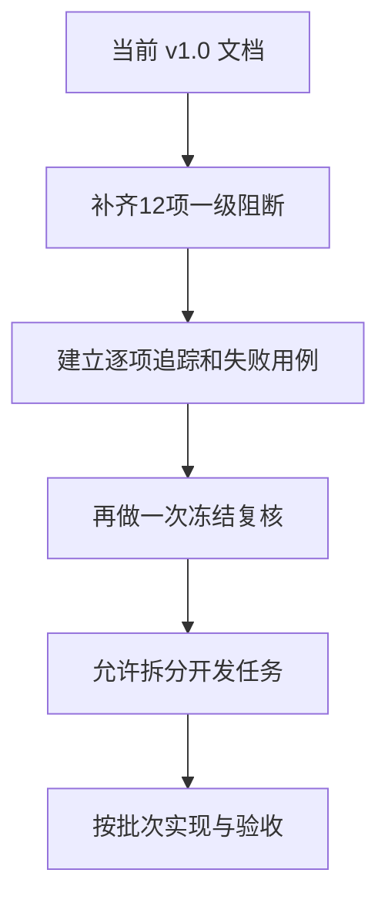

# SRVF 活动业务文档系统性对抗性复核报告

> 版本：v1.0  
> 复核日期：2026-08-02  
> 复核对象：《SRVF 活动业务全流程修正方案｜正式版 v1.0》《SRVF 活动业务全流程改造｜详细开发文档 v1.0》  
> 代码参照：所提供的 SRVF `0.66.0` 仓库快照，目录标识为 `47c4987514fef3772efb95a78adcd73dbd81c89c`

## 一、最终结论

这两份文档的业务方向是对的，不需要推倒重来；但详细开发文档目前还不能作为最终开发合同直接拆任务。

| 判断对象 | 结论 | 大白话解释 |
| --- | --- | --- |
| 业务修正方向 | 有条件通过 | 多场次、扫码、可选定位、逐人结算、两次审核、不可改账本、机器关账等主方向可以保留 |
| 业务方案作为讨论稿 | 通过 | 已足够支持继续收口，不需要重新填写355项 |
| 详细开发文档作为最终开发合同 | 暂不通过 | 仍有若干规则会导致重复计分、真实记录丢失、万人任务半生效或活动无法关账 |
| 按当前第14节直接并行开发 | 不允许 | 多名开发者或多个 AI 会在锁、账本、名额和更正上做出互不兼容的实现 |
| 坐标处理决定 | 通过 | 已按最新决定保持简单，不新增专用加密仓、隔离库、临时授权、专门保存期限或告知门槛 |

当前最合适的动作是：先把两份文档修成 v1.1，并通过本报告第十三节的全部验收门，再开始数据库和业务代码开发。只修完12项一级阻断还不等于可以开工。

### 12项阻断问题大白话速览

这一页先给不懂代码的业务人员看。后面的 P0 详细章节是给开发人员落实用的。

| 问题 | 现实中可能发生什么 | 最终要改成什么 |
| --- | --- | --- |
| 1. 没有真正封场 | 活动还在签退，正式考勤和分数却已经审核生效 | 等所有有效签退时间结束、人员和证据冻结后，才能提交审核 |
| 2. 关键变化可绕审核 | 已发布活动的时间、地点、名额或签到规则被直接改掉 | 发布后关键内容只能提交变更申请，由另一人审核 |
| 3. 30分钟内离场卡死 | 人真实离开了，却既不能正常签退，也不能再次签到，最后还关不了活动 | 普通签退仍拦截，由现场人员登记“提前离场”，真实闭合、0时长、0分 |
| 4. 取消后重报重复结算 | 同一人同一场次可能出现两个曾通过身份，被处理两次 | 同一人同一场次永远只有一个业务身份，重报只增加版本 |
| 5. 取消吞掉已做工作 | 正式开始前已经有人到场干活，活动一取消，真实记录可能被排除 | 有有效现场记录就走提前终止并结算，不能当作从未发生 |
| 6. 总名额口径不清 | 100人参加3场，系统可能当成300个总名额 | 活动总名额按去重人数；场次和岗位按参与人次 |
| 7. 重复请求可能串人 | 同一个防重号被换人或换动作使用，系统可能返回错记录 | 防重号必须同时核对完整请求，内容不同就明确拒绝 |
| 8. 新旧业务用两把不同锁 | 两个操作都以为自己独占同一队员，仍可能同时改分数 | 沿用仓库唯一的队员排队规则，不另造“队员＋日期”锁 |
| 9. 正式账可能重复记 | 重试或断点续跑时，同一笔时长和分数可能加两次或扣两次 | 每笔账、冲回和替换都有唯一编号，数据库直接防重复 |
| 10. 一万人可能半批生效 | 一半人已经看到分数，另一半仍失败或重试 | 先整批准备，最后统一生效；准备中数据任何页面都看不到 |
| 11. 更正后统计互相打架 | 原来缺席的人改成出勤后，有分数但人数统计仍算缺席 | 人员结果、服务段、账和关账凭证都按新版本一起更新 |
| 12. 离线记录可被倒填 | 被撤权人员可能修改发生时间，再上传成“以前做的” | 有效包自动补传；撤权、异常时间或篡改记录进入人工复核 |

## 二、这轮是怎么审的

本轮不是只检查措辞，而是从四条不同路线互相反查。

1. 业务决定反查：把24条总原则、12项二次确认、坐标最新决定与两份文档逐条对照。
2. 两份文档互查：检查业务方案承诺的能力，开发文档是否真的有数据、接口、权限、页面和验收入口。
3. 真实代码反查：检查文档是否服从现有接口路径、分页、权限单轨、队员并发锁、事务预算和仓库开工规则。
4. 对抗性推演：用取消重报、29分59秒离场、二维码作废竞态、权限刚撤销、任务中途宕机、同日多活动并发记分、一万人终审和关账后更正等场景攻击方案。

复核视角覆盖：发布人、主负责人、协作人、普通参与者、候补人员、现场人员、一审人、终审人、更正审核人、系统管理员、运维人员、统计使用者和后续接手开发的 AI。

## 三、证据边界

为方便定位，下文使用以下简称：

- `业务文档`：`SRVF_活动业务全流程修正方案_正式版_v1.0.md`，共576行。
- `开发文档`：`SRVF_活动业务全流程改造_详细开发文档_v1.0.md`，共1935行。
- `仓库规则`：所提供仓库快照中的 `AGENTS.md`、`docs/current-state.md` 和当前代码。

本轮还核对了两份用户填写的拍板表：

- `429abb8f-cfab-4a60-8a02-9aa5878329b8.xlsx`：355项总清单及24项总原则，SHA-256 为 `503d588a9a93225254974953ce45601545b7decef203ed541591133e9f9bcd06`。
- `a501758b-387c-4ae6-ad32-67767aeb870c.xlsx`：12项二次确认，SHA-256 为 `76d06cbb4df6cc2687571f9b8006f98d2482c995265c7cc5d5221df2c7a2ea7a`。

两份 Markdown 文件指纹：

- 业务文档 SHA-256：`c2b970e1fe1ad08e093ec51a87060516b437e03f94909a84dec6cb61daf24a00`
- 开发文档 SHA-256：`d2282b4dfa1c6322c0c9399fb4db25c6a56b3e1d3404e326460be8c6d92f0575`

仓库副本没有 `.git` 元数据，因此本轮不能用 `git rev-parse` 独立证明提交号；可以确认 `package.json` 版本是 `0.66.0`，且目录标识包含 `47c49875...`。文档下一版应把“精确对照某提交”改成“对照所提供的0.66.0仓库快照，目录标识为……”，除非重新提供带 Git 元数据的仓库。

## 四、一级阻断问题：修完前不能写核心业务代码

以下12项不是普通优化，而是会直接产生错账、假关账、重复人员或半批数据的问题。

这里的 P0 表示“详细开发合同在开工前必须消除的一级阻断”。除非条目明确引用当前运行代码，否则不表示现网已经发生该故障，也不表示当前仓库已经存在对应实现；其中一部分是按当前文档继续开发后才会出现的风险。

### P0-01 结算缺少真正的“封场时刻”

现状：开发文档允许先生成和提交结算，再经过一审、终审写账；只有最后关账时才明确检查活动是否结束。活动自然结束又按场次结束时间判断，但有效签退窗口可能比场次结束更晚。人员摘要只覆盖报名选择，没有覆盖打卡证据版本。

对抗场景：活动18:00结束，签退允许到18:30。负责人18:01提交结算，18:05终审记账，队员18:20又完成合法签退。正式账已经按旧证据生效，现场事实却继续变化。

必须修正：

- 活动进行中可以整理草稿，但不能提交结算。
- 所有场次的有效打卡窗口已经关闭后，才能提交。活动提前终止也不能立即提交，仍要等终止后的签退窗口关闭，并把所有开放服务段真实闭合或明确收口。
- 为活动或场次增加单调递增的 `evidenceRevision`。签到、签退、提前离场闭合、作废、替代、导入和离线补传时，在同一事务中增加该版本。
- 为应结算人员集合增加 `populationRevision`。结算提交版本冻结每个场次的证据版本和人员版本；提交、一审、终审都做条件比较，不能用最大 UUID 或最大时间冒充版本。
- 提交后普通打卡不得继续改动本次审核依据；迟到证据只能进入退回重提或更正流程。
- 每次提交生成不可变的结算版本和内容摘要，审核记录必须指向该版本。

过关标准：在活动未结束、签退窗口未关闭、提交后新增打卡、审核中名单变化四种情况下，系统都不得让旧版本终审生效。

主要位置：业务文档第102—105、276—284行；开发文档第768—810、861—895、940—995行。

### P0-02 已发布活动可能绕过变更审核直接改关键内容

现状：业务文档明确“发布后关键变化必须重新审核”，但开发文档同时列出了场次、岗位、报名表和资格规则的直接新增、修改、删除接口，没有给出每个动作在草稿、已发布、进行中、已结束、已关闭、已归档阶段的服务端硬限制。

对抗场景：活动已经有500人报名，工作人员直接调用场次修改接口把地点、名额、签到窗口或定位范围改掉，没有形成完整变更方案，也没有通知受影响人员。

必须修正：

- 增加“动作×生命周期”总矩阵，并落实到服务端，而不是只靠前端隐藏按钮。
- 明确可直接修改的小改白名单；除该白名单外，一律进入完整变更提案。
- 发布后的场次、时间、地点、名额、岗位、资格、报名表、可见范围、签到规则和贡献规则都必须走提案。
- 单个未来场次是否允许取消、改期或提前终止属于尚需明确的业务口径；v1.1 必须选择支持并补齐联动，或明确本期只能整场操作，不能静默留空。

过关标准：绕过页面直接调用任何关键子资源修改接口，都必须被拒绝或自动转成待审核提案。

主要位置：业务文档第63、125、341行；开发文档第1027—1037、1087—1091、1310—1334行。

### P0-03 “不足30分钟提前离场”会把人永远卡在场内

现状：已拍板规则是29分59秒不能生成普通签退；但开发方案又以“最近一次是签到”判断仍在场，并禁止未闭合服务段再次签到，关账也不允许存在未闭合段。

对抗场景：队员签到10分钟后身体不适离场。普通签退被拦截，系统仍认为他在场；他稍后回来也不能重新签到，活动最终也无法关账。

必须修正：保持“普通签退未满30分钟不成功”的业务决定，同时新增一种由现场人员登记的“提前离场闭合事实”。它不是有效签退，不计算服务时长和贡献值，但必须真实记录离场时间、原因和操作人，并关闭该段，之后可以重新签到。

过关标准：10分钟离场被登记后，第一段显示“已闭合、0时长、0分”，允许重新签到，活动也能正常关账；系统不得伪造30分钟。

主要位置：业务文档第74、207—211行；开发文档第543—570、757—766、878—884、958—995行。

### P0-04 取消后重新报名可能把同一个人同一个场次结算两次

现状：开发文档只限制同一活动、同一队员最多有一份“当前未取消”的总报名。取消后可以创建新报名；场次选择的唯一性只在同一张报名内生效，而结算人口又可能把历史上所有曾通过选择都找出来。

对抗场景：小王先报名通过，随后取消，再重新报名同一场次并再次通过。系统中出现两个曾经通过的选择，最终占两次名额并要求结算两次。

确定风险：会产生两个曾经通过的历史选择，并生成两个逐人结算身份。若名额释放或任务恢复另有异常，还可能造成容量桶漂移；不能直接断言一定同时占用两个当前名额。

必须修正：同一活动、同一队员、同一场次只能有一个永久业务身份。重新报名应重新开启原身份并增加版本，不创建第二个身份；结算人口以“队员＋场次”固定身份生成。

过关标准：重复取消、重报、撤销和递补后，同一队员同一场次始终只有一个当前名额和一个逐人结算身份，历史版本仍可查。

主要位置：开发文档第272—313、888—895行。

### P0-05 开始前取消可能吞掉已经真实发生的现场工作

现状：场次允许在正式开始前开放签到，但文档又规定第一场开始前取消不进入服务结算。

对抗场景：活动9:00开始，8:00开放签到。队员8:10到场布置，8:55活动被取消。按当前规则，这些真实签到和工作可能被整场排除。

必须修正：取消接口在锁内检查是否已有签到、代签、服务段或其他现场证据。只有不存在尚未作废、已经确认有效的现场证据时才允许普通取消；存在有效证据就改走“提前终止”，保留证据并逐人结算。误扫或测试记录可以先通过追加式纠错作废，再重新判断。

过关标准：取消与第一条现场证据并发发生时，只能得到一个一致结果，不能既显示普通取消又留下无人结算的真实记录。

主要位置：业务文档第81、270、276行；开发文档第181—197、718—730、891、1003—1017行。

### P0-06 活动总名额到底算人数还是场次人次没有冻结

现状：一个人可以参加多个场次，但开发文档对每个场次选择都依次占用活动、场次和岗位三层名额。因此一个人参加三场可能占三个“活动总名额”。

建议冻结为：

- 活动总名额按去重队员人数计算。
- 场次名额、岗位名额按参与人次计算。
- 某人第一次取得任一有效场次时，活动总名额加1。
- 取消部分场次不释放活动总名额；最后一个有效场次释放时才减1。
- 页面同时显示“报名人数”和“场次参与人次”。

过关标准：100人每人参加3场，在活动总名额中占100，在场次合计中占300；并发取消和递补不超卖、不负数。

主要位置：业务文档第66—68、154—163行；开发文档第314—340行。

### P0-07 打卡防重原则有了，但数据模型无法证明两次请求完全相同

现状：开发文档写了“同一防重号、相同请求返回原结果，不同请求要拒绝”，但打卡模型只明确保存唯一 `eventKey`，没有明确保存请求摘要及其归属范围。

对抗场景：同一个防重号第一次用于小王签到，第二次被误用于小李签退。数据库只看到号码重复，可能把小王的成功结果返回给小李。

必须修正：保存 `requestHash`，并把操作者、参与者、活动、场次、报名选择、动作、来源、设备或离线包纳入摘要。只有键和摘要都相同才返回原结果；键相同、摘要不同必须返回专门的冲突错误。

过关标准：同键换人、换场、换动作、换来源、换时间全部被拒绝，且绝不返回其他人的记录。

主要位置：开发文档第467—495、861—876、1505—1518行；仓库已有通知待办箱的请求摘要做法可复用。

### P0-08 文档另造“队员＋日期”锁，破坏仓库已有唯一队员锁

现状：开发文档建议终审按“队员＋日期”处理每日贡献值；但仓库已经把跨业务的队员写入锁固定为只按 `memberId` 的单参数锁，并明确禁止建立另一套锁域。

对抗场景：考勤用“队员＋日期”锁，入队进度用“队员”锁，两边都以为已经排他，实际可以同时修改同一队员的贡献结果和入队条件。

必须修正：使用仓库现有 `runMemberLinearizedTransaction` 开启事务；一般路径按既有方向先取得 Activity、AttendanceSheet 等所属聚合根锁，再通过 `lockMembersForWrite` 按稳定顺序取得 `memberId` 锁。每日账户行锁只能作为后续第二层，不能替代现有锁，也不得新建 `memberId+date` 锁域；`team-join` 保留仓库注明的唯一例外。

过关标准：同一队员的两场活动终审、更正和入队进度刷新并发时仍严格串行，且不改变仓库既有锁键空间。

主要位置：开发文档第916—956、1487—1527行；仓库 `member-advisory-lock.util.ts` 第90—152行。

### P0-09 账本说“不可改”，但没有真正防止重复记账

现状：账本设计有 `logicalKey`，但没有明确唯一约束、提交批次、冲回唯一性和每日分配版本。网络重试、任务续跑或重复点击可能重复加分、重复扣分。

必须修正：

- 每次记账操作有全局唯一 `operationKey` 或 `entryKey`。
- 同一结算项、版本、日期、分录类型只能有一组有效分录。
- 一笔旧账最多被一个指定冲回操作冲回；冲回和替换本身也必须防重。
- 固定守恒关系：人工认定分＝实际计入分＋因每日上限未计入分。
- 所有统计只读取已经正式提交的账本批次。
- 数据库层禁止业务账户更新或删除正式分录。

过关标准：终审、更正和任务恢复各重复执行100次，时长和贡献最终与执行1次完全相同。

主要位置：开发文档第614—661、916—956、1630—1642行。

### P0-10 一万人终审的“原子生效”只有一句建议，没有可执行协议

现状：文档一边要求终审和一万人账本全部在一个原子事务中完成，一边又说可以分批写暂存表，最后快速切换。数据表、读取过滤、批次重验、失败恢复和清理规则都没有定义。

危险：一万人放在一个事务里容易超时和长时间锁人；分批直接写正式账又会让用户看到半批生效。

必须冻结为唯一方案：

1. 新建明确的账本发布批次，状态至少有“准备中、待提交、已提交、失败、作废”。
2. 新建持久化的队员每日账户版本行，例如 `MemberContributionDayState(memberId, ledgerDate, version)`，并对“队员＋日期”唯一；它是锁后校验的数据版本，不是新的 advisory 锁域。
3. 分批准备时记录受影响队员、日期和基准版本；分录全部带批次号，准备中的分录对任何统计和页面都不可见。
4. 最终提交仍使用仓库现有事务入口和锁顺序：先活动／结算聚合根，再按排序取得全部相关队员锁和每日账户行锁，批量重读基准版本、已生效账本及其他待提交批次。
5. 任一版本变化时，本批次不能直接生效；只重算受影响人员或整批作废重做。版本一致时，在同一短事务中完成最终审核、批次生效、每日版本递增、审计和通知待办写入。
6. 所有读取端必须关联并过滤“已提交”批次；失败批次可安全续跑或作废，绝不产生半批正式结果。
7. 必须先做性能探针，证明万人稳定取锁、批量校验和状态翻转能落入仓库当前7秒事务预算。若不能通过，必须先升级仓库锁框架或重新拍板“整场一次生效”要求，不能靠调大超时掩盖。

过关标准：分别在第1、199、200、201、9999和10000条后强制杀死进程，重新启动后都没有半批可见、重复账或漏账。

主要位置：业务文档第240—253行；开发文档第614—638、940—956、1487—1526行。

### P0-11 更正后没有新的“当前人员结果”和新的关账凭证

现状：原逐人结果终审后不可编辑，更正可以冲回旧时长和分数，但没有独立的人员结果修订版本。关闭凭证又设计成一场活动只能有一张，而状态允许“已关闭→更正中→已关闭”。

对抗场景：小王原来是缺席，更正后变成正常出勤。账本有时长和分数，但当前人员结果仍写缺席；到场人数和贡献值互相打架。活动重新关闭时，也没有第二张凭证说明更正后的关账检查。

必须修正：

- 新增不可覆盖的人员结果修订版本和服务段修订版本。
- 页面和统计读取最新已生效版本，历史仍展示原结果和变化链。
- 更正只能针对明确的基础版本，同一结算项只允许一个处理中更正。
- 固定使用 `ActivitySettlementClosureRevision`：`(activityId, revision)` 唯一；首次关账和更正后重新关账都追加新版本，旧版本永久保留。
- 同一活动同一时刻只能有一个当前生效关闭版本；页面默认读取最新生效版本，历史页展示完整版本链。

过关标准：缺席改出勤、出勤改缺席、跨日时长更正、多次连续更正后，人数、服务时长、每日分数、评价资格和关闭凭证始终一致且可追溯。

主要位置：业务文档第262—290、308—312行；开发文档第541—570、640—678、797—810、998—1001行。

### P0-12 离线补传无法证明“发生时有权限”，客户端还能改发生时间

现状：离线包证明工作人员提前下载过名单，但不能证明每条离线事件在所填时间真实发生，也没有权限历史模型可验证“当时有权限”。若直接信任客户端 `occurredAt`，被撤权后仍可把事件改成更早时间补传。

为了不把系统做得无限复杂，建议采用可上线的简单规则：

- 离线包有设备绑定、有效期、连续序号和事件摘要签名。
- 上传时工作人员必须仍然拥有现场权限；已撤权的包不能自动入正式证据。
- 已撤权、设备时间异常、超过补传时限或事件链断裂的记录进入人工复核，不自动计入时长和贡献。
- 在线工作人员扫码和代签一律使用服务端时间；只有导入和离线补传可以提交受严格限制的发生时间。

过关标准：撤权后补传、篡改时间、跳号、重复序号、换设备、过期包和未来时间全部不会直接形成有效服务记录。

主要位置：业务文档第213—218行；开发文档第467—518、1133—1178、1683—1690行。

## 五、仓库开工门：即使业务文档修好，也不能绕过

这是与上面12项并列的开工条件，但它属于项目治理，不是新的业务功能。

仓库明确规定：数据库结构、迁移、权限种子、角色扩展、契约、生产入口等属于受保护区域；必须先执行预检，由维护者发放对应授权，AI 不能自行授权。新定时器、Redis、队列等也不能悄悄引入。

开发文档 v1.1 必须新增“仓库执行约束”一章，至少写明：

1. 开工先执行仓库预检；失败就停，不在脏状态强行写。
2. 本项目属于高风险跨模块改造，要以正式目标立项，列出完成条件、探针、写集、禁止域和授权清单。
3. 数据库相关任务只能有一条写入通道，不能多个 AI 同时改结构。
4. 触碰受保护路径，由维护者执行授权命令；AI 不得自授权。
5. 对外接口、权限地图、OpenAPI 快照和交接文档必须与代码同一批更新。
6. 后台任务必须明确选择复用现有独立 worker，或立项新增独立的 PostgreSQL 轮询 worker。新增进程、生产入口和脚本都要取得受保护区域授权；不得新增第3个 cron，也不得引入 Redis、BullMQ 或其他 queue。
7. 每批必须通过仓库要求的检查，并由另一个模型做交叉复核。
8. “先合并必然失败的测试”改为待办测试，或与让它通过的最小实现放在同一合并请求，主分支不能故意长期红灯。

执行细则也要写进 v1.1，不能只写“按仓库要求处理”：

- 开工命令：`pnpm agent:preflight`。
- 新工作树先执行：`pnpm install --frozen-lockfile && pnpm prisma:generate`。
- 本地基础自证：`pnpm lint && pnpm harness:selftest && pnpm test:contract`。
- 触碰 `common/*`、permissions、audit 等枢纽前先列引用链，并执行 `agent:check:full`。
- `harness:grant` 只解除本地写入门，不代表允许合并。
- 并行开发通道最多3条，触碰数据库结构的通道最多1条。
- `RBAC_MAP` 是生成物，不能手工编辑。
- 修改已有端到端测试断言等于改变业务合同，必须暂停并上报。
- `prisma migrate reset` 和 `prisma db push` 在任何环境都不能由 AI 自动执行；目标中的预授权也不算，必须由用户当场明确同意。生产只能执行已审查的 `prisma migrate deploy`。

主要证据：仓库 `AGENTS.md` 第17—18、29—38、75、85—89行；`docs/current-state.md` 第49—58行。

## 六、重要修订问题：建议在 v1.1 一次收口

以下项目不一定单独造成即时错账，但若不写清楚，不同开发者会做出不同系统。为了便于修订，按主题归并为35组。

### 6.1 需求覆盖和业务词义

| 编号 | 问题 | v1.1 必须写清楚 |
| --- | --- | --- |
| P1-01 | 文档宣称355项全覆盖，但没有证据链 | 增加“原清单编号→最终规则→开发对象／接口→验收用例→本期／后续”的逐项追踪矩阵。对已填写总表抽样发现以下接受项未落入开发文档：A13复制旧活动为新草稿；A15长期无人处理草稿提醒与后台归档；E07协作候选人取消200人限制并改为搜索分页；D18发布后各字段变更通知矩阵；G24报名取消截止后由谁审批；H30误签到撤回申请；H45/K10活动结束前后未签退提醒；I27应计分活动无贡献规则时禁止终审；K01发布通知可选目标组织、标签或不广播。最终仍以355项追踪矩阵复核为准 |
| P1-02 | 多场次仍写成“每个报名通过者一条结果” | 统一为“每个通过的队员×场次一条逐人结果”；同时显示去重人数和参与人次 |
| P1-03 | 能看活动与能报名只在业务文档分开 | 新增独立报名方式：公开申请、仅邀请确认、只允许后台代报名、暂停报名；不能用 `visibilityCode` 兼任。系统内部公开活动只对账号正常的正式队员可见；邀请活动只对受邀人和工作人员可见；普通活动完结后保留只读详情，邀请活动仍按参与、邀请或工作人员关系查看 |
| P1-04 | 业务方案承诺内置模板和定位继承，开发模型只有场次值 | 补模板、活动默认、场次覆盖、岗位覆盖及快照；若第一版简化，必须在业务文档明确删减，不能暗中少做 |
| P1-05 | 多志愿和预留名额只有文字 | 增加岗位志愿顺序、名额组、适用资格、释放时间、降志愿和确认规则 |
| P1-06 | 十区块建立页没有完整落入模型 | 补结构化地址、集合／执行／撤离点、公开和内部联系人、交通餐饮住宿、天气、备用日期、取消规则、通知目标和系统附件关系 |
| P1-07 | 资格排序和抽签没有可重放对象 | 增加分配批次、冻结候选名单、规则版本、评分明细、随机种子承诺、结果和候补序列；候补顺序取决于所选分配方式，不是一律先进先出 |
| P1-08 | 7天被写成“更正申请窗口”，但归档后仍允许更正 | 改名为可配置的“归档等待期”；合法更正是否长期允许另行明确，不制造假截止 |
| P1-09 | 二次确认 R02 的措辞被静默改变，且接口清单漏了开始前取消 | 写明“开始后取消”在统一流程中改名为“提前终止”，仍由主负责人直接操作、原因必填、强确认、通知并保留真实记录；补齐开始前取消接口、请求内容、权限、强确认、防重号、数据库时间边界和通知合同 |

### 6.2 报名、邀请和人员终态

| 编号 | 问题 | v1.1 必须写清楚 |
| --- | --- | --- |
| P1-10 | 一份总报名下多个场次结果不一致时，总状态不明确 | 最好由各选择状态实时推导；若保存总状态，必须给出部分通过、部分候补、部分取消等完整聚合表 |
| P1-11 | 待审核和候补没有活动开始后的自然终态 | 增加“未入选、候补到期、审核到期／报名关闭”等终态，并定义批量收口时点和责任人 |
| P1-12 | 邀请有状态但缺少接受、拒绝、撤回接口 | 补受邀人操作；明确邀请是否仍检查资格、报名表、保险、名额和审核 |
| P1-13 | 报名取消截止后由谁批准、是否释放名额不明确 | 写清申请、审批、名额释放和候补递补的事务顺序 |
| P1-14 | 内部临时参加只有概念，缺审批和并发规则 | 保存批准人、原因、批准时间；与现场补报名、名额、重复身份和结算人口同事务处理 |
| P1-15 | 报名附件存在“还没有报名编号却要求附件归属报名”的死结 | 使用报名草稿或一次性上传会话，提交时核验归属并绑定；定义未提交附件清理方式 |
| P1-16 | 一个单选结果无法表达“既迟到又早退” | 拆成主服务结论、迟到标签、早退标签和异常标签；不要把互不排斥事实压成一个值 |

### 6.3 现场、打卡和时间

| 编号 | 问题 | v1.1 必须写清楚 |
| --- | --- | --- |
| P1-17 | 二维码作废与旧码打卡并发 | 打卡在锁内重新读取码版本；不能在锁外检查后继续写 |
| P1-18 | 现场权限撤销与代签并发 | 单次写入前在同一锁内重读当前权限；批量代签、导入和批量审核的每个任务项也要重新判权，或在撤权事务中可靠取消关联任务。任务运行一半撤权后，后续项目不得继续写入 |
| P1-19 | 工作人员在线入口允许客户端填任意发生时间 | 在线扫码和代签使用服务端时间；仅经预览的导入和受控离线补传可带历史时间 |
| P1-20 | 错扫一次后没有撤销／作废事实 | 增加追加式的“作废或替代事件”，保存原因和操作者；不删除原事件，也不能让错误签到永久挡住正确签到 |
| P1-21 | 签到后队员失效、报名取消时，正常签退可能被资格检查挡住 | 签到要求当前资格；已有开放服务段的退出应允许闭合，或由现场人员明确收口，不能把人永远留在场内 |
| P1-22 | 岗位有时间，但打卡算法只看场次 | 有岗位时，打卡窗口取场次和岗位的有效交集；明确早到准备时间是否计入，提前终止后的有效时长如何封顶 |
| P1-23 | 提前终止后的合理签退窗口没有数值 | 定义终止后允许多久完成真实签退，以及工作人员如何收口仍在场人员 |
| P1-24 | 定位精度写成“提醒或硬拦”两种答案 | 冻结唯一做法，并给出边界值和失败提示 |
| P1-25 | 静态码且场次不要求定位时存在转发代扫风险 | 作为已知剩余风险写入文档；本期不增加动态码、人脸或设备证明，不要再次扩大范围 |

### 6.4 审核、贡献值、更正和评价

| 编号 | 问题 | v1.1 必须写清楚 |
| --- | --- | --- |
| P1-26 | 审核人到底直接改数值还是只退回，两文档不一致 | 建议审核人只通过或退回，负责人／考勤协作人修改后生成新提交版本，更符合职责分离 |
| P1-27 | 迟到、早退阈值及其对贡献值影响缺失 | 定义宽限、截止、是否计时、是否扣分；应计分活动没有贡献规则时禁止终审 |
| P1-28 | 同日超过3分时，哪一场优先计入没有业务决定 | 建议按真实服务发生顺序分配，固定并公开同一时刻的稳定排序；更正后按可追踪版本重算 |
| P1-29 | 同一更正项可被并发提交多个申请 | 一项只能有一个处理中更正，并保存基础版本；批准前版本变化就要求重新申请 |
| P1-30 | 两个活动同时给同一人同一天记服务，未锁内复查重叠 | 在现有队员锁内重读所有已生效和待生效服务段，拒绝无法解释的时间重叠 |
| P1-31 | 评价只写原则，无法执行 | 定义哪些结果可评价、开放和截止时间、一次还是多次、匿名与否，以及更正后资格增加或消失如何处理 |

### 6.5 权限、安全和接口合同

| 编号 | 问题 | v1.1 必须写清楚 |
| --- | --- | --- |
| P1-32 | 活动角色能力表可能变成第二套权限系统 | 责任配置只描述业务关系，统一投影到现有授权单轨；所有接口最终走同一个判权服务 |
| P1-33 | 主负责人和能力历史缺少数据库不变量 | 保证任何已发布活动恰好一个当前主负责人；移交同事务完成，不能短暂0人或2人；能力授予、撤销保留历史且禁止自我提权 |
| P1-34 | 查看／打印／作废二维码没有独立能力 | 只读协作人不能因为“能看完整活动”就看到可打印静态码；二维码展示和管理单独授权 |
| P1-35 | Controller 路径和分页违反仓库现有合同 | 手机管理路径补回 `/api/app/v1/my/managed-activities`；App、Admin、System 等所有 Controller 接口都使用 `page/pageSize` 和标准分页响应，DTO、OpenAPI、请求参数和响应结构都不得出现 `cursor`；Prisma cursor 只能用于 worker 或服务内部数据库扫描 |

## 七、开发与运维层面的补充修订

这些问题可以并入上述章节，不必再创建新的业务模块，但必须进入开发文档和测试。

1. 幂等覆盖不完整：提交、一审、终审、取消、终止、归档、邀请、现场人工、导入执行和批量重试都要有稳定防重规则。
2. 批处理崩溃窗口：业务写成功、任务明细尚未标成功时进程退出，重试必须依靠业务防重安全恢复。
3. 通知对象要在业务动作发生时冻结；异步展开时不能重新查一份已经变化的报名名单。
4. 导入预览必须产生任务号、文件摘要和解析版本；执行只能使用该预览结果，防止预览后换文件。
5. 批处理任务查询必须检查活动和组织归属，不能知道任务编号就查看、下载或重试别人的任务。
6. 当前有效二维码、报名表版本、邀请和负责人等槽位需要数据库唯一约束，不能只靠“先查再写”。
7. 富文本需要服务端清洗；文件必须核验上传人、归属、状态和用途，不能只信附件编号。
8. 个人会员码必须是可信凭证或由工作人员搜索后人工确认，不能只把可猜的队员编号当防伪码。
9. 二维码签名补密钥配置、轮换、旧版本兼容和泄露后一键失效规则。
10. `ledgerDate` 固定唯一数据类型和北京时间换算方法，不能写成“日期或字符串二选一”。
11. “日志与业务同事务”改成“审计记录和通知待办与业务同事务”；普通运行日志不受数据库回滚控制。
12. 任务错误只存安全错误码和脱敏说明，不能把原始异常堆栈、SQL或人员信息放进失败明细。
13. 邀请与场次使用关联表，不用缺少外键保护的编号数组。
14. 活动结算状态、结算单状态、关闭凭证和更正状态必须明确谁是主事实、谁是页面投影及如何修复漂移。
15. 打卡事件和正式账本的“不可修改”要有数据库级保护，并测试绕过业务服务直接更新或删除也会失败。
16. 旧考勤数据读者必须列迁移矩阵：入队进度、里程碑通知、参与汇总、手机端我的考勤、评价资格和所有统计都要统一切到账本。
17. 后台和手机端是独立交付面时，要写明对应仓库、合同版本、发布顺序和不允许新旧合同混跑的条件。
18. 正式开放前没有生产数据，可以按已拍板方案干净切换；若技术团队为了短期回滚暂留空旧表，旧表必须零写入、零读取并约定删除版本，不得形成双读、双写或长期兼容链。
19. 回滚真实含义应是“停止写入＋只读维护＋修复版本”，并准备可部署的维护镜像；不能只写一句“回滚到只读”。
20. 批处理工作进程必须有启动命令、健康检查、抢任务、停机排空、发布和回滚说明，并服从仓库现有定时器数量限制。

## 八、规模与故障验收需要补的硬指标

当前“5分钟内能看到进度”不足以证明一万人流程可用。v1.1 至少补以下可复现门槛：

| 场景 | 必须量化的结果 |
| --- | --- |
| 500人 | 业务人员一次提交；给出固定测试环境下的生成、提交、一审、终审完成时间 |
| 2000人 | 后台任务持续推进；中途杀进程可续跑；无重复账和重复通知 |
| 10000人 | 分批准备、短事务生效；任何时刻只能看见0%或100%的正式账，不能看见半批 |
| 混合负载 | 报名、扫码、终审、通知、导出、关账同时运行，不只测试单一空闲活动 |
| 名额对账 | 容量桶与实际有效选择逐项一致；提供自动对账和修复告警 |
| 性能证据 | 固定数据库规格、数据分布、并发模型、缓存冷热和测试命令，P95才可复现 |
| 恢复目标 | 明确任务最长恢复时间、允许重试次数、死信后谁处理和页面提示 |

建议增加以下对抗测试：

1. 结算提交与最后一次合法签退并发。
2. 二维码作废与旧码打卡并发。
3. 现场权限撤销与代签并发。
4. 取消与第一条现场签到并发。
5. 取消重报十次后只存在一个结算身份。
6. 29分59秒提前离场、特殊闭合、重新签到和最终关账。
7. 同一防重号换人、换场、换动作、换设备。
8. 一万人账本准备到任意位置进程退出并续跑。
9. 批次业务写成功但任务明细未标成功时崩溃。
10. 两个活动同时给同一队员同一天记分，并与入队进度刷新并发。
11. 同一结算项同时申请两个更正。
12. 更正把缺席改出勤后，人数、时长、分数、评价和关闭凭证一起变化。
13. 离线包撤权后上传、过期、篡改时间、跳号、重复号和换设备。
14. 导入预览后替换文件再执行。
15. 未授权人员用其他活动的子资源编号访问报名、场次、任务和结算。
16. 通知生成后报名名单变化，原事件收件人仍保持冻结。
17. 新名额小于已占用数时修改被拒绝。
18. 单个未来场次取消后，只影响该场次人员和对应通知。
19. 账号正常的正式队员可以查看内部公开活动；停用账号、非正式队员和未受邀人员不能查看不属于自己的邀请活动。
20. 数据库层直接更新／删除正式打卡事件和账本必须失败。
21. 同一结算单“终审通过”和“终审退回”同时发生，只能一个状态变化成功，不能记账后又退回。
22. 更正提交／生效与关账、归档同时发生时，必须按同一活动锁顺序串行，不能漏掉处理中更正。
23. 批量代签、导入或审核任务运行一半时撤销操作者权限，后续项目不得继续写入。

## 九、已经通过、建议原样保留的设计

本轮不是只找缺点。以下方向经多视角复核后仍然成立：

- 所有初次发布和关键变更由另一人审核，禁止自审。
- 报名截止时间可以明确清空，空值不再变成1970年。
- 活动可以多日、多场次、多岗位、多段服务。
- 普通队员自助必须扫对应场次的签到码或签退码。
- 定位由发布人按场次选择限制半径或不限制。
- 没有真实签退时绝不拿计划结束时间编造签退。
- 缺席、请假等逐人结果与真实服务明细分开。
- 提交人、一审人、终审人严格分离，最高管理员也不能绕过。
- 终审后使用追加式账本；错误通过冲回旧值再追加新值修正。
- 活动结束、结算关闭、归档冻结是三件不同的事。
- 30人通过但0结果时必须拒绝关账。
- 外部通知不在数据库事务中直接发送，只在事务中写通知待办。
- 系统按30人真人演练以及500、2000、10000模拟规模验收。
- 当前没有生产历史数据时，可以干净切换，不建设长期双写兼容链。
- 坐标继续按普通业务字段处理；现有普通响应不返原始坐标、日志遮挡经纬度的保护可以保留，但不增加专用坐标系统。

## 十、仍需明确的现实口径与推荐答案

大部分问题都属于开发文档需要补严，不需要重新填写大清单。下表汇总当前仍会改变现实操作的口径，并给出推荐答案；它们必须写入 v1.1 的决策追踪，不能冒充以前已经全部拍板。

| 问题 | 推荐冻结答案 |
| --- | --- |
| 活动总名额的单位 | 按去重人员数；场次和岗位按参与人次 |
| 审核人能否直接改时长和分数 | 不能直接改；只通过或退回，由负责人修改并生成新版本 |
| 同一天多活动超过3分时谁先计入 | 按实际服务发生顺序；相同时间按稳定编号排序；页面仍展示全部人工认定分和未计入分 |
| 7天是什么 | 是可配置的归档等待期，不是更正申请截止期 |
| 不足30分钟真实离场 | 普通签退仍拒绝；现场人员登记特殊离场闭合事实，0时长、0分，可再次签到 |
| 已撤权人员的离线包 | 不自动入正式证据，进入人工复核；正常有效包仍可自动补传 |
| 定位距离配置层级 | 保留业务文档承诺的系统默认、活动类型模板、单活动、场次和必要时岗位覆盖；发布审核保存最终解析值和来源，不做实时继承漂移 |
| 受邀人员要不要继续检查资格 | 仍检查账号、正式队员资格、保险、硬性资格和名额；邀请只代替公开申请，不自动绕过安全和容量规则 |
| 活动提前终止后允许多久签退 | 推荐从实际终止时刻起保留30分钟签退窗口；窗口结束后由现场人员逐个收口未闭合人员 |
| 定位精度是提醒还是硬拦 | 这项必须按真实现场设备情况定一个明确阈值；在阈值确定前不得把“提醒或拦截均可”交给开发自由选择 |
| 迟到、早退和扣分 | 由发布人按场次从系统模板选择宽限和阈值；应计分活动没有贡献规则时禁止终审，不能由开发自定分钟数 |
| 评价窗口与更正影响 | 推荐结算关闭后开放、30天内评价；更正后新增资格可补开，资格被撤销时保留原评价但标注其资格后来更正，不静默删除历史 |
| 单个未来场次能否取消或改期 | 推荐支持；只影响该场次的报名、名额、二维码、通知和结算人口，不强迫终止整场活动 |

除“定位精度阈值”和“迟到／早退具体分钟数”需要结合真实设备与现场制度给出数值外，其余项目若采用上表推荐答案，就不需要再发一轮大清单，可以直接写入 v1.1。

## 十一、建议重新安排开发顺序

当前文档先做二维码和工作人员入口，后做结算、账本和关账。这样会先增加大量新打卡来源，却仍没有可靠的最终闭环。

建议调整为：

1. 第0批：修订合同、建立355项追踪矩阵、仓库预检与授权、失败用例和机器红线。
2. 第1批：活动、场次、报名身份、人员结果版本、结算版本、账本批次、关闭版本和更正版本的数据地基。
3. 第2批：机器逐人核对、终审记账、每日3分、不可改账本、更正和关账先跑通。
4. 第3批：活动页面、发布审核、关键变更、可见性、报名方式、取消和提前终止。
5. 第4批：报名表、资格、名额、分配、邀请、候补和临时人员。
6. 第5批：二维码、自助扫码、可选定位、30分钟和多段服务。
7. 第6批：工作人员扫码、代签、导入和离线补传。
8. 第7批：万人批处理、通知、导出、混合负载和上线演练。

如果前端需要先开发二维码页面，可以使用假数据或关闭的功能开关；在结算、账本和关账链通过前，不应让新现场入口在真实环境生效。

## 十二、必须增加的机器红线

为了让后续 AI 不会把已经修好的问题又写回来，建议在仓库检查中增加：

- 不存在直接发布路由或自审成功路径。
- 已发布关键字段不能绕过变更提案服务写入。
- 旧单行签到签退表不再接受新写入。
- 对外不存在要求业务人员提交最多200人数组的考勤入口。
- 不再使用“负责人声明全部提交”作为关账条件。
- 正式账本和正式打卡事实不能更新或删除。
- 所有正式账读取必须过滤为已生效批次。
- 所有会改贡献值的写入必须走现有队员线性化锁。
- App 管理接口保持 `/my` 边界，App 和 Admin 数据合同物理分离。
- 所有 Controller 分页保持仓库统一的 `page/pageSize` 合同；数据库游标只留在 worker 或服务内部。
- 新业务权限不得绕过现有授权单轨。
- 历史事故回放至少包含：假签退、0考勤假关闭、200人上限、自审、重复记账和半批生效。

## 十三、最终验收门

只有同时满足以下条件，文档才能从“讨论稿”升级为“正式开发合同”：

- 12项一级阻断问题都有唯一方案，不再写“可以A也可以B”。
- 仓库开工门、授权和工作进程方案写入文档。
- 35组重要问题全部补齐或明确延期；延期项从本期承诺中移除。
- 建立355项逐项追踪矩阵，并能证明没有接受项失踪。
- 业务方案49项验收与开发自动测试建立编号映射。
- 24条冻结规则、12项二次确认和最新坐标决定均能反查到数据、接口、页面和测试。
- 关键并发、崩溃恢复和一万人半批可见问题都有失败用例。
- v1.1 再由不同视角做一次交叉复核，一级阻断问题为0。

达到这些条件后，建议结论改为：

> 业务合同 GO；详细开发合同 GO；允许按依赖顺序开工。

在此之前，允许进行的工作只有文档修订、架构决策、测试设计、仓库预检和维护者授权准备；不建议开始数据库结构或核心业务代码开发。

## 十四、本次未做

- 未修改两份原始 Markdown 文档。
- 未修改仓库代码、数据库结构、接口、权限或测试。
- 未重新讨论用户已明确否决的坐标专用加密、隔离存储、临时授权和专门保存期限。
- 未宣称真实 Git 提交已独立验证；本轮只按所提供的0.66.0仓库快照核对。
